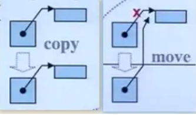

<center><font size = 45>C++11新特性</font></center>

#### 所有STL容器支持初始化列表

例如： `std::vector<int> v = { 1, 2, 3 }`


#### 自定义class支持初始化列表

```c++
class A {
public:
    A(const std::initializer_list<int> &items) : m_items(items){
        
    }
private:
    std::vector<int> m_items;
};
int main() {
    A a1 = {1, 2, 3};
}
```


#### forEach遍历方式

对容器或者数组可以使用`forEach`遍历， `for(auto i: a){}`


#### nullptr

传统 C++ 会把 `NULL`、`0 `视为同一种东西，这取决于编译器如何定义 `NULL`，有些编译器会将` NULL`定义为` ((void*)0)`，有些则会直接将其定义为 `0`，因此C++11 引入了` nullptr` 关键字，专门用来区分空指针与`0`


#### decltype

`decltype`关键字是为解决`auto`关键字只能对变量进行类型推导的缺陷。用法与`sizeof`类似：`decltype(x + y) z;`


#### auto

 自动推导类型，` Map<int, int>::iterator itor = mmap.find();`

1. `auto`声明的变量必须要初始化，否则编译器不能判断变量的类型。
2. `auto`不能被声明为返回值，`auto`不能作为形参，`auto`不能被修饰为模板参数


#### lambda表达式

`lambda`表达式是匿名函数，可以认为是一个可执行体`functor`，语法：`[捕获区](参数区){代码区};`

```c++
auto add = [](int a, int b) { return a + b; };
std::cout << add(1, 2) << std::endl; 
```

##### 捕获

捕获即为将一些变量展开使得为`lambda`内部可见 

- `[a,&b]`其中 `a` 以复制捕获而 `b` 以引用捕获。

- `[this] `以引用捕获当前对象`(*this)`

- `[&] `以引用捕获所有用于 `lambda` 体内的自动变量，并以引用捕获当前对象，若存在

   `auto f = [&]() { std::cout << i << std::endl; }; `

- `[=] `以复制捕获所有用于 `lambda` 体内的自动变量，并以引用捕获当前对象，若存在

   `auto f = [=]() { std::cout << i << std::endl; }; `

- `[]` 不捕获，大部分情况下不捕获就可以了


#### 正则表达式

正则表达式描述了一种字符串匹配的模式。一般使用正则表达式主要是实现下面三个需求： 

1. 检查一个串是否包含某种形式的子串； 
2. 将匹配的子串替换；
3. 从某个串中取出符合条件的子串。

  

#### 统一的初始化方法       

可以统一使用大括号`{}`进行初始化。对构造函数的选择的优先级如下

```c++
class A {
public:
    A(const std::initializer_list<int> &items) : m_items(items){
    }
    
    A(int age) : age(age) {
    }
private:
    std::vector<int> m_items;
    int age;
};
int main() {
    A a{5};
}
```


#### 默认构造函数 `default`

有其他的构造函数的时候是不会有默认构造的，但是程序员希望有默认的时候可以写成是`A() = default; `当然 `A(){}`也是也可以的


#### 对枚举做了一个强类型枚举 

原来的枚举有两个缺点，因此引入了强类型枚举，使用的时候要加入 `Dir::Left`

1. 不同的枚举类型但是名字起一样会编译报错。

   ```c++
   enum Dir{
       left,Right
   };
   enum Pos{
       left,Right
   };
   ```

2. 不同的枚举类型可以判断

   ```c++
    if(dir == pos){}  //dir和pos分类是两种枚举，但是这里可以判断，不合理
   ```


#### 显式重写 `override`和`final`

1. 显示重写`override`：`void fun() override {}`
2. 显示重写`final`：`virtual void fun() final {}`


#### `delete`关键字

`delete`关键字放在函数后面，表示函数不能被调用 。`A() = delete;`


#### 智能指针

1. `auto_ptr`（c++98的方案，cpp11已经抛弃）

   采用所有权模式。`p2 = p1`，`p2`剥夺`p1`的所有权当程序运行时访问`p1`将会报错。因此其存在潜在的内存崩溃问题

2. `unique_ptr`（替换`auto_ptr`）

   实现独占式拥有或严格拥有概念，保证同一时间内只有一个智能指针可以指向该对象。

3. `shared_ptr`

   实现共享式拥有概念。多个智能指针可以指向相同对象，该对象和其相关资源会在“最后一个引用被销毁”时候释放。它使用计数机制来表明资源被几个指针共享，使用`use_count()`来查看资源的所有者个数。该引用计数的内存在堆上分配。当新增一个时引用计数加1，当过期时引用计数减一。只有引用计数为0时，智能指针才会自动释放引用的内存资源。当两个对象相互使用一个`shared_ptr`成员变量指向对方，会造成循环引用，使引用计数失效导致**内存泄漏**。使用`weak_ptr`解决

4. `weak_ptr`

   是一种不控制对象生命周期的智能指针, 它指向一个 `shared_ptr` 管理的对象. 进行该对象的内存管理的是那个强引用的` shared_ptr`， `weak_ptr`只是提供了对管理对象的一个访问手段。`weak_ptr` 设计的目的是为配合 `shared_ptr` 而引入的一种智能指针来协助`shared_ptr` 工作, 它只可以从一个 `shared_ptr` 或另一个 `weak_ptr `对象构造, 它的构造和析构不会引起引用记数的增加或减少。`weak_ptr`是用来解决`shared_ptr`相互引用时的死锁问题,如果说两个`shared_ptr`相互引用,那么这两个指针的引用计数永远不可能下降为0,资源永远不会释放。它是对对象的一种弱引用，不会增加对象的引用计数，和`shared_ptr`之间可以相互转化，`shared_ptr`可以直接赋值给它，它可以通过调用`lock函数`来获得`shared_ptr`


#### tuple

`std::pair<std::string,int>`的扩展版，可以当做一个通用的结构体来使用

```c++
void fun() {
    std::tuple<int, std::string, char> t(2, "foo", 'a')
}
```


#### 语言级线程支持

[链接](./c++parallel)


#### 右值引用/`std::move`/完美转发

透彻讲解右值引用、移动语义、完美转发链接：https://www.jianshu.com/p/d19fc8447eaa，非常顶

C++中引入了右值引用和移动语义，可以避免无谓的复制，提高程序性能。

##### 左值与右值

C++中所有的值都必然属于左值、右值二者之一。

1. 左值是指表达式结束后依然存在的持久化对象，所有的具名变量或者对象都是左值，而右值不具名
2. 右值是指表达式结束时就不再存在的临时对象

简单区分方法：**看能不能对表达式取地址，如果能，则为左值，否则为右值**

##### 左值引用与右值引用

C++98中引用就是给变量取了个别名，C++11中，因为增加了**右值引用**的概念符号是`&&`，所以C++98中的引用都称为了**左值引用**。

1. 左值引用， 使用 `T&`, 只能绑定**左值**，给变量取别名
2. 右值引用， 使用 `T&&`， 只能绑定**右值**，可以取得临时对象的控制权，终于可以修改临时对象了！
3. 常量左值， 使用 `const T&`, 既可以绑定**左值**又可以绑定**右值**

```C++
int a = 10;
int& refA = a; // 左值引用
int& refB = 10; //编译错误，10是右值，不能够使用左值引用
int&& refC = 10; // 右值引用
int&& refD = getTemp(); //getTemp返回一个临时变量是右值 
const int& refF = getTemp(); 
```

##### 移动语义

**目的**：对于临时对象拷贝完就没什么用，造成了没有意义的资源申请和释放操作，如果能够直接使用临时对象已经申请的资源，既能节省资源，又能节省资源申请和释放的时间。而C++11新增加的**移动语义**就能够做到这一点。



**原理**：并不是重新分配一块新的空间，将要拷贝的对象复制过来，而是"偷"了过来，将自己的指针指向别人的资源，然后将别人的指针修改为`nullptr`，这一步很重要，如果不将别人的指针修改为空，那么临时对象析构的时候就会释放掉这个资源。C++11为了解决这个问题，提供了`std::move()`方法来将左值转换为右值，从而方便应用移动语义

**注意**

```c++
MyString str1("hello"); //调用构造函数
MyString str2("world"); //调用构造函数
MyString str3(str1); //调用拷贝构造函数
MyString str4(std::move(str1)); // 调用移动构造函数、
//    cout << str1.get_c_str() << endl; // 此时str1的内部指针已经失效了！不要使用
//注意：虽然str1中的m_dat已经称为了空，但是str1这个对象还活着，知道出了它的作用域才会析构！而不是move完了立刻析构
MyString str5;
str5 = str2; //调用拷贝赋值函数
MyString str6;
str6 = std::move(str2); // str2的内容也失效了，不要再使用
```

1. `str6 = std::move(str2)`，虽然将`str2`的资源给了`str6`，但是`str2`并没有立刻析构，只有在`str2`离开了自己的作用域的时候才会析构，所以，如果继续使用`str2`的`m_data`变量，可能会发生意想不到的错误。
2. 如果我们没有提供移动构造函数，只提供了拷贝构造函数，`std::move()`会失效但是不会发生错误，因为编译器找不到移动构造函数就去寻找拷贝构造函数，也这是拷贝构造函数的参数是`const T&`常量左值引用的原因！
3. `c++11`中的所有容器都实现了`move`语义，`move`只是转移了资源的控制权，本质上是将左值强制转化为右值使用，以用于移动拷贝或赋值，避免对**含有资源的对象**发生无谓的拷贝。`move`对于拥有如内存、文件句柄等资源的成员的对象有效，如果是一些基本类型，如int和char[10]数组等，如果使用move，仍会发生拷贝（因为没有对应的移动构造函数），所以说`move`对含有资源的对象说更有意义。

##### 通用引用

右值引用和模板结合的时候。`T&&`并不一定表示右值引用，它可能是个左值引用又可能是个右值引用。是左值引用还是右值引用却决于它的初始化，如果它被一个左值初始化，它就是一个左值引用；如果被一个右值初始化，它就是一个右值引用。一句话， 传递左值进去，就是左值引用，传递右值进去，就是右值引用。如它的名字，这种类型确实很"通用"

**注意：**只有当**发生自动类型推断**时（如函数模板的类型自动推导，或auto关键字），`&&`才是一个`universal references`。

##### 引用折叠的规则

1. 所有的右值引用叠加到右值引用上仍然使一个右值引用。
2. 所有的其他引用类型之间的叠加都将变成左值引用。

##### 完美转发

所谓转发，就是通过一个函数将参数继续转交给另一个函数进行处理，原参数可能是右值，可能是左值，如果还能继续保持参数的原有特征，那么它就是完美的，c++中提供了一个`std::forward()`模板函数解决这个问题

