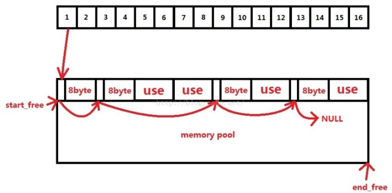
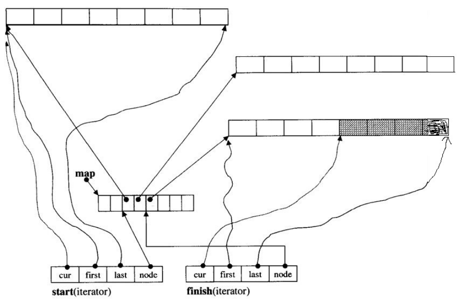

<center><font size = 45>STL</font></center>

## 基本概念

STL(Standard Template Library,**标准模板库**)，STL 从广义上分为: **容器，算法， 迭代器**，**容器**和**算法**之间通过**迭代器**进行无缝连接。STL源码剖析见[链接](./STL源码剖析)

#### 组件

1. **容器**

   STL**容器**就是将运用**最广泛的一些数据结构**实现出来，常用的数据结构：数组, 链表,树, 栈, 队列, 集合, 映射表等

   **容器分类：**

   - **序列式容器**：强调值的排序，序列式容器中的每个元素均有固定的位置。 

   - **关联式容器**：二叉树结构，各元素之间没有严格的物理上的顺序关系

2. **算法**

   - 质变算法：是指运算过程中会更改区间内的元素的内容。例如拷贝，替换，删除等等
   - 非质变算法：是指运算过程中不会更改区间内的元素内容，例如查找、计数、遍历、寻找极值等等

3. **迭代器**

   提供一种方法，使之能够依序寻访某个容器所含的各个元素。每个容器都有自己专属的迭代器，迭代器使用非常类似于指针

   **迭代器种类：**输入迭代器，输出迭代器，前向迭代器，**双向迭代器，随机访问迭代器**

4. **仿函数**：行为类似函数，可作为算法的某种策略。

5. **适配器**：一种用来修饰容器或者仿函数或迭代器接口的东西

6. **空间配置器**：负责空间的配置与管理。


## 内存管理

STL的分配器用于封装STL容器在内存管理上的底层细节。在C++中，其内存配置和释放如下：

new运算分两个阶段：(1)调用::operator new配置内存;(2)调用对象构造函数构造对象内容

delete运算分两个阶段：(1)调用对象希构函数；(2)掉员工::operator delete释放内存

为了精密分工，STL allocator将两个阶段操作区分开来：内存配置有alloc::allocate()负责，内存释放由alloc::deallocate()负责；对象构造由::construct()负责，对象析构由::destroy()负责。

同时为了提升内存管理的效率，减少申请小内存造成的内存碎片问题，SGI STL采用了两级配置器，当分配的空间大小超过128B时，会使用第一级空间配置器；当分配的空间大小小于128B时，将使用第二级空间配置器。第一级空间配置器直接使用malloc()、realloc()、free()函数进行内存空间的分配和释放，而第二级空间配置器采用了内存池技术，通过空闲链表来管理内存。


## 内存优化

1）二级配置器结构
STL内存管理使用二级内存配置器。
1、第一级配置器
第一级配置器以malloc()，free()，realloc()等C函数执行实际的内存配置、释放、重新配置等操作，并且能在内存需求不被满足的时候，调用一个指定的函数。
一级空间配置器分配的是大于128字节的空间
如果分配不成功，调用句柄释放一部分内存
如果还不能分配成功，抛出异常
2、第二级配置器
在STL的第二级配置器中多了一些机制，避免太多小区块造成的内存碎片，小额区块带来的不仅是内存碎片，配置时还有额外的负担。区块越小，额外负担所占比例就越大。
3、分配原则
如果要分配的区块大于128bytes，则移交给第一级配置器处理。
如果要分配的区块小于128bytes，则以内存池管理（memory pool），又称之次层配置（sub-allocation）：每次配置一大块内存，并维护对应的16个空闲链表（free-list）。下次若有相同大小的内存需求，则直接从free-list中取。如果有小额区块被释放，则由配置器回收到free-list中。
当用户申请的空间小于128字节时，将字节数扩展到8的倍数，然后在自由链表中查找对应大小的子链表
如果在自由链表查找不到或者块数不够，则向内存池进行申请，一般一次申请20块
如果内存池空间足够，则取出内存
如果不够分配20块，则分配最多的块数给自由链表，并且更新每次申请的块数
如果一块都无法提供，则把剩余的内存挂到自由链表，然后向系统heap申请空间，如果申请失败，则看看自由链表还有没有可用的块，如果也没有，则最后调用一级空间配置器
2）二级内存池
二级内存池采用了16个空闲链表，这里的16个空闲链表分别管理大小为8、16、24......120、128的数据块。这里空闲链表节点的设计十分巧妙，这里用了一个联合体既可以表示下一个空闲数据块（存在于空闲链表中）的地址，也可以表示已经被用户使用的数据块（不存在空闲链表中）的地址。


1、空间配置函数allocate
首先先要检查申请空间的大小，如果大于128字节就调用第一级配置器，小于128字节就检查对应的空闲链表，如果该空闲链表中有可用数据块，则直接拿来用（拿取空闲链表中的第一个可用数据块，然后把该空闲链表的地址设置为该数据块指向的下一个地址），如果没有可用数据块，则调用refill重新填充空间。
2、空间释放函数deallocate
首先先要检查释放数据块的大小，如果大于128字节就调用第一级配置器，小于128字节则根据数据块的大小来判断回收后的空间会被插入到哪个空闲链表。
3、重新填充空闲链表refill
在用allocate配置空间时，如果空闲链表中没有可用数据块，就会调用refill来重新填充空间，新的空间取自内存池。缺省取20个数据块，如果内存池空间不足，那么能取多少个节点就取多少个。
从内存池取空间给空闲链表用是chunk_alloc的工作，首先根据end_free-start_free来判断内存池中的剩余空间是否足以调出nobjs个大小为size的数据块出去，如果内存连一个数据块的空间都无法供应，需要用malloc取堆中申请内存。
假如山穷水尽，整个系统的堆空间都不够用了，malloc失败，那么chunk_alloc会从空闲链表中找是否有大的数据块，然后将该数据块的空间分给内存池（这个数据块会从链表中去除）。
3、总结：
\1. 使用allocate向内存池请求size大小的内存空间，如果需要请求的内存大小大于128bytes，直接使用malloc。
\2. 如果需要的内存大小小于128bytes，allocate根据size找到最适合的自由链表。
a. 如果链表不为空，返回第一个node，链表头改为第二个node。
b. 如果链表为空，使用blockAlloc请求分配node。
x. 如果内存池中有大于一个node的空间，分配竟可能多的node(但是最多20个)，将一个node返回，其他的node添加到链表中。
y. 如果内存池只有一个node的空间，直接返回给用户。
z. 若果如果连一个node都没有，再次向操作系统请求分配内存。
①分配成功，再次进行b过程。
②分配失败，循环各个自由链表，寻找空间。
I. 找到空间，再次进行过程b。
II. 找不到空间，抛出异常。
\3. 用户调用deallocate释放内存空间，如果要求释放的内存空间大于128bytes，直接调用free。
\4. 否则按照其大小找到合适的自由链表，并将其插入。


## 迭代器

作用

1、迭代器

Iterator（迭代器）模式又称Cursor（游标）模式，用于提供一种方法顺序访问一个聚合对象中各个元素, 而又不需暴露该对象的内部表示。或者这样说可能更容易理解：Iterator模式是运用于聚合对象的一种模式，通过运用该模式，使得我们可以在不知道对象内部表示的情况下，按照一定顺序（由iterator提供的方法）访问聚合对象中的各个元素。

由于Iterator模式的以上特性：与聚合对象耦合，在一定程度上限制了它的广泛运用，一般仅用于底层聚合支持类，如STL的list、vector、stack等容器类及ostream_iterator等扩展iterator。

2、迭代器和指针的区别

迭代器不是指针，是类模板，表现的像指针。他只是模拟了指针的一些功能，通过重载了指针的一些操作符，->、*、++、--等。迭代器封装了指针，是一个“可遍历STL（ Standard Template Library）容器内全部或部分元素”的对象， 本质是封装了原生指针，是指针概念的一种提升（lift），提供了比指针更高级的行为，相当于一种智能指针，他可以根据不同类型的数据结构来实现不同的++，--等操作。

迭代器返回的是对象引用而不是对象的值，所以cout只能输出迭代器使用*取值后的值而不能直接输出其自身。

3、迭代器产生原因

Iterator类的访问方式就是把不同集合类的访问逻辑抽象出来，使得不用暴露集合内部的结构而达到循环遍历集合的效果。

#### 迭代器失效

1.对于序列容器vector,deque来说，使用erase(itertor)后，后边的每个元素的迭代器都会失效，但是后边每个元素都会往前移动一个位置，但是erase会返回下一个有效的迭代器；

2.对于关联容器map set来说，使用了erase(iterator)后，当前元素的迭代器失效，但是其结构是红黑树，删除当前元素的，不会影响到下一个元素的迭代器，所以在调用erase之前，记录下一个元素的迭代器即可。3.对于list来说，它使用了不连续分配的内存，并且它的erase方法也会返回下一个有效的iterator，因此上面两种正确的方法都可以使用。


## 常用容器

| 容器               | 底层数据结构      | 时间复杂度                                                | 有无序 | 可不可重复 | 其他                                                         |
| ------------------ | ----------------- | --------------------------------------------------------- | ------ | ---------- | ------------------------------------------------------------ |
| **array**          | 数组              | 随机读改 O(1)                                             | 无序   | 可重复     | 支持随机访问                                                 |
| **vector**         | 数组              | 随机读改、尾部插入、尾部删除 O(1) 头部插入、头部删除 O(n) | 无序   | 可重复     | 支持随机访问                                                 |
| **tuple**          |                   |                                                           |        |            |                                                              |
| **deque**          | 双端队列          | 头尾插入、头尾删除 O(1)                                   | 无序   | 可重复     | 一个中央控制器 + 多个缓冲区，支持首尾快速增删，支持随机访问  |
| forward_list       | 单向链表          | 插入、删除 O(1)                                           | 无序   | 可重复     | 不支持随机访问                                               |
| **list**           | 双向链表          | 插入、删除 O(1)                                           | 无序   | 可重复     | 不支持随机访问                                               |
| stack              | deque / list      | 顶部插入、顶部删除 O(1)                                   | 无序   | 可重复     | deque 或 list 封闭头端开口，不用 vector 的原因应该是容量大小有限制，扩容耗时 |
| queue              | deque / list      | 尾部插入、头部删除 O(1)                                   | 无序   | 可重复     | deque 或 list 封闭头端开口，不用 vector 的原因应该是容量大小有限制，扩容耗时 |
| priority_queue     | vector + max-heap | 插入、删除 O(log2n)                                       | 有序   | 可重复     | vector容器+heap处理规则                                      |
| **set**            | 红黑树            | 插入、删除、查找 O(log2n)                                 | 有序   | 不可重复   |                                                              |
| multiset           | 红黑树            | 插入、删除、查找 O(log2n)                                 | 有序   | 可重复     |                                                              |
| **map**            | 红黑树            | 插入、删除、查找 O(log2n)                                 | 有序   | 不可重复   |                                                              |
| multimap           | 红黑树            | 插入、删除、查找 O(log2n)                                 | 有序   | 可重复     |                                                              |
| **unordered_set**  | 哈希表            | 插入、删除、查找 O(1) 最差 O(n)                           | 无序   | 不可重复   |                                                              |
| unordered_multiset | 哈希表            | 插入、删除、查找 O(1) 最差 O(n)                           | 无序   | 可重复     |                                                              |
| **unordered_map**  | 哈希表            | 插入、删除、查找 O(1) 最差 O(n)                           | 无序   | 不可重复   |                                                              |
| unordered_multimap | 哈希表            | 插入、删除、查找 O(1) 最差 O(n)                           | 无序   | 可重复     |                                                              |


#### Map与Set

map和set都是C++的关联容器，其底层实现都是红黑树。由于 map 和set所开放的各种操作接口，RB-tree 也都提供了，所以几乎所有的 map 和set的操作行为，都只是转调 RB-tree 的操作行为。

map和set区别在于：

1. map中的元素是key-value（关键字—值）对：关键字起到索引的作用，值则表示与索引相关联的数据；Set与之相对就是关键字的简单集合，set中每个元素只包含一个关键字。
2. set的迭代器是const的，不允许修改元素的值；map允许修改value，但不允许修改key。其原因是因为map和set是根据关键字排序来保证其有序性的，如果允许修改key的话，那么首先需要删除该键，然后调节平衡，再插入修改后的键值，调节平衡，如此一来，严重破坏了map和set的结构，导致iterator失效，不知道应该指向改变前的位置，还是指向改变后的位置。所以STL中将set的迭代器设置成const，不允许修改迭代器的值；而map的迭代器则不允许修改key值，允许修改value值。
3. map支持下标操作，set不支持下标操作。map可以用key做下标，map的下标运算符[ ]将关键码作为下标去执行查找，如果关键码不存在，则插入一个具有该关键码和mapped_type类型默认值的元素至map中，因此下标运算符[ ]在map应用中需要慎用，const_map不能用，只希望确定某一个关键值是否存在而不希望插入元素时也不应该使用，mapped_type类型没有默认值也不应该使用。如果find能解决需要，尽可能用find。

#### Deque底层



首先可以明白`deque`模板中肯定需要`map，start，finish`三个数据用来管理整个内存空间。其一，`map`是指针数组，里面成员是分配空间Node的地址，如何明白如何动态分配二维数组，那么这个map就很容易理解；其二，迭代器，迭代器里面含有4个成员，连续空间开始地址（first），结束地址（last），空间中当前元素的地址（cur）以及连续空间地址在map中的位置（node），上图可以看很清楚。


resize()：改变当前容器内含有元素的数量(size())，eg: vector<int>v; v.resize(len);v的size变为len,如果原来v的size小于len，那么容器新增（len-size）个元素，元素的值为默认为0.当v.push_back(3);之后，则是3是放在了v的末尾，即下标为len，此时容器是size为len+1；
reserve()：改变当前容器的最大容量（capacity）,它不会生成元素，只是确定这个容器允许放入多少对象，如果reserve(len)的值大于当前的capacity()，那么会重新分配一块能存len个对象的空间，然后把之前v.size()个对象通过copy construtor复制过来，销毁之前的内存


## String 

string封装了char*，管理这个字符串，是一个char*型的容器。也就是说string是一个容器，里面元素的数据类型是char*。

c_str();

#### 存值取值 

operator[]和at()均返回当前字符串中第n个字符，但二者是有区别的。主要区别在于`at()在越界时会抛出异常，[]在刚好越界时会返回(char)0，再继续越界时，编译器直接出错`。如果你的程序希望可以通过try,catch捕获异常，建议采用at()。


## 和char*类型的转换

从string转换到char*的成员函数主要是： 
`const char *c_str() const; //返回一个以'\0'结尾的字符串的首地址`

把string拷贝到char*指向的内存空间的成员函数是： 
`int copy(char *s, int n, int pos=0) const;` 
把当前串中以pos开始的n个字符拷贝到以s为起始位置的字符数组中，返回实际拷贝的数目


## Array

 Array 是固定大小的顺序容器，它们保存了一个以严格的线性顺序排列的特定数量的元素。

| 方法                         | 含义                                                         |
| ---------------------------- | ------------------------------------------------------------ |
| begin                        | 返回指向数组容器中第一个元素的迭代器                         |
| end                          | 返回指向数组容器中最后一个元素之后的理论元素的迭代器         |
| rbegin                       | 返回指向数组容器中最后一个元素的反向迭代器                   |
| rend                         | 返回一个反向迭代器，指向数组中第一个元素之前的理论元素       |
| cbegin                       | 返回指向数组容器中第一个元素的常量迭代器（const_iterator）   |
| cend                         | 返回指向数组容器中最后一个元素之后的理论元素的常量迭代器（const_iterator） |
| crbegin                      | 返回指向数组容器中最后一个元素的常量反向迭代器（const_reverse_iterator） |
| crend                        | 返回指向数组中第一个元素之前的理论元素的常量反向迭代器（const_reverse_iterator） |
| size                         | 返回数组容器中元素的数量                                     |
| max_size                     | 返回数组容器可容纳的最大元素数                               |
| empty                        | 返回一个布尔值，指示数组容器是否为空                         |
| operator[]                   | 返回容器中第 n（参数）个位置的元素的引用                     |
| at                           | 返回容器中第 n（参数）个位置的元素的引用                     |
| front                        | 返回对容器中第一个元素的引用                                 |
| back                         | 返回对容器中最后一个元素的引用                               |
| data                         | 返回指向容器中第一个元素的指针                               |
| fill                         | 用 val（参数）填充数组所有元素                               |
| swap                         | 通过 x（参数）的内容交换数组的内容                           |
| get（array）                 | 形如 `std::get<0>(myarray)`；传入一个数组容器，返回指定位置元素的引用 |
| relational operators (array) | 形如 `arrayA > arrayB`；依此比较数组每个元素的大小关系       |

## vector

vector 是表示可以改变大小的数组的序列容器。

| 方法                          | 含义                                                         |
| ----------------------------- | ------------------------------------------------------------ |
| vector                        | 构造函数                                                     |
| ~vector                       | 析构函数，销毁容器对象                                       |
| operator=                     | 将新内容分配给容器，替换其当前内容，并相应地修改其大小       |
| begin                         | 返回指向容器中第一个元素的迭代器                             |
| end                           | 返回指向容器中最后一个元素之后的理论元素的迭代器             |
| rbegin                        | 返回指向容器中最后一个元素的反向迭代器                       |
| rend                          | 返回一个反向迭代器，指向中第一个元素之前的理论元素           |
| cbegin                        | 返回指向容器中第一个元素的常量迭代器（const_iterator）       |
| cend                          | 返回指向容器中最后一个元素之后的理论元素的常量迭代器（const_iterator） |
| crbegin                       | 返回指向容器中最后一个元素的常量反向迭代器（const_reverse_iterator） |
| crend                         | 返回指向容器中第一个元素之前的理论元素的常量反向迭代器（const_reverse_iterator） |
| size                          | 返回容器中元素的数量                                         |
| max_size                      | 返回容器可容纳的最大元素数                                   |
| resize                        | 调整容器的大小，使其包含 n（参数）个元素                     |
| capacity                      | 返回当前为 vector 分配的存储空间（容量）的大小               |
| empty                         | 返回 vector 是否为空                                         |
| reserve                       | 请求 vector 容量至少足以包含 n（参数）个元素                 |
| shrink_to_fit                 | 要求容器减小其 capacity（容量）以适应其 size（元素数量）     |
| operator[]                    | 返回容器中第 n（参数）个位置的元素的引用                     |
| at                            | 返回容器中第 n（参数）个位置的元素的引用                     |
| front                         | 返回对容器中第一个元素的引用                                 |
| back                          | 返回对容器中最后一个元素的引用                               |
| data                          | 返回指向容器中第一个元素的指针                               |
| assign                        | 将新内容分配给 vector，替换其当前内容，并相应地修改其 size   |
| push_back                     | 在容器的最后一个元素之后添加一个新元素                       |
| pop_back                      | 删除容器中的最后一个元素，有效地将容器 size 减少一个         |
| insert                        | 通过在指定位置的元素之前插入新元素来扩展该容器，通过插入元素的数量有效地增加容器大小 |
| erase                         | 从 vector 中删除单个元素（`position`）或一系列元素（`[first，last)`），这有效地减少了被去除的元素的数量，从而破坏了容器的大小 |
| swap                          | 通过 x（参数）的内容交换容器的内容，x 是另一个类型相同、size 可能不同的 vector 对象 |
| clear                         | 从 vector 中删除所有的元素（被销毁），留下 size 为 0 的容器  |
| emplace                       | 通过在 position（参数）位置处插入新元素 args（参数）来扩展容器 |
| emplace_back                  | 在 vector 的末尾插入一个新的元素，紧跟在当前的最后一个元素之后 |
| get_allocator                 | 返回与vector关联的构造器对象的副本                           |
| swap(vector)                  | 容器 x（参数）的内容与容器 y（参数）的内容交换。两个容器对象都必须是相同的类型（相同的模板参数），尽管大小可能不同 |
| relational operators (vector) | 形如 `vectorA > vectorB`；依此比较每个元素的大小关系         |

## deque

deque（['dek]）（双端队列）是double-ended queue 的一个不规则缩写。deque是具有动态大小的序列容器，可以在两端（前端或后端）扩展或收缩。

| 方法          | 含义                                                         |
| ------------- | ------------------------------------------------------------ |
| deque         | 构造函数                                                     |
| push_back     | 在当前的最后一个元素之后 ，在 deque 容器的末尾添加一个新元素 |
| push_front    | 在 deque 容器的开始位置插入一个新的元素，位于当前的第一个元素之前 |
| pop_back      | 删除 deque 容器中的最后一个元素，有效地将容器大小减少一个    |
| pop_front     | 删除 deque 容器中的第一个元素，有效地减小其大小              |
| emplace_front | 在 deque 的开头插入一个新的元素，就在其当前的第一个元素之前  |
| emplace_back  | 在 deque 的末尾插入一个新的元素，紧跟在当前的最后一个元素之后 |

## forward_list

forward_list（单向链表）是序列容器，允许在序列中的任何地方进行恒定的时间插入和擦除操作。

| 方法          | 含义                                                |
| ------------- | --------------------------------------------------- |
| forward_list  | 返回指向容器中第一个元素之前的位置的迭代器          |
| cbefore_begin | 返回指向容器中第一个元素之前的位置的 const_iterator |

## list

list，双向链表，是序列容器，允许在序列中的任何地方进行常数时间插入和擦除操作，并在两个方向上进行迭代。

## stack

stack 是一种容器适配器，用于在LIFO（后进先出）的操作，其中元素仅从容器的一端插入和提取。

## queue

queue 是一种容器适配器，用于在FIFO（先入先出）的操作，其中元素插入到容器的一端并从另一端提取。

## priority_queue

在优先队列中，元素被赋予优先级。当访问元素时，具有最高优先级的元素最先删除。优先队列具有最高级先出 （first in, largest out）的行为特征。

## set

set 是按照特定顺序存储唯一元素的容器。

## multiset

multiset容器中允许有重复的元素

## map

map 是关联容器，按照特定顺序存储由 key value (键值) 和 mapped value (映射值) 组合形成的元素。

| 方法        | 含义                                                         |
| ----------- | ------------------------------------------------------------ |
| map         | 构造函数                                                     |
| begin       | 返回引用容器中第一个元素的迭代器                             |
| end         | 返回指向容器中最后一个元素之后的理论元素的迭代器             |
| key_comp    | 返回容器用于比较键的比较对象的副本                           |
| value_comp  | 返回可用于比较两个元素的比较对象，以获取第一个元素的键是否在第二个元素之前 |
| find        | 在容器中搜索具有等于 k（参数）的键的元素，如果找到则返回一个迭代器，否则返回 map::end 的迭代器 |
| count       | 在容器中搜索具有等于 k（参数）的键的元素，并返回匹配的数量   |
| lower_bound | 返回一个非递减序列 `[first, last)`（参数）中的第一个大于等于值 val（参数）的位置的迭代器 |
| upper_bound | 返回一个非递减序列 `[first, last)`（参数）中第一个大于 val（参数）的位置的迭代器 |
| equal_range | 获取相同元素的范围，返回包含容器中所有具有与 k（参数）等价的键的元素的范围边界（`pair< map<char,int>::iterator, map<char,int>::iterator >`） |

## multimap


## unordered_set


## unordered_multiset


## unordered_map


## unordered_multimap


## tuple

元组是一个能够容纳元素集合的对象。每个元素可以是不同的类型。

## pair

这个类把一对值（values）结合在一起，这些值可能是不同的类型（T1 和 T2）。每个值可以被公有的成员变量first、second访问。


## 函数对象

##### 概念

- 重载**函数调用操作符**的类，其对象常称为**函数对象**
- **函数对象**使用重载的()时，行为类似函数调用，也叫**仿函数**

**本质：**

函数对象(仿函数)是一个**类**，不是一个函数

##### 函数对象使用

- 函数对象在使用时，可以像普通函数那样调用, 可以有参数，可以有返回值
- 函数对象超出普通函数的概念，函数对象可以有自己的状态，即可以有成员变量
- 函数对象可以作为参数传递

##### 谓词概念

**返回bool类型的仿函数**称为**谓词**，**如果operator()接受一个参数**，那么叫做**一元谓词**，接受两个参数，那么叫做**二元谓词**

##### STL内建函数对象

这些仿函数所产生的对象，用法和一般函数完全相同，引入头文件`#include<functional>`

1. **算术仿函数**

   ```c++
   - `template<class T> T plus<T>`          //加法仿函数
   - `template<class T> T minus<T>`         //减法仿函数
   - `template<class T> T multiplies<T>`    //乘法仿函数
   - `template<class T> T divides<T>`       //除法仿函数
   - `template<class T> T modulus<T>`       //取模仿函数
   - `template<class T> T negate<T>`        //取反仿函数
   ```

2. **关系仿函数**

   ```c++
   - `template<class T> bool equal_to<T>`                //等于
   - `template<class T> bool not_equal_to<T>`            //不等于
   - `template<class T> bool greater<T>`                 //大于
   - `template<class T> bool greater_equal<T>`           //大于等于
   - `template<class T> bool less<T>`                    //小于
   - `template<class T> bool less_equal<T>`              //小于等于
   ```

3. **逻辑仿函数**

   ```c++
   template<class T> bool logical_and<T>`              //逻辑与         
   template<class T> bool logical_or<T>`               //逻辑或        
   template<class T> bool logical_not<T>`              //逻辑非
   ```

## 算法

```c++
// 简单查找算法，要求输入迭代器（input iterator）
find(beg, end, val); // 返回一个迭代器，指向输入序列中第一个等于 val 的元素，未找到返回 end
find_if(beg, end, unaryPred); // 返回一个迭代器，指向第一个满足 unaryPred 的元素，未找到返回 end
find_if_not(beg, end, unaryPred); // 返回一个迭代器，指向第一个令 unaryPred 为 false 的元素，未找到返回 end
count(beg, end, val); // 返回一个计数器，指出 val 出现了多少次
count_if(beg, end, unaryPred); // 统计有多少个元素满足 unaryPred
all_of(beg, end, unaryPred); // 返回一个 bool 值，判断是否所有元素都满足 unaryPred
any_of(beg, end, unaryPred); // 返回一个 bool 值，判断是否任意（存在）一个元素满足 unaryPred
none_of(beg, end, unaryPred); // 返回一个 bool 值，判断是否所有元素都不满足 unaryPred

// 查找重复值的算法，传入向前迭代器（forward iterator）
adjacent_find(beg, end); // 返回指向第一对相邻重复元素的迭代器，无相邻元素则返回 end
adjacent_find(beg, end, binaryPred); // 返回指向第一对相邻重复元素的迭代器，无相邻元素则返回 end
search_n(beg, end, count, val); // 返回一个迭代器，从此位置开始有 count 个相等元素，不存在则返回 end
search_n(beg, end, count, val, binaryPred); // 返回一个迭代器，从此位置开始有 count 个相等元素，不存在则返回 end

// 查找子序列算法，除 find_first_of（前两个输入迭代器，后两个前向迭代器） 外，都要求两个前向迭代器
search(beg1, end1, beg2, end2); // 返回第二个输入范围（子序列）在爹一个输入范围中第一次出现的位置，未找到则返回 end1
search(beg1, end1, beg2, end2, binaryPred); // 返回第二个输入范围（子序列）在爹一个输入范围中第一次出现的位置，未找到则返回 end1
find_first_of(beg1, end1, beg2, end2); // 返回一个迭代器，指向第二个输入范围中任意元素在第一个范围中首次出现的位置，未找到则返回end1
find_first_of(beg1, end1, beg2, end2, binaryPred); // 返回一个迭代器，指向第二个输入范围中任意元素在第一个范围中首次出现的位置，未找到则返回end1
find_end(beg1, end1, beg2, end2); // 类似 search，但返回的最后一次出现的位置。如果第二个输入范围为空，或者在第一个输入范围为空，或者在第一个输入范围中未找到它，则返回 end1
find_end(beg1, end1, beg2, end2, binaryPred); // 类似 search，但返回的最后一次出现的位置。如果第二个输入范围为空，或者在第一个输入范围为空，或者在第一个输入范围中未找到它，则返回 end1

// 其他只读算法，传入输入迭代器
for_each(beg, end, unaryOp); // 对输入序列中的每个元素应用可调用对象 unaryOp，unaryOp 的返回值被忽略
mismatch(beg1, end1, beg2); // 比较两个序列中的元素。返回一个迭代器的 pair，表示两个序列中第一个不匹配的元素
mismatch(beg1, end1, beg2, binaryPred); // 比较两个序列中的元素。返回一个迭代器的 pair，表示两个序列中第一个不匹配的元素
equal(beg1, end1, beg2); // 比较每个元素，确定两个序列是否相等。
equal(beg1, end1, beg2, binaryPred); // 比较每个元素，确定两个序列是否相等。

// 二分搜索算法，传入前向迭代器或随机访问迭代器（random-access iterator），要求序列中的元素已经是有序的。通过小于运算符（<）或 comp 比较操作实现比较。
lower_bound(beg, end, val); // 返回一个非递减序列 [beg, end) 中的第一个大于等于值 val 的位置的迭代器，不存在则返回 end
lower_bound(beg, end, val, comp); // 返回一个非递减序列 [beg, end) 中的第一个大于等于值 val 的位置的迭代器，不存在则返回 end
upper_bound(beg, end, val); // 返回一个非递减序列 [beg, end) 中第一个大于 val 的位置的迭代器，不存在则返回 end
upper_bound(beg, end, val, comp); // 返回一个非递减序列 [beg, end) 中第一个大于 val 的位置的迭代器，不存在则返回 end
equal_range(beg, end, val); // 返回一个 pair，其 first 成员是 lower_bound 返回的迭代器，其 second 成员是 upper_bound 返回的迭代器
binary_search(beg, end, val); // 返回一个 bool 值，指出序列中是否包含等于 val 的元素。对于两个值 x 和 y，当 x 不小于 y 且 y 也不小于 x 时，认为它们相等。

// 只写不读算法，要求输出迭代器（output iterator）
fill(beg, end, val); // 将 val 赋予每个元素，返回 void
fill_n(beg, cnt, val); // 将 val 赋予 cnt 个元素，返回指向写入到输出序列最有一个元素之后位置的迭代器
genetate(beg, end, Gen); // 每次调用 Gen() 生成不同的值赋予每个序列，返回 void
genetate_n(beg, cnt, Gen); // 每次调用 Gen() 生成不同的值赋予 cnt 个序列，返回指向写入到输出序列最有一个元素之后位置的迭代器

// 使用输入迭代器的写算法，读取一个输入序列，将值写入到一个输出序列（dest）中
copy(beg, end, dest); // 从输入范围将元素拷贝所有元素到 dest 指定定的目的序列
copy_if(beg, end, dest, unaryPred); // 从输入范围将元素拷贝满足 unaryPred 的元素到 dest 指定定的目的序列
copy_n(beg, n, dest); // 从输入范围将元素拷贝前 n 个元素到 dest 指定定的目的序列
move(beg, end, dest); // 对输入序列中的每个元素调用 std::move，将其移动到迭代器 dest 开始始的序列中
transform(beg, end, dest, unaryOp); // 调用给定操作（一元操作），并将结果写到dest中
transform(beg, end, beg2, dest, binaryOp); // 调用给定操作（二元操作），并将结果写到dest中
replace_copy(beg, end, dest, old_val, new_val); // 将每个元素拷贝到 dest，将等于 old_val 的的元素替换为 new_val
replace_copy_if(beg, end, dest, unaryPred, new_val); // 将每个元素拷贝到 dest，将满足 unaryPred 的的元素替换为 new_val
merge(beg1, end1, beg2, end2, dest); // 两个输入序列必须都是有序的，用 < 运算符将合并后的序列写入到 dest 中
merge(beg1, end1, beg2, end2, dest, comp); // 两个输入序列必须都是有序的，使用给定的比较操作（comp）将合并后的序列写入到 dest 中

// 使用前向迭代器的写算法，要求前向迭代器
iter_swap(iter1, iter2); // 交换 iter1 和 iter2 所表示的元素，返回 void
swap_ranges(beg1, end1, beg2); // 将输入范围中所有元素与 beg2 开始的第二个序列中所有元素进行交换。返回递增后的的 beg2，指向最后一个交换元素之后的位置。
replace(beg, end, old_val, new_val); // 用 new_val 替换等于 old_val 的每个匹配元素
replace_if(beg, end, unaryPred, new_val); // 用 new_val 替换满足 unaryPred 的每个匹配元素

// 使用双向迭代器的写算法，要求双向选代器（bidirectional iterator）
copy_backward(beg, end, dest); // 从输入范围中拷贝元素到指定目的位置。如果范围为空,则返回值为 dest；否则，返回值表示从 *beg 中拷贝或移动的元素。
move_backward(beg, end, dest);  // 从输入范围中移动元素到指定目的位置。如果范围为空,则返回值为 dest；否则,返回值表示从 *beg 中拷贝或移动的元素。
inplace_merge(beg, mid, end); // 将同一个序列中的两个有序子序列合并为单一的有序序列。beg 到 mid 间的子序列和 mid 到 end 间的子序列被合并，并被写入到原序列中。使用 < 比较元素。
inplace_merge(beg, mid, end, comp); // 将同一个序列中的两个有序子序列合并为单一的有序序列。beg 到 mid 间的子序列和 mid 到 end 间的子序列被合并，并被写入到原序列中。使用给定的 comp 操作。

// 划分算法，要求双向选代器（bidirectional iterator）
is_partitioned(beg, end, unaryPred); // 如果所有满足谓词 unaryPred 的元素都在不满足 unarypred 的元素之前，则返回 true。若序列为空，也返回 true
partition_copy(beg, end, dest1, dest2, unaryPred); // 将满足 unaryPred 的元素拷贝到到 dest1，并将不满足 unaryPred 的元素拷贝到到 dest2。返回一个迭代器 pair，其 first 成员表示拷贝到 dest1 的的元素的末尾，second 表示拷贝到 dest2 的元素的末尾。
partitioned_point(beg, end, unaryPred); // 输入序列必须是已经用 unaryPred 划分过的。返回满足  unaryPred 的范围的尾后迭代器。如果返回的迭代器不是 end，则它指向的元素及其后的元素必须都不满足 unaryPred
stable_partition(beg, end, unaryPred); // 使用 unaryPred 划分输入序列。满足 unaryPred 的元素放置在序列开始，不满足的元素放在序列尾部。返回一个迭代器，指向最后一个满足 unaryPred 的元素之后的位置如果所有元素都不满足 unaryPred，则返回 beg
partition(beg, end, unaryPred); // 使用 unaryPred 划分输入序列。满足 unaryPred 的元素放置在序列开始，不满足的元素放在序列尾部。返回一个迭代器，指向最后一个满足 unaryPred 的元素之后的位置如果所有元素都不满足 unaryPred，则返回 beg

// 排序算法，要求随机访问迭代器（random-access iterator）
sort(beg, end); // 排序整个范围
stable_sort(beg, end); // 排序整个范围（稳定排序）
sort(beg, end, comp); // 排序整个范围
stable_sort(beg, end, comp); // 排序整个范围（稳定排序）
is_sorted(beg, end); // 返回一个 bool 值，指出整个输入序列是否有序
is_sorted(beg, end, comp); // 返回一个 bool 值，指出整个输入序列是否有序
is_sorted_until(beg, end); // 在输入序列中査找最长初始有序子序列，并返回子序列的尾后迭代器
is_sorted_until(beg, end, comp); // 在输入序列中査找最长初始有序子序列，并返回子序列的尾后迭代器
partial_sort(beg, mid, end); // 排序 mid-beg 个元素。即，如果 mid-beg 等于 42，则此函数将值最小的 42 个元素有序放在序列前 42 个位置
partial_sort(beg, mid, end, comp); // 排序 mid-beg 个元素。即，如果 mid-beg 等于 42，则此函数将值最小的 42 个元素有序放在序列前 42 个位置
partial_sort_copy(beg, end, destBeg, destEnd); // 排序输入范围中的元素，并将足够多的已排序元素放到 destBeg 和 destEnd 所指示的序列中
partial_sort_copy(beg, end, destBeg, destEnd, comp); // 排序输入范围中的元素，并将足够多的已排序元素放到 destBeg 和 destEnd 所指示的序列中
nth_element(beg, nth, end); // nth 是一个迭代器，指向输入序列中第 n 大的元素。nth 之前的元素都小于等于它，而之后的元素都大于等于它
nth_element(beg, nth, end, comp); // nth 是一个迭代器，指向输入序列中第 n 大的元素。nth 之前的元素都小于等于它，而之后的元素都大于等于它

// 使用前向迭代器的重排算法。普通版本在输入序列自身内部重拍元素，_copy 版本完成重拍后写入到指定目的序列中，而不改变输入序列
remove(beg, end, val); // 通过用保留的元素覆盖要删除的元素实现删除 ==val 的元素，返回一个指向最后一个删除元素的尾后位置的迭代器
remove_if(beg, end, unaryPred); // 通过用保留的元素覆盖要删除的元素实现删除满足 unaryPred 的元素，返回一个指向最后一个删除元素的尾后位置的迭代器
remove_copy(beg, end, dest, val); // 通过用保留的元素覆盖要删除的元素实现删除 ==val 的元素，返回一个指向最后一个删除元素的尾后位置的迭代器
remove_copy_if(beg, end, dest, unaryPred); // 通过用保留的元素覆盖要删除的元素实现删除满足 unaryPred 的元素，返回一个指向最后一个删除元素的尾后位置的迭代器
unique(beg, end); // 通过对覆盖相邻的重复元素（用 == 确定是否相同）实现重排序列。返回一个迭代器，指向不重复元素的尾后位置
unique (beg, end, binaryPred); // 通过对覆盖相邻的重复元素（用 binaryPred 确定是否相同）实现重排序列。返回一个迭代器，指向不重复元素的尾后位置
unique_copy(beg, end, dest); // 通过对覆盖相邻的重复元素（用 == 确定是否相同）实现重排序列。返回一个迭代器，指向不重复元素的尾后位置
unique_copy_if(beg, end, dest, binaryPred); // 通过对覆盖相邻的重复元素（用 binaryPred 确定是否相同）实现重排序列。返回一个迭代器，指向不重复元素的尾后位置
rotate(beg, mid, end); // 围绕 mid 指向的元素进行元素转动。元素 mid 成为为首元素，随后是 mid+1 到到 end 之前的元素，再接着是 beg 到 mid 之前的元素。返回一个迭代器，指向原来在 beg 位置的元素
rotate_copy(beg, mid, end, dest); // 围绕 mid 指向的元素进行元素转动。元素 mid 成为为首元素，随后是 mid+1 到到 end 之前的元素，再接着是 beg 到 mid 之前的元素。返回一个迭代器，指向原来在 beg 位置的元素

// 使用双向迭代器的重排算法
reverse(beg, end); // 翻转序列中的元素，返回 void
reverse_copy(beg, end, dest);; // 翻转序列中的元素，返回一个迭代器，指向拷贝到目的序列的元素的尾后位置

// 使用随机访问迭代器的重排算法
random_shuffle(beg, end); // 混洗输入序列中的元素，返回 void
random_shuffle(beg, end, rand); // 混洗输入序列中的元素，rand 接受一个正整数的随机对象，返回 void
shuffle(beg, end, Uniform_rand); // 混洗输入序列中的元素，Uniform_rand 必须满足均匀分布随机数生成器的要求，返回 void

// 最小值和最大值，使用 < 运算符或给定的比较操作 comp 进行比较
min(val1, va12); // 返回 val1 和 val2 中的最小值，两个实参的类型必须完全一致。参数和返回类型都是 const的引引用，意味着对象不会被拷贝。下略
min(val1, val2, comp);
min(init_list);
min(init_list, comp);
max(val1, val2);
max(val1, val2, comp);
max(init_list);
max(init_list, comp);
minmax(val1, val2); // 返回一个 pair，其 first 成员为提供的值中的较小者，second 成员为较大者。下略
minmax(vall, val2, comp);
minmax(init_list);
minmax(init_list, comp);
min_element(beg, end); // 返回指向输入序列中最小元素的迭代器
min_element(beg, end, comp); // 返回指向输入序列中最小元素的迭代器
max_element(beg, end); // 返回指向输入序列中最大元素的迭代器
max_element(beg, end, comp); // 返回指向输入序列中最大元素的迭代器
minmax_element(beg, end); // 返回一个 pair，其中 first 成员为最小元素，second 成员为最大元素
minmax_element(beg, end, comp); // 返回一个 pair，其中 first 成员为最小元素，second 成员为最大元素

// 字典序比较，根据第一对不相等的元素的相对大小来返回结果。如果第一个序列在字典序中小于第二个序列，则返回 true。否则，返回 fa1se。如果个序列比另一个短，且所有元素都与较长序列的对应元素相等，则较短序列在字典序中更小。如果序列长度相等，且对应元素都相等，则在字典序中任何一个都不大于另外一个。
lexicographical_compare(beg1, end1, beg2, end2);
lexicographical_compare(beg1, end1, beg2, end2, comp)
```

