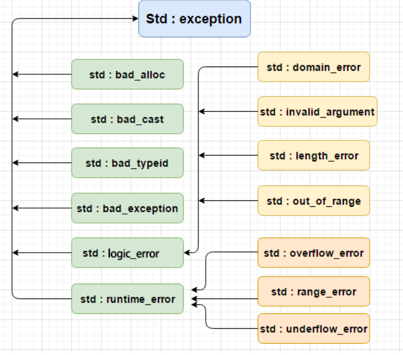

<center><font size = 45>C++基础</font></center>

## 基础知识

#### 变量声明和定义

- 声明仅仅是把变量的声明的位置及类型提供给编译器，并不分配内存空间；定义要在定义的地方为其分配存储空间。
- 相同变量可以再多处声明（外部变量`extern`），但只能在一处定义。例如：`extern int val;`

#### 左值与右值

放在赋值操作符左边为**左值**，可以放到赋值操作符右边为**右值**。

1. 有些变量即可以当左值，也可以当右值。
2. 左值为Lvalue，L代表Location，表示内存可以寻址，可以赋值。
3. 右值为Rvalue，R代表Read，就是可以知道它的值，比如`int temp = 10`; `temp`在内存中有地址，10没有，但是可以Read到它的值。

#### 命名空间

1. `::` **作用域运算符**

   - 全局作用域符（`::name`）：用于类型名称（类、类成员、成员函数、变量等）前，表示作用域为全局命名空间. `::a使用全局变量a`
   - 类作用域符（`class::name`）：用于表示指定类型的作用域范围是具体某个类的
   - 命名空间作用域符（`namespace::name`）:用于表示指定类型的作用域范围是具体某个命名空间的

2. **命名空间**

   C++引入关键字`namespace`（命名空间/名字空间/名称空间），可以有效解决软件开发中**命名冲突**的工程问题。

   - 命名空间可以嵌套命名空间
   - 声明和实现可以分开
   - 命名空间别名：`namespace shortname =  veryLongName;`
   - 无名命名空间，即`namespace{}`，意味着命名空间中的标识符只能在本文件内访问，相当于给这个标识符加上了static。

3. `using`**声明** 

   使得某个特定命名空间中所有名字都可见，这样我们就无需再为它们添加任何前缀限定符了，使用方式如下：
   
   1. `using` 声明语句一次只引入命名空间的一个成员。它使得我们可以清楚知道程序中所引用的到底是哪个名字。`using namespace_name::name;`
   
   2. 在 C++11 中，派生类能够重用其直接基类定义的构造函数。
   
      ```c++
      class Derived : Base {
      public:
          using Base::Base;
          /* ... */
      };
      ```

#### RTTI

Run-Time Type Identification,**运行时类型检查**，在C++层面主要体现在`dynamic_cast`和`typeid`，虚函数表的-1位置存放了指向`type_info`的指针。对于存在虚函数的类型，`typeid`和`dynamic_cast`都会去查询`type_info`

1. **dynamic_cast**

   用于多态类型的转换，目标类型和源对象有**继承关系**。 更准确的说用来检查两者是否有继承关系。语法：`dynamic_cast <新类型> (表达式)`

2. **typeid**

   - `typeid `**运算符**允许在运行时确定对象的类型， 返回一个`type_info` 对象的引用

   - 如果想通过基类的指针获得派生类的数据类型，基类必须带有虚函数
   - 只能获取对象的实际类型

3. **type_info**

   类描述编译器在程序中生成的类型信息。 此类的对象可以有效存储指向类型的名称的指针。` type_info` 类还可存储适合比较两个类型是否相等或比较其排列顺序的编码值。 类型的编码规则和排列顺序是未指定的，并且可能因程序而异。头文件：`<typeinfo>`
   
   ```c++
   #include<typeinfo>
   #include<iostream>
   void fun(){
       int a = 10;
   	type_info &info = typeid(a); 
       std::cout << info.name() << " " << info.raw_name() << " " << info.hash_code() << std::endl;	
   }
   ```

#### 静态连接与动态链接

1. **静态链接**：所谓静态链接就是在编译链接时直接将需要的执行代码拷贝到调用处，优点就是在程序发布的时候就不需要依赖库，也就是不再需要带着库一块发布，程序可以独立执行，但是体积可能会相对大一些。
2. **动态链接**：所谓动态链接就是在编译的时候不直接拷贝可执行代码，而是通过记录一系列符号和参数，在程序运行或加载时将这些信息传递给操作系统，操作系统负责将需要的动态库加载到内存中，然后程序在运行到指定的代码时，去共享执行内存中已经加载的动态库可执行代码，最终达到运行时连接的目的。优点是多个程序可以共享同一段代码，而不需要在磁盘上存储多个拷贝，缺点是由于是运行时加载，可能会影响程序的前期执行性能。

#### 函数指针与指针函数  

1. 函数指针的重点是指针。表示的是一个指针，它指向的是一个函数，例如：`int  (*pf)();`
2. 指针函数的点是函数。表示的是一个函数，它的返回值是指针。例如：`int*  fun();  `

#### 数组指针与指针数组  

1. 指针数组的重点是数组。表示的是一个数组，它包含的元素是指针。例如：`int*  ap[8];  `
2. 数组指针的重点是指针。表示的是一个指针，它指向的是一个数组，例如：`int  (*pa)[8];  `

#### 类模板与模板类

1. 类模板的重点是模板。表示的是一个模板，专门用于产生类的模子。例如：`vector，list`
2. 模板类的重点是类。表示的是由一个模板生成而来的类。例如：`vector<int>，vector<char>`


## 数据类型

#### 基本内置数据类型

`1 字节 = 1 byte = 8bit, Byte通常写为大B, Bit通常写为小b`

| **数据类型**            | **占用空间**    | 其它                                                         |
| ----------------------- | --------------- | ------------------------------------------------------------ |
| `char`                  | 1 字节          | -128 到 127 或者 0 到 255                                    |
| `short`                 | 2 字节          |                                                              |
| `int`                   | 4 字节          | -2147483648 到 2147483647                                    |
| `long`                  | 4 字节 / 8 字节 | 32位系统为占用4字节， 64位系统占用为8字节                    |
| `float`                 | 4 字节          | **浮点型存在精度问题的**[链接](https://www.cnblogs.com/SugarLSG/p/3534248.html)， 在比较大小的时候，不能像int整数型那样，直接if(a==b) |
| `double`                | 8 字节          |                                                              |
| `void*`（任意类型指针） | 4 字节 / 8字节  |                                                              |
| `bool`                  | 1 字节          | 只有两个值`true`(1值)/`false`(0值)，给`bool`类型赋值时，会自动转换为`true`(1) / `false`(0) |

**一些基本类型可以使用一个或多个类型修饰符进行修饰**：

- `signed`
- `unsigned`
- `short`
- `long` : `long int`4字节/8字节； `long long ` 8 字节；`long long int` 8 字节

#### 自定义类型

常见的自定义类型（即复合类型）有：

1. 结构体：`struct`，是由一批数据组合而成的一种新的数据类型。
2. 共用体（联合体）:`union`，有多个数据成员，但是在任意时刻只有**一个数据成员可以有值**
3. 枚举：`enum`，将变量的值一一列举出来

**其它**：使用关键字 `typedef` 可以定义一个新名字，但不能创建新类型

#### 数据类型转换

##### 隐式类型转换

隐式转换指的是不需要用户干预，编译器私下进行的类型转换行为。

1. 对于**内置类型**，低精度的变量给高精度变量赋值会发生隐式类型转换，例如：`double a = int b;`
2. 对于只存在**单个参数的构造函数的对象构造来说**，函数调用可以直接使用该参数传入，编译器会自动调用其构造函数生成临时对象

##### 显示类型转换

1. `const_cast`：用于将`const`变量转为非`const`

2. `static_cast `：用于各种隐式转换，比如非`const`转`const`，`void*`转指针等, `static_cast`能用于多态向上转化，如果向下转能成功但是不安全，结果未知
   
   - 向上转换：指的是子类向基类的转换
   - 向下转换：指的是基类向子类的转换
   
3. `dynamic_cast`：用于动态类型转换。只能用于含有虚函数的类，用于类层次间的向上和向下转化。只能转指针或引用。向下转化时，如果是非法的对于指针返回NULL，对于引用抛异常。要深入了解内部转换的原理

   ```c++
   // A derived B    -------    A -> B
   B *b = new B();
   A *a = dynamic_cast<A *>(b);
   ```

4. `reinterpret_cast`：几乎什么都可以转，比如将int转指针，可能会出问题，尽量少用

5. `bad_cast`：由于强制转换为引用类型失败，`dynamic_cast `运算符引发` bad_cast` 异常


## 关键字 

**关键字**是C++中预先保留的单词（标识符）

| asm        | do           | if               | return      | typedef  |
| ---------- | ------------ | ---------------- | ----------- | -------- |
| auto       | double       | inline           | short       | typeid   |
| bool       | dynamic_cast | int              | signed      | typename |
| break      | else         | long             | sizeof      | union    |
| case       | enum         | mutable          | static      | unsigned |
| catch      | explicit     | namespace        | static_cast | using    |
| char       | export       | new              | struct      | virtual  |
| class      | extern       | operator         | switch      | void     |
| const      | false        | private          | template    | volatile |
| const_cast | float        | protected        | this        | wchar_t  |
| continue   | for          | public           | throw       | while    |
| default    | friend       | register         | true        |          |
| delete     | goto         | reinterpret_cast | try         |          |

#### sizeof

`sizeof(object/type_name)`其作用是返回一个对象或类型所占的内存字节数。其是**关键字也是操作符不是函数**，类似于`++ -- >=...`

1. 结构体`sizeof`：涉及到字节对齐问题。

   `#pragma pack(n)` 设定结构体、联合以及类成员变量以 n 字节方式对齐

   - 结构体内成员按照声明顺序存储，第一个成员地址和整个结构体地址相同。
   - 未特殊说明时，按结构体中size最大的成员对齐（若有double成员），按8字节对齐。

2. 数组`sizeof`值：等于数组所占用的内存字节数

3. 指针`sizeof`：指针是用来记录另一个对象的地址，所以指针的内存大小等于计算机内部地址总线的宽度。在32位系统中指针变量的返回值必定是4字节

4. `strlen`和`sizeof`区别：

   - `sizeof`是运算符，`strlen`是字符串操作的库函数 
   - `sizeof`得到的是内存空间占用的大小，`strlen`得到是字符串的长度

#### const

1. 修饰变量，修饰变量常量，该值不可以改变，语法：`const  数据类型 常量名 = 常量值`
2. 修饰指针存在三种情况
   1. 常量指针：修饰指针 `const int *p = &a`，此时指针指向可以改变，值不可以变，修饰的为`int *`
   2. 指针常量：修饰常量`int * const p = &a` ，此时指针指向不可以变，值可以改变 ，修饰的为`p`
   3. 既修饰常量，又修饰指针`const int * const p = &a`，此时都不可改变
3. `const`修饰成员函数，表明函数调用不会对对象做出任何更改，事实上，如果确认不会对对象做更改，就应该为函数加上`const`限定，这样无论`const`对象还是普通对象都可以调用该函数。

#### this

1. `this` 指针是一个隐含于每一个非静态成员函数中的特殊指针。它指向调用该成员函数的那个对象。
2. 当对一个对象调用成员函数时，编译程序先将对象的地址赋给`this`指针，然后调用成员函数，每次成员函数存取数据成员时，都隐式使用 `this` 指针。
3. 当一个成员函数被调用时，自动向它传递一个隐含的参数，该参数是一个指向这个成员函数所在的对象的指针。
4. `this` 指针被隐含地声明为: `ClassName* const this`，这意味着不能给 this 指针赋值；在 `ClassName` 类的 `const` 成员函数中，`this` 指针的类型为：`const ClassName* const`，这说明不能对 this 指针所指向的这种对象是不可修改的（即不能对这种对象的数据成员进行赋值操作）；
5. `this` 并不是一个常规变量，而是个右值，所以不能取得 `this` 的地址（不能 `&this`）。
6. 在以下场景中，经常需要显式引用 this 指针：
   - 为实现对象的链式引用；
   - 为避免对同一对象进行赋值操作；
   - 在实现一些数据结构时，如`list`

#### static

1. **修饰普通变量**，分为全局和局部，修改变量的存储区域和生命周期，使变量存储在静态区，在 `main 函数`运行前就分配了空间，如果有初始值就用初始值初始化它，如果没有初始值系统用默认值初始化它。
2. **修饰普通函数**，表明函数的作用范围，仅在定义该函数的文件内才能使用。防止与他人命名空间里的函数重名，可以将函数定位为 `static`。
3. **修饰成员变量**，修饰成员变量使所有的对象只保存一个该变量，而且不需要生成对象就可以访问该成员。
4. **修饰成员函数**，修饰成员函数使得不需要生成对象就可以访问该函数，但是在 `static 函数`内不能访问非静态成员。

#### inline

1. 相当于把内联函数里面的内在调用内联函数处展开；
2. 相当于不用执行进入函数的步骤，直接执行函数体；
3. 相当于宏，却比宏多了类型检查，真正具有函数特性；
4. 一般不推荐包含循环、递归、`switch` 等复杂操作的内联函数；
5. 在类声明中定义的函数，除了虚函数的其他函数都会自动隐式地当成内联函数。

#### virtual与inline

1. 虚函数可以是内联函数，内联是可以修饰虚函数的，但是当**虚函数表现多态性的时候不能内联**。
2. 内联是在编译期进行编译器内联，而虚函数的多态性在运行期，编译器无法知道运行期调用哪个代码，因此虚函数表现为多态性时（运行期）不可以内联。
3. `inline virtual` 唯一可以内联的时候是：编译器知道所调用的对象是哪个类（如 `Base::who()`），这只有在编译器具有实际对象而不是对象的指针或引用时才会发生。

#### volatile

1. `volatile`定义变量的值是易变的，每次用到这个变量的值的时候都要去重新读取这个变量的值，而不是读寄存器内的备份。
2. 多线程中被几个任务共享的变量需要定义为`volatile`类型。

#### new、delete

1. `new`：在堆区开辟空间，返回地址即该数据对应的类型的指针，`delete`：释放空间
2. 若使用`new[]`开辟空间，则对应需要`delete[]`释放空间
3. 与`malloc`和`free`的区别
   - `malloc`和`free`是标准库函数，支持覆盖；`new`和`delete`是运算符，并且支持重载。
   - `malloc`仅仅分配内存空间，`free`仅仅回收空间，不具备调用构造函数和析构函数功能，用`malloc`分配空间存储类的对象存在风险；`new`和`delete`除了分配回收功能外，还会调用构造函数和析构函数。
   - `malloc`和`free`返回的是`void`类型指针（必须进行类型转换），`new`和`delete`返回的是具体类型指针。

#### typedef

可以用` typedef` 为一个**已有的类型**取一个新的名字，不能创建新类型，发生于编译阶段。语法：`typedef type newname; `

#### extern "C"

`extern "C"` 的作用是让 C++ 编译器将 `extern "C"` 声明的代码当作 C 语言代码处理，避免 C++ 因符号修饰导致代码不能和C语言库中的符号进行链接的问题。

##### 原因：

**由于c++中需要支持函数重载**，所以c和c++中对同一个函数经过编译后生成的函数名是不相同的，这就导致了一个问题，如果在c++中调用一个使用c语言编写模块中的某个函数，那么c++是根据c++的名称修饰方式来查找并链接这个函数，那么就会发生链接错误，如下所示：

```
c函数: void MyFunc(){}， 被编译成函数: MyFunc
c++函数: void MyFunc(){}， 被编译成函数: _Z6Myfuncv
```

#### extern 

用于修改函数` [extern] 函数类型 函数名(函数参数表)`，表示此函数是外部函数，可以被其他文件中的函数调用。一般情况下`extern`省略，即没`static`修饰都是外部函数

#### explicit

即显式关键字，**禁止通过构造函数进行的隐式转换**。声明为`explicit`的构造函数不能在隐式转换中使用。

1. `explicit `修饰构造函数时，可以防止隐式转换和复制初始化
2. 是针对单参数的构造函数(或者除了第一个参数外其余参数都有默认值的多参构造)而言。
3. `explicit `修饰转换函数时，可以防止隐式转换，但按语境转换除外

#### decltype 

语法：`decltype ( expression )`

`decltype `关键字用于检查实体的声明类型或表达式的类型及值分类。

#### auto 

编译器可以根据初始值自动推导出类型。但是不能用于函数传参以及数组类型的推导，类似的关键字还有`decltype`。

#### assert

断言，是宏，而非函数。assert 宏的原型定义在 `<assert.h>`（C）、`<cassert>`（C++）中，其作用是如果它的条件返回错误，则终止程序执行。可以通过定义 `NDEBUG` 来关闭 assert，但是需要在源代码的开头，`include <assert.h>` 之前。


## 数组

更加详细的内容请参考[链接](https://blog.csdn.net/qq_28114615/article/details/86434837)

#### 数组类型

##### 一维数组

定义 `数据类型 数组名[] = {值1, 2}`

在一维数组中，数组A的元素`A[i]`的地址`&A[i]=A+L*i`,其中`A`为数组的标识符（数组名），也可用`A`来代表数组的首地址，`L`为数组`A`的数据类型，由此可见，对于一维数组，只需要知道数据类型大小和索引`i`，就可以知道`A[i]`的地址，从而访问`A[i]`

##### 二维数组

定义 `数据类型 数组名[][列数] = {值1, 2, 3, 4}`

二维数组，**实际上也是一维数组**，只不过这个一维数组的每个元素都是一个一维数组。因此，将二维数组的每一行看做一个元素（行指针），很容易可以知道**二维数组中各元素在内存中是按行优先进行连续存储的**


由此也可得到二维数组中元素`A[i][j]`的地址为`&A[i][j]=A+L*（C*i+j)`，其中`A`为二维数组`A`的标识符（数组名），也就是数组的首地址，`L`为数组元素的数据类型，`C`为二维数组的列数。由此可见，要知道二维数组中某一元素的地址，**必须知道数据类型大小以及二维数组的列数**

#### 利用指针访问数组

##### 数组地址

1. `A`是数组第一个**元素的首地址**，`&A`是数组的地址，虽然二者值是一样，但含义不同
2. `A+1`实际是加上`sizeof(元素类型)`访问下一个元素，而`&A+1`则加上`sizeof(数组)`
3. 二维数组则`A`表示数组地址，`A[0]`则表示第一行，`A+i`就是第`i`行`A[i]`的行首地址了

明白上述基础后，由于指针就是地址，后续指针访问数组也较好理解。

##### 通过指针访问一维数组

```c++
int a[4] = {1,2,3,4};
int *p = a;
```

##### 通过指针访问二维数组

1. **指向元素的指针**

   ```c++
   int a[3][4] = {{1,2,3,4},{5,6,7,8},{9,10,11,12}};
   int *p = &a[0][0];
   ```

   二维数组是按行优先存储的, 对于数组元素的访问可类似于一维数组，所以可以通过访问，即`a[i][j]=*(p+i*c+j)`,`c`为二维数组的列数

2. **指向行指针**

   数组实际上都是一维的，`a`一定是数组第一个元素的地址，将`a`看做一维数组后它的每一个元素实际上是每一行，因此如果让指针变量`p`指向`a`，就相当于让p指向第0行。

   ```c++
   int a[3][4] = {{1,2,3,4},{5,6,7,8},{9,10,11,12}};
   int *p[i] = a[i]; //随意写，每一行都有一个指针
   ```

   因此，对于有`r`行的二维数组，就需要定义`r`个指针指向每一行，这样其实就可以定义一个装有`r`个指针的数组，其中每一个指针分别指向二维数组的每一行, 因此`p[i]`即指向数组的第i行，即`a[i][j]=*(p[i]+j)`

   这里`p`是以指针作为元素的数组，也就是**指针数组**。

3. **指向数组指针**

   ```c++
   int a[3][4] = {{1,2,3,4},{5,6,7,8},{9,10,11,12}};
   int (*p)[4] = a;
   ```

   这里`p`的含义也就不难得出了：**指向一个有四个元素的数组的首地址**。可以理解为`(*p)[4] 和 a[4]`,`a[i][j]`的地址就是`(p+i)+j，a[i][j]=*(*(p+i)+j)`

#### 指针数组和数组指针

1. **指针数组**：首先它是一个数组**，数组的元素都是指针**，它是“储存指针的数组”的简称。

2. **数组指针**，**首先它是一个指针**，它指向一个数组。

   

## 函数

#### 函数重载

同一个作用域下，**函数名可以相同**，函数参数**类型不同** 或者 **个数不同** 或者 **顺序不同**，返回值不可以作为函数重载的条件

##### 原理

编译器为了实现函数重载，也是默认为我们做了一些幕后的工作，编译器用不同的参数类型来修饰不同的函数名，例如：当碰到`void func(int x)`,编译器可能将函数名修饰为`_func_int`

##### 注意

1. 引用可作为重载条件

   ```c++
   void func(int &a){}
   void func(const int &a){}
   ```

2. 函数重载碰到函数默认参数，可能会产生歧义需要避免

   ```c++
   void MyFunc(string a);
   void MyFunc(string a, int b = 20);
   MyFunc("hello") //同时匹配以上两个函数，产生二义性
   ```

#### 函数参数

1. 在C语言中，`int fun() `表示返回值为`int`，接受任意参数的函数，`int fun(void)` 表示返回值为int的无参函数。
2.  在C++ 中，`int fun() `和`int fun(void)` 具有相同的意义，都表示返回值为`int`的无参函数。
3. 函数的默认参数从左向右，如果一个参数设置了默认参数，那么这个参数之后的参数都必须设置默认参数
4. 在声明函数时，可以设置占位参数。占位参数只有参数类型声明，而没有参数名声明`int fun(int a, int)`。一般情况下，在函数体内部无法使用占位参数。

#### 函数指针

1. ##### 定义

   **函数指针是指向函数的指针变量。**函数指针本身首先是一个指针变量，该指针变量指向一个具体的函数。这正如用指针变量可指向整型变量、字符型、数组一样，这里是指向函数。每一个函数都有一个入口地址，该入口地址就是函数指针所指向的地址。

2. ##### 用途

   调用函数和做函数的参数，比如回调函数。

3. ##### 示例：

   ```c++
   char* fun(char * p) {…}    // 函数fun
   char* (*pf)(char * p);     // 函数指针pf
   pf = fun;            // 函数指针pf指向函数fun
   pf(p);              // 通过函数指针pf调用函数fun
   ```

4. **指针函数与函数指针**

   - **指针函数**：其实是返回值为指针的函数，例如`char *fun()`
   - **函数指针**：每个函数都有一个入口地址，将该入口地址赋值给一个指针，通过该指针即可以调用这个函数 `char (*fp)(int x)`
   

#### 字符串操作函数

1. `strcpy`：将字符串`str2`复制到字符串`str1`中，并覆盖`str1`原始字符串，可以用来为字符串变量赋值

2. `strlen`：计算字符串`str1`的长度

3. `strcat`：将字符串`str2`添加到字符串`str1`的尾部，也就是拼接两个字符串

4. `strcmp`：比较两个字符串，如果两个字符串相等，则返回0

5. `strchr`：在`str`字符串中查找首次出现字符`c`的位置（从字符串的首地址开始查找）

6. 常出现如何实现上述函数的实现代码？

   ...


#### 其它函数

1. `fork`

   创建一个和当前进程映像一样的进程可以通过`fork()`系统调用。

   若父进程产生子进程使用`fork`拷贝出来一个父进程的副本，此时只拷贝了父进程的页表，两个进程都读同一块内存，当有进程写的时候使用写实拷贝机制分配内存
   
2. `wait`

   fork从父进程返回子进程的pid，从子进程返回0.调用了wait的父进程将会发生阻塞，直到有子进程状态改变,执行成功返回0，错误返回-1。

3. `exec`

   exec函数可以加载一个二进制文件去替换父进程，从此父进程和子进程就可以运行不同的程序了。

   exec执行成功则子进程从新的程序开始运行，无返回值，执行失败返回-1

   

## 指针

#### 基本概念

**指针的作用：** 简单的说指针就是地址，可以通过指针间接访问内存，

**野指针：**就是指向一个已删除的对象或者未申请访问受限内存区域的指针

#### 智能指针

**头文件**：`#include <memory>`，智能指针的作用是管理一个指针，**可以避免申请的空间在函数结束时忘记释放**，造成内存泄漏。

C++里面的四个智能指针: `auto_ptr, shared_ptr, weak_ptr, unique_ptr`其中**后三个是c++11支持**，而**第一个已经被C++11弃用**

##### 原理

**智能指针就是一个类**，当超出了类的作用域类会自动调用析构函数，析构函数会自动释放资源。所以智能指针的作用原理就是在函数结束时自动释放内存空间，不需要手动释放内存空间

##### 分类

1. `auto_ptr`（c++98的方案，cpp11已经抛弃）

   采用所有权模式。`p2 = p1`，`p2`剥夺`p1`的所有权当程序运行时访问`p1`将会报错。因此其存在潜在的内存崩溃问题

2. `unique_ptr`（替换`auto_ptr`）

   实现独占式拥有或严格拥有概念，保证同一时间内只有一个智能指针可以指向该对象。

3. `shared_ptr`

   实现共享式拥有概念。多个智能指针可以指向相同对象，该对象和其相关资源会在“最后一个引用被销毁”时候释放。它使用计数机制来表明资源被几个指针共享，使用`use_count()`来查看资源的所有者个数。该引用计数的内存在堆上分配。当新增一个时引用计数加1，当过期时引用计数减一。只有引用计数为0时，智能指针才会自动释放引用的内存资源。当两个对象相互使用一个`shared_ptr`成员变量指向对方，会造成循环引用，使引用计数失效导致**内存泄漏**。使用`weak_ptr`解决

4. `weak_ptr`

   是一种不控制对象生命周期的智能指针, 它指向一个 `shared_ptr` 管理的对象. 进行该对象的内存管理的是那个强引用的` shared_ptr`. `weak_ptr`只是提供了对管理对象的一个访问手段。`weak_ptr` 设计的目的是为配合 `shared_ptr` 而引入的一种智能指针来协助`shared_ptr` 工作, 它只可以从一个 `shared_ptr` 或另一个 `weak_ptr `对象构造, 它的构造和析构不会引起引用记数的增加或减少。`weak_ptr`是用来解决`shared_ptr`相互引用时的死锁问题,如果说两个`shared_ptr`相互引用,那么这两个指针的引用计数永远不可能下降为0,资源永远不会释放。它是对对象的一种弱引用，不会增加对象的引用计数，和`shared_ptr`之间可以相互转化，`shared_ptr`可以直接赋值给它，它可以通过调用`lock函数`来获得`shared_ptr`

#### 易混概念

1. `int *p[10]`表示指针数组，强调数组概念，是一个数组变量，数组大小为10，数组内每个元素都是指向`int`类型的指针变量
2. `int (*p)[10]`表示数组指针，强调是指针，只有一个变量，是指针类型，不过指向的是一个`int`类型的数组，这个数组大小是10
3. `int *p(int)`是函数声明，函数名是`p`，参数是int类型的，返回值是`int `类型的。
4. `int (*p)(int)`是函数指针，强调是指针，该指针指向的函数具有`int`类型参数，并且返回值是`int`类型的


## 引用

**实质**上是一段连续内存空间的别名，**语法：**`数据类型 &别名 = 原名`，**引用的本质**就是在c++内部实现是一个指针常量`Type * const p = &a`

1. 必须在声明引用变量时进行初始化，初始化后值不可以改变

3. 引用做函数参数

4. 引用做函数返回值，不可返回局部变量引用

##### 左值引用

常规引用，一般表示对象的身份。

##### 右值引用

右值引用就是必须绑定到右值（一个临时对象、将要销毁的对象）的引用，一般表示对象的值。

右值引用可实现转移语义（Move Sementics）和精确传递（Perfect Forwarding），它的主要目的有两个方面：

- 消除两个对象交互时不必要的对象拷贝，节省运算存储资源，提高效率。
- 能够更简洁明确地定义泛型函数。

##### 常引用

- 常引用可以理解为常量指针，形式为`const typename & refname = varname`
- 常引用下，原变量值不会被别名所修改
- 原变量的值可以通过原名修改
- 常引用通常用作只读变量别名或是形参传递

##### 引用折叠

- `X& &`、`X& &&`、`X&& &` 可折叠成 `X&`
- `X&& &&` 可折叠成 `X&&`


## 指针与引用的区别

##### 引用

C++是C语言的继承，它可进行过程化程序设计，又可以进行以抽象数据类型为特点的基于对象的程序设计，还可以进行以继承和多态为特点的面向对象的程序设计。引用就是C++对C语言的重要扩充。引用就是某一变量的一个别名，对引用的操作与对变量直接操作完全一样。引用的声明方法：`类型标识符 &引用名=目标变量名;`，引用引入了对象的一个同义词。定义引用的表示方法与定义指针相似，只是用`&`代替了`*`。

##### 指针

指针利用地址，它的值直接指向存在电脑存储器中另一个地方的值。由于通过地址能找到所需的变量单元，可以说，地址指向该变量单元。因此，将地址形象化的称为“指针”。意思是通过它能找到以它为地址的内存单元。

##### 区别

1. 指针有自己的一块空间，而引用只是一个别名；
2. 使用`sizeof`看一个指针的大小是4，而引用则是被引用对象的大小；
3. 指针可以被初始化为`NULL`，而引用必须被初始化且必须是一个已有对象的引用；
4. 作为参数传递时，指针需要被解引用才可以对对象进行操作，而直接对引用的修改都会改变引用所指向的对象；
5. 可以有`const`指针，但是没有`const`引用；
6. 指针在使用中可以指向其它对象，但是引用只能是一个对象的引用，不能 被改变；
7. 指针可以有多级指针`**p`，而引用至于一级；
8. 指针和引用使用`++`运算符的意义不一样；
9. 如果返回动态内存分配的对象或者内存，必须使用指针，引用可能引起内存泄露。


## 联合体/共用体

联合`union`是一种节省空间的特殊的类，`union `以有多个数据成员，但是在任意时刻只有**一个数据成员可以有值**。当某个成员被赋值后其他成员变为未定义状态。联合有如下特点：

- 默认访问控制符为 `public`
- 可以含有构造函数、析构函数
- 不能含有引用类型的成员
- 不能继承自其他类，不能作为基类
- 不能含有虚函数
- 匿名 `union` 在定义所在作用域可直接访问 `union` 成员
- 匿名 `union` 不能包含 `protected` 成员或` private `成员
- 全局匿名联合必须是静态`static`的


## 枚举

将变量的值一一列举出来，变量的值只限于列举出来的值的范围内。

1. 在枚举值表中应列出所有可用值，也称为枚举元素。
2. 枚举值是常量，不能在程序中用赋值语句再对它赋值。
3. 枚举元素本身由系统定义了一个表示序号的数值从0开始顺序定义为0，1，2 …


## 结构体

结构体是由一批数据组合而成的一种新的数据类型。

#### 结构体创建

```c++
struct tag { 
    member-list
    member-list 
    member-list  
    ...
} variable-list ;
```

#### 内存布局

##### 偏移量

一旦结构体定义下来，则结构体的成员内存布局也定下来

```c++
void myFun(){
    stu *s = new stu();
    int offsize1 = (int)&(s->b) - (int)s;	//输出结果都为4， 为b属性成员相对首地址的偏移
    int offsize2 = offsetof(stu, b);
}
```

##### 字节对齐

理论上讲，对于任何变量的访问都可以从任何地址开始访问，但是事实上不是如此，实际上访问特定类型的变量只能在特定的地址访问，这就需要各个变量在空间上按一定的规则排列， 而不是简单地顺序排列，这就是**内存对齐。**

**原因：**cpu将内存当成多个块，每次从内存中读取一个块，这个块的大小可能是2、4、8、16等，如果没有对齐，为了避免访问一个变量可能产生二次访问。

**手动设定：**`#pragma pack(4)`，强行按照4字节进行对齐

**未设定：**首先按最大属性占用的内存进行对齐，其它属性内存占用则看成是**连续的**

```c++
struct stu {	//按最大字节double为8字节进行对齐， int + char = 5字节，按8字节对齐，因此sizeof(stu) = 16;
    int a;
    char b;
    double c;
};
struct stu {   //按最大字节double为8字节进行对齐， int与char不连续，都需要按8字节对齐，因此sizeof(stu) = 24;
    int a;
   	double c;
    int b;
};
```


## 位域

类可以将其（非静态）数据成员定义为位域，语法：`Bit mode : 2`, `mode占 2 位`，在一个位域中含有一定数量的二进制位。当一个程序需要向其他程序或硬件设备传递二进制数据时，通常会用到位域。

```c++
struct stu {
  int a : 2;
  int b : 2;
};
```

1. 位域在内存中的布局是与机器有关的
2. 位域的类型必须是整型或枚举类型，带符号类型中的位域的行为将因具体实现而定
3. 取地址运算符`（&）`不能作用于位域，任何指针都无法指向类的位域


## 预处理

#### 文件包含

`#incude<>`和`#include ""`区别：

- `""` 表示系统先在`file1.c`所在的当前目录找`file1.h`，如果找不到，再按系统指定的目录检索。

- `< > `表示系统直接按系统指定的目录检索。

#### 宏定义

宏在编译时完成替换 ，宏定义可以实现类似于函数的功能，但是它终归不是函数，而宏定义中括弧中的“参数”也不是真的参数，在宏展开的时候对 “参数” 进行的是一对一的替换。

1. ##### 宏定义和函数区别
   
   - 宏在编译时完成替换，之后被替换的文本参与编译，相当于直接插入了代码，运行时不存在函数调用，执行起来更快；函数调用在运行时需要跳转到具体调用函数。
   - 宏函数属于在结构中插入代码，没有返回值；函数调用具有返回值。
   - 宏函数参数没有类型，不进行类型检查；函数参数具有类型，需要检查类型。
   - 宏函数不要在最后加分号。
2. ##### 宏定义和const区别
   
   - 宏替换发生在编译阶段之前，属于文本插入替换；`const`作用发生于编译过程中。
   - 宏不检查类型；`const`会检查数据类型。
   - 宏定义的数据没有分配内存空间，只是插入替换掉；`const`定义的变量只是值不能改变，但要分配内存空间。
3. ##### 宏定义和typedef区别
   
   - 宏主要用于定义常量及书写复杂的内容；`typedef`主要用于定义类型别名。
   - 宏替换发生在编译阶段之前，属于文本插入替换；`typedef`是编译的一部分。
   - 宏不检查类型；`typedef`会检查数据类型。
   - 宏不是语句，不在在最后加分号；`typedef`是语句，要加分号标识结束。
   - 注意对指针的操作，`typedef char * p_char`和`#define p_char char *`区别巨大。
4. ##### 宏定义和内联函数区别
   
   - 在使用时，宏只做简单字符串替换（编译前）。而内联函数可以进行参数类型检查（编译时），且具有返回值。
   - 内联函数本身是函数，强调函数特性，具有重载等功能。
   - 内联函数可以作为某个类的成员函数，这样可以使用类的保护成员和私有成员。而当一个表达式涉及到类保护成员或私有成员时，宏就不能实现了。

#### 条件编译

让编译器只对满足条件的代码进行编译

```c++
#ifdef     标识符
     语句序列
[#else
     语句序列]
#endif
```


## 文件操作

#### 文件类型

1. **文本文件** - 文件以文本的**ASCII码形式存储在计算机中**

2. **二进制文件** - 文件以文本的**二进制**形式存储在计算机中，用户一般不能直接读懂它们

#### 流

1. 输入/输出流

    `iostream`标准库，它提供了 `cin `和 `cout` 方法分别用于从标准输入读取流和向标准输出写入流。

2. 文件流

   - `ofstream`：该数据类型表示输出文件流，用于创建文件并向文件写入信息。
   - `ifstream`：该数据类型表示输入文件流，用于从文件读取信息。
   - `fstream`：该数据类型通常表示文件流，且同时具有`ofstream`和`ifstream`两种功能，可以创建文件，向文件写入信息，从文件读取信息。

#### 文件打开模型

| 模式标志   | 描述                                                         |
| ---------- | ------------------------------------------------------------ |
| ios::app   | 追加模式。所有写入都追加到文件末尾。                         |
| ios::ate   | 文件打开后定位到文件末尾。                                   |
| ios::in    | 打开文件用于读取。                                           |
| ios::out   | 打开文件用于写入。                                           |
| ios::trunc | 如果该文件已经存在，其内容将在打开文件之前被截断，即把文件长度设为 0。 |


## 异常

异常是程序在执行期间产生的问题。C++ 异常是指在程序运行时发生的特殊情况，比如尝试除以零的操作。

三个关键字：`try、catch、throw`

- `throw`: 当问题出现时，程序会抛出一个异常。这是通过使用` throw` 关键字来完成的。
- `catch`: 在您想要处理问题的地方，通过异常处理程序捕获异常。`catch` 关键字用于捕获异常。
- `try`: `try` 块中的代码标识将被激活的特定异常。它后面通常跟着一个或多个 `catch` 块。

#### 标准的异常



| 异常                  | 描述                                                         |
| :-------------------- | ------------------------------------------------------------ |
| std::exception        | 该异常是所有标准 C++ 异常的父类。                            |
| std::bad_alloc        | 该异常可以通过 `new` 抛出。                                  |
| std::bad_cast         | 该异常可以通过 `dynamic_cast` 抛出。                         |
| std::bad_exception    | 这在处理 C++ 程序中无法预期的异常时非常有用。                |
| std::bad_typeid       | 该异常可以通过 `typeid`抛出。                                |
| std::logic_error      | 理论上可以通过读取代码来检测到的异常。                       |
| std::domain_error     | 当使用了一个无效的数学域时，会抛出该异常。                   |
| std::invalid_argument | 当使用了无效的参数时，会抛出该异常。                         |
| std::length_error     | 当创建了太长的 `std::string` 时，会抛出该异常。              |
| std::out_of_range     | 该异常可以通过方法抛出，例如 `std::vector` 和 `std::bitset<>::operator[]()`。 |
| std::runtime_error    | 理论上不可以通过读取代码来检测到的异常。                     |
| std::overflow_error   | 当发生数学上溢时，会抛出该异常。                             |
| std::range_error      | 当尝试存储超出范围的值时，会抛出该异常。                     |
| std::underflow_error  | 当发生数学下溢时，会抛出该异常。                             |

#### 自定义异常

可以通过继承和重载 `exception` 类来定义新的异常。下面的实例演示了如何使用 `std::exception `类来实现自己的异常：

```c++
struct MyException : public exception {
  const char * what () const throw () {
    return "C++ Exception";
  }
};
```


## Makefile

`makefile`定义了一系列的规则来指定哪些文件需要编译，配和`make`命令一起配合使用的


