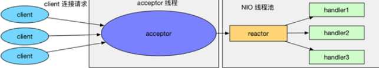

C++深入

## 编译过程

对于C++源文件，从文本到可执行文件一般需要四个过程：

1. **预处理阶段**：对源代码文件中文件包含关系（头文件）、预编译语句（宏定义）进行分析和替换，生成预编译文件。
2. **编译阶段**：将经过预处理后的预编译文件转换成特定汇编代码，生成汇编文件
3. **汇编阶段**：将编译阶段生成的汇编文件转化成机器码，生成可重定位目标文件
4. **链接阶段**：将多个目标文件及所需要的库连接成最终的可执行目标文件

## 内存管理

#### 内存管理分配

在C++中，**虚拟内存分为**：代码段、数据段、BSS段、堆区、文件映射区以及栈区六部分。**内存四区**：栈区、堆区、数据区、代码区

##### 静态区域 

1. **代码段**：包括只读存储区和文本区，其中只读存储区存储字符串常量，文本区存储程序的机器代码。
2. **数据段**：存储程序中已初始化的全局变量和静态变量
3. bss 段：存储未初始化的全局变量和静态变量（局部+全局），以及所有被初始化为0的全局变量和静态变量。

##### 动态区域

1. **堆区**：调用new/malloc函数时在堆区动态分配内存，同时需要调用delete/free来手动释放申请的内存。
2. 映射区:存储动态链接库以及调用mmap函数进行的文件映射
3. **栈区**：使用栈空间存储函数的返回地址、参数、局部变量、返回值

#### 堆与栈的区别

1. **管理方式：**栈是由编译器自动管理；堆分配释放工作由程序员控制，容易产生memory leak。
2. **空间大小：**一般来讲在 32 位系统下，堆内存可以达到4G的空间，堆内存几乎是没有什么限制的。栈有一定的空间大小的
3. **碎片问题：**堆中频繁的`new/delete`势必会造成内存空间的不连续，从而造成大量的碎片。栈是先进后出的队列，不可能有内存块从栈中间弹出
4. **生长方向：**堆的生长方向是向上的，向着内存地址增加的方向；栈的生长方向是向下的，向着内存地址减小的方向增长。
5. **分配方式：**堆都是动态分配的，没有静态分配的堆。栈有2种分配方式：静态分配和动态分配。静态分配是编译器完成的，比如局部变量的分配。动态分配由 malloc 函数进行分配，但是栈的动态分配和堆是不同的，他的动态分配是由编译器进行释放，无需我们手工实现。
6. **分配效率：**栈是机器系统提供的数据结构，计算机会在底层对栈提供支持：分配专门的寄存器存放栈的地址，压栈出栈都有专门的指令执行，这就决定了栈的效率比较高。堆则是 C/C++ 函数库提供的，它的机制是很复杂的，例如为了分配一块内存，库函数会按照一定的算法（具体的算法可以参考数据结构/操作系统）在堆内存中搜索可用的足够大小的空间，如果没有足够大小的空间（可能是由于内存碎片太多），就有可能调用系统功能去增加程序数据段的内存空间，这样就有机会分到足够大小的内存，然后进行返回。显然，堆的效率比栈要低得多。

#### 内存泄露（memory leak）

内存泄漏是指由于疏忽或错误造成了程序未能释放掉不再使用的内存的情况。内存泄漏并非指内存在物理上的消失，而是应用程序分配某段内存后，由于设计错误，失去了对该段内存的控制，因而造成了内存的浪费。

##### 内存泄漏的分类：

1. **堆内存泄漏** （Heap leak）。对内存指的是程序运行中根据需要分配通过`malloc,realloc new`等从堆中分配的一块内存，再是完成后必须通过调用对应的 `free`或者`delete` 删掉。如果程序的设计的错误导致这部分内存没有被释放，那么此后这块内存将不会被使用，就会产生Heap Leak.
2. **系统资源泄露**（Resource Leak）。主要指程序使用系统分配的资源比如 Bitmap,handle ,SOCKET等没有使用相应的函数释放掉，导致系统资源的浪费，严重可导致系统效能降低，系统运行不稳定。
3. **没有将基类的析构函数定义为虚函数**。当基类指针指向子类对象时，如果基类的析构函数不是`virtual`，那么子类的析构函数将不会被调用，子类的资源没有正确是释放，因此造成内存泄露。

##### 判断内存泄露

1. 可以使用linux环境下的内存泄漏检查工具Valgrind，mtrace
2. 写代码时可以添加内存申请和释放的统计功能，统计当前申请和释放的内存是否一致，

#### 段错误

段错误通常**发生在访问非法内存地址**的时候，具体来说分为以下几种情况：

1. 使用野指针
2. 试图修改字符串常量的内容

#### malloc

`malloc`函数用于动态分配内存

##### 原理

1. **内存申请**：`malloc`其采用内存池的方式，先申请大块内存作为堆区，然后将堆区分为多个内存块，以块作为内存管理的基本单位。当用户申请内存时，直接从堆区分配一块合适的空闲块。
2. **链式管理**：`malloc`采用隐式链表结构将堆区分成连续的、大小不一的块，包含已分配块和未分配块；同时malloc采用显示链表结构来管理所有的空闲块，即使用一个双向链表将空闲块连接起来，每一个空闲块记录了一个连续的、未分配的地址。
3. **分配合并**：当进行内存分配时，`malloc`会通过隐式链表遍历所有的空闲块，选择满足要求的块进行分配；当进行内存合并时，`malloc`采用边界标记法，根据每个块的前后块是否已经分配来决定是否进行块合并。

##### 系统调用 

`malloc`在申请内存时，一般会通过brk或者mmap系统调用进行申请。其中当申请内存小于128K时，会使用系统函数brk在堆区中分配；而当申请内存大于128K时，会使用系统函数mmap在映射区分配

## 网络编程——NIO 

#### 传统多线程模型

1. **原始型**：每个请求都将导致服务器阻塞。即服务器用一个while循环，不断监听端口是否有新的套接字连接，如果有，那么就调用一个处理函数处理，那么后面的请求只能被阻塞。导致无法并发，效率太低，服务器的吞吐量太低
2. **多线程并发模型**：对于每一个请求都分发给一个线程，每个线程中都独自处理上面的流程。但是创建线程是需要比较高的系统资源的，如果连接数太高，系统无法承受，而且线程的反复创建-销毁也需要代价
3. **多线程并发模型连接池**：使用一个连接池来管理上述的线程，避免反复创建和销毁

#### IO多路复用

IO复用模型在阻塞IO模型上多了一个`select`函数，`select`函数有一个参数是文件描述符集合，意思就是对这些的文件描述符进行循环监听，当某个文件描述符就绪的时候，就对这个文件描述符进行处理。在单线程模型中，可以采用I/O复用来提高单线程处理多个请求的能力，然后再采用事件驱动模型，基于异步回调来处理事件

##### 原理

IO多路复用就是我们说的`select，poll，epoll。select/epoll`的好处就在于单个进程就可以同时处理多个网络连接的IO。它的基本原理就是`select，poll，epoll`这些函数会不断的轮询所负责的所有`socket`。也就是说，I/O 多路复用的特点是通过一种机制一个进程能同时等待多个文件描述符，而这些文件描述符（套接字描述符）其中的任意一个进入读就绪状态，`select()`函数就可以返回。

##### 调用 

1. `select`

   `select`：是最初解决IO阻塞问题的方法。用结构体`fd_set`来告诉内核监听多个文件描述符，该结构体被称为描述符集。由数组来维持哪些描述符被置位了。对结构体的操作封装在三个宏定义中。通过轮寻来查找是否有描述符要被处理。

   **问题**：

   - 内置数组的形式使得`select`的最大文件数与`FD_SIZE`受限
   - 每次调用`select`前都要重新初始化描述符集，将fd从用户态拷贝到内核态，每次调用`select`后，都需要将fd从内核态拷贝到用户态；
   -  轮寻排查当文件描述符个数很多时，效率很低；

2. `poll`

   `poll`通过一个**可变长度的数组**解决了`select`文件描述符受限的问题。**数组中元素是结构体**，该结构体保存描述符的信息，每增加一个文件描述符就向数组中加入一个结构体，结构体只需要拷贝一次到内核态。`poll`解决了`select`重复初始化的问题，但是轮寻排查的问题未能解决。

3. `epoll`

   轮寻排查所有文件描述符的效率不高，使服务器并发能力受限。因此，`epoll`采用只返回状态发生变化的文件描述符，便解决了轮寻的瓶颈。`epoll`对文件描述符的操作有两种模式：`LT`和`ET`

   **模式**

   - `LT`模式，默认模式

     `LT(level triggered)`是缺省的工作方式，并且同时支持`block`和`no-block socket`。在这种做法中，内核告诉你一个文件描述符是否就绪了，然后你可以对这个就绪的fd进行IO操作。如果你不作任何操作，内核还是会继续通知你的。

   - `ET`模式

     `ET(edge-triggered)`是高速工作方式`only-once`，只支持`no-block socket`。在这种模式下，当描述符从未就绪变为就绪时，内核通过`epoll`告诉你。然后它会假设你知道文件描述符已经就绪，并且不会为那个文件描述符发送更多的就绪通知，直到你做了某些操作导致那个文件描述符不再为就绪状态

#### Reactor设计模型

`Reactor`模式是一种以事件驱动为核心的机制。在`Reactor`模式中，应用程序不是主动的调用某个API完成处理，而是逆置了事件处理流程，应用程序需要提供相应的事件接口并注册到`Reactor`上，如果相应的事件发生，`Reactor`将主动调用应用程序注册的接口，通过注册的接口完成具体的事件处理。

##### 组件

1. `Reactor`：负责响应IO事件，当检测到一个新的事件，将其发送给相应的Handler去处理；新的事件包含连接建立就绪、读就绪、写就绪等。
2. `Handler`:将自身（handler）与事件绑定，负责事件的处理，完成channel的读入，完成处理业务逻辑后，负责将结果写出channel。

