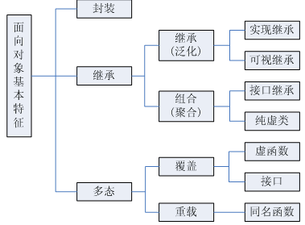

<center><font size = 45>C++面向对象</font></center>



C++面向对象的三大特性为：**封装、继承、多态**

**类和对象**的理解：类是某种类型的事物的特征表现，对象是类的实例，万事万物都皆为对象，对象上有其属性和行为

## 类(class)

**类**是某一种类型的事物的特征表现，语法：`class 类名{访问权限：属性/方法};`

**构造函数与析构函数：**默认情况下，c++编译器至少给一个类添加3个函数，**默认构造函数**，**默认析构函数**，**默认拷贝构造函数（对属性进行值拷贝**），如果用户定义有参构造函数，c++不在提供默认无参构造，但是会提供默认拷贝构造，如果用户定义拷贝构造函数，c++不会再提供其他构造函数

#### 成员

**分类**：成员包括**成员变量和成员函数**

**空间占用**

1. 类内的成员变量和成员函数**分开存储**，只有**非静态成员变量**才属于类的对象上占用对象空间，函数和静态成员不占对象空间。
2. 编译器加入的额外成员变量（如指向虚函数表的指针)
3. 为了边缘对齐优化加入的padding

**const修饰成员：**成员函数后加const后我们称为这个函数为**常函数**，常函数内不可以修改成员属性，但成员属性声明时加**关键字mutable**后，在常函数中依然可以修改。声明对象前加const称该对象为常对象常对象只能调用常函数

#### 构造函数

主要作用在于**创建对象**时为对象的**成员属性赋值**，编译器默认提供构造函数（空实现）

1. **语法：**`类名(){}`，其函数名称与类名相同，没有返回值也不写void，可以有参数可发生重载

2. **分类**

   1. 有参构造和无参构造

   2. 普通构造和拷贝构造 

      ```c++
      Person(const Person &p){	//拷贝构造
          this->age = p.age;
      }
      ```

3. **调用方式**

   1. 显示法：`Person p = Person(10);`
   2. 括号法：`Person p1(10);`, 
   3. 隐式转换法`Person p1 = 10; // 就是Person p = Person(10);`

   特别地：**无参构造函数不能加括号**，加了编译器认为这是一个函数声明；**不能利用拷贝构造函数初始化匿名对象**

4. **初始化方式**

   **语法：** `构造函数(参数1, 参数2, ...)：属性1(参数1),属性2（参数2）... {}`

   ```c++
   Person(int a, int b, int c):m_a(a), m_b(b), m_c(c){}
   ```

#### 析构函数

主要作用在于对象**销毁前**系统自动调用，执行一些清理工作

1. **语法**：`~类名(){}`其函数名称与类名相同前面加上`~`符号，没有返回值也不写void，不能重载。

2. **执行顺序**

   派生类本身的析构函数；对象成员析构函数；基类析构函数。

3. **虚析构函数**

   将可能会被继承的父类的析构函数设置为虚函数`virtual ~类名`，可以保证当我们new一个子类，然后使用基类指针指向该子类对象，释放基类指针时可以释放掉子类的空间，防止内存泄漏。C++默认的析构函数不是虚函数是因为虚函数需要额外的**虚函数表和虚表指针**，占用额外的内存。而对于不会被继承的类来说，其析构函数如果是虚函数，就会浪费内存。因此C++默认的析构函数不是虚函数，而是只有当需要当作父类时，设置为虚函数。

#### 静态成员

静态成员就是在成员变量和成员函数前加上关键字static，称为静态成员，也称类成员。调用`类名::静态成员`，不需要创建实例对象

1. 静态成员变量：所有对象共享同一份数据；在编译阶段分配内存；类内声明，类外初始化
2. 静态成员函数：所有对象共享同一个函数；静态成员函数只能访问静态成员变量

#### this指针

1. **this指针**指向被调用的成员函数所属的对象
2. **作用：**
   1. 当形参和成员变量同名时，可用this指针来区分
   2. 在类的非静态成员函数中返回对象本身，可**使用return *this**

#### 其它

1. ##### struct与class的区别

   在C++中，可以用struct和class定义类，都可以继承。区别在于：structural的默认**继承权限和默认访问权限**是public，而class的默认继承权限和默认访问权限是private，class还可以定义模板类形参，比如template <class T, int i>。

2. ##### 深拷贝与浅拷贝

   **浅拷贝**：简单的赋值拷贝操作； **深拷贝**：在堆区重新申请空间，进行拷贝操作

3. **空指针对象调用**

   空指针，可以调用成员函数，但是如果成员函数中用到了this指针，就不可以了

   ```c++
   void method{
       Person *p = NULL;
       p->methodName(); // 空指针，可以调用成员函数
   }
   ```
   
4.  **如何定义一个只能在堆上（栈上）生成对象的类**

   1. **只能在栈上**：将析构函数设置为私有

      原因：C++ 是静态绑定语言，编译器管理栈上对象的生命周期，编译器在为类对象分配栈空间时，会先检查类的析构函数的访问性。若析构函数不可访问，则不能在栈上创建对象。

   2. **只能在栈上**：将 new 和 delete 重载为私有

      原因：在堆上生成对象，使用 new 关键词操作，其过程分为两阶段：第一阶段，使用 new 在堆上寻找可用内存，分配给对象；第二阶段，调用构造函数生成对象。将 new 操作设置为私有，那么第一阶段就无法完成，就不能够在堆上生成对象。

5. **`delete this`合法**

   1. 必须保证 this 对象是通过 `new`（不是 `new[]`、不是 placement new、不是栈上、不是全局、不是其他对象成员）分配的
   2. 必须保证调用 `delete this` 的成员函数是最后一个调用 this 的成员函数
   3. 必须保证成员函数的 `delete this` 后面没有调用 this 了
   4. 必须保证 `delete this` 后没有人使用了

6. **如何让一个类不能实例化？**

   将类定义为抽象基类或者将构造函数声明为private。

7. **如何让main函数之前执行函数？**

   1)C++中在main函数之前定义一个全局对象，调用构造函数。

   2) C语言中使用gcc的attribute关键字，声明constructor和destructor。

## 友元类

友元的目的就是让一个函数或者类**访问另一个类中私有成员**，关键字`friend`

**特性：**能访问私有成员，破坏封装性，友元关系不可传递、单向性，友元声明的形式及数量不受限制

友元的**三种实现**：**全局函数做友元，类做友元，成员函数做友元**

1. **全局函数做友元**

   ```c++
   public class Clazz{
       friend void friendMethod(Clazz *clazz);
   private:
       string value;
   };
   void friendMethod(Clazz *clazz){
       cout << clazz->value << endl;
   }
   ```

2. **类做友元**

3. **成员函数做友元**

## 运算符重载

运算符重载概念：**对已有的运算符重新进行定义**，赋予其另一种功能，以适应不同的数据类型1

1. **加号运算符重载**
2. **移位运算符重载**
3. **递增运算符重载**
4. **赋值运算符重载**
5. **关系运算符重载**
6. **调用运算符重载**

## 封装

把客观事物封装成抽象的类，并且类可以把自己的数据和方法只让可信的类或者对象操作，对不可信的进行信息隐藏。**关键字：public, protected, private。不写默认为 private。**

1. **public** :可以被任意实体访问
2. **protected**：只允许被子类及本类的成员函数访问
3. **private**：只允许被本类的成员函数、友元类或友元函数访问

## 继承

下级别的成员除了拥有上一级的共性，还有自己的特性。**可以减少重复的代码**

**语法：**`class 子类 : 继承方式 父类;`

**继承模型**：父类中私有成员也是被子类继承下去了，只是由编译器给隐藏后访问不到

**构造与析构：**继承中 先调用父类构造函数，再调用子类构造函数，析构顺序与构造相反

**同名成员：**

1. 子类对象可以直接访问到子类中同名成员
2. 子类对象加作用域可以访问到父类同名成员
3. 当子类与父类拥有同名的成员函数，子类会隐藏父类中同名成员函数，加作用域可以访问到父类中

##### 继承方式

1. **公共继承**：基类的公有成员和保护成员作为派生类的成员时，它们都保持原有的状态，而基类的私有成员仍然是私有的
2. **保护继承**：基类的所有公有成员和保护成员都成为派生类的保护成员，并且只能被它的派生类成员函数或友元访问，基类的私有成员仍然是私有的
3. **私有继承**：基类的公有成员和保护成员都作为派生类的私有成员，并且不能被这个派生类的子类所访问

**多继承**

`class 子类 ：继承方式 父类1 ， 继承方式 父类2...`，多继承可能会引发父类中有同名成员出现，需要加作用域区分

**虚继承**

`class Sheep : virtual public Animal {};`

虚继承用于解决多继承条件下的菱形继承问题（浪费存储空间、存在二义性）。

底层实现原理与编译器相关，一般通过**虚基类指针**和**虚基类表**实现，每个虚继承的子类都有一个虚基类指针（占用一个指针的存储空间，4字节）和虚基类表（不占用类对象的存储空间）（需要强调的是，虚基类依旧会在子类里面存在拷贝，只是仅仅最多存在一份而已，并不是不在子类里面了）；当虚继承的子类被当做父类继承时，虚基类指针也会被继承。

实际上，vbptr 指的是虚基类表指针（virtual base table pointer），该指针指向了一个虚基类表（virtual table），虚表中记录了虚基类与本类的偏移地址；通过偏移地址，这样就找到了虚基类成员，而虚继承也不用像普通多继承那样维持着公共基类（虚基类）的两份同样的拷贝，节省了存储空间。

## 多态

**多态分类：**

1. **静态多态：**重载， 函数重载和运算符重载属于静态多态，复用函数名，编译阶段确定函数地址

2. **动态多态：** **动态多态是用虚函数机制实现的**。一个父类类型的指针指向一个子类对象时候，使用父类的指针去调用子类中重写了的父类中的虚函数的时候，会调用子类重写过后的函数

   ```c++
   class Animal{
   public:
       virtual void speak(){
           cout << "animal speak" << endl;
       }
   };
   class Cat : public Animal{
   public:
       void speak(){
           cout << "cat speak" << endl;
       }
   }
   int main(){
       Animal *animal = new Cat();
       animal->speak(); // cout << cat speak << endl;
       delete animal;
   }
   ```
   
3. **参数多态性**（编译期）：类模板、函数模板

4. **强制多态**（编译期/运行期）：基本类型转换、自定义类型转换

##### 虚函数

虚函数的实现`virtual 类型 函数名(参数列表)`：在有虚函数的类中，类的最开始部分是一个虚函数表的指针，这个指针指向一个**虚函数表，表中放了虚函数的地址**，实际的虚函数在代码段中。当子类继承了父类的时候也会继承其虚函数表，当子类重写父类中虚函数时候，会将其继承到的虚函数表中的地址替换为重新写的函数地址。使用了虚函数，会增加访问内存开销，降低效率。

**纯虚函数**

**语法：**`virtual 返回值类型 函数名 （参数列表）= 0 ;`纯虚函数是一种特殊的虚函数，在基类中不能对虚函数给出有意义的实现，而把它声明为纯虚函数，它的实现留给该基类的派生类去做。

##### 虚析构函数

虚析构函数是为了解决基类的指针指向派生类对象，并用基类的指针删除派生类对象。

##### 虚函数与纯虚函数

1. 类里如果声明了虚函数，这个函数是实现的，哪怕是空实现，它的作用就是为了能让这个函数在它的子类里面可以被覆盖（override），这样的话，编译器就可以使用后期绑定来达到多态了。纯虚函数只是一个接口，是个函数的声明而已，它要留到子类里去实现。
2. 虚函数在子类里面可以不重写；但纯虚函数必须在子类实现才可以实例化子类。
3. 虚函数的类用于 “实作继承”，继承接口的同时也继承了父类的实现。纯虚函数关注的是接口的统一性，实现由子类完成。
4. 带纯虚函数的类叫抽象类，这种类不能直接生成对象，而只有被继承，并重写其虚函数后，才能使用。抽象类被继承后，子类可以继续是抽象类，也可以是普通类。
5. 虚基类是虚继承中的基类，具体见下文虚继承。

##### 虚函数指针、虚函数表

1. **虚函数指针**：在含有虚函数类的对象中，指向虚函数表，在运行时确定。
2. **虚函数表**：在程序只读数据段，存放虚函数指针，如果派生类实现了基类的某个虚函数，则在虚表中覆盖原本基类的那个虚函数指针，在编译时根据类的声明创建。

## 抽象类

通常父类中虚函数的实现是毫无意义的，主要都是调用子类重写的内容，因此可以将虚函数改为**纯虚函数**。**当类中有了纯虚函数，这个类也称为抽象类**

**特点：**

1. 无法实例化对象
2. 子类必须重写抽象类中的纯虚函数，否则也属于抽象类

##### 虚析构和纯虚析构

多态使用时，如果子类中有属性开辟到堆区，那么父类指针在释放时无法调用到子类的析构代码，将父类中的析构函数改为**虚析构**或者**纯虚析构**

1. **相同点：**用来解决通过父类指针释放子类对象
2. **区别：**
   - 虚析构语法：`virtual ~类名(){}`
   - 纯虚析构语法：`virtual ~类名() = 0; `
   - 如果是纯虚析构，该类属于抽象类，无法实例化对象

## 接口类

仅含有纯虚函数的抽象类

## 模板

为了提高复用性，**将类型参数化**。作用：(1)实现泛型；(2)对参数进行限制；(3)根据参数进行优化；

#### 函数模板

建立一个通用函数，其函数返回值类型和形参类型可以不具体制定，用一个**虚拟的类型**来代表。` <>`括号中的参数叫模板形参，`template`和`class`是关键字，`class`可以用`typename `关键字代替

```c++
template<typename T> 
//函数声明或定义
```

##### 使用函数模板

1. 自动类型推导
2. 显示指定类型 `mySwap<int>(a, b); `

#### 类模板

建立一个通用类，类中的成员 数据类型可以不具体制定，用一个**虚拟的类型**来代表。类模板中的成员函数在调用时才创建

```c++
template<typename T> 
//类
```

##### 类模板对象做函数参数

1. **指定传入的类型** `void myPrint(Person<string, int> &p) `,使用比较广泛

2. **参数模板化**

   ```c++
   template<class T1, class T2>
   void myPrint(Person<T1, T2> &p){}
   ```

3. **整个类模板化**  

   ```c++
   template<class T>
   void myPrint(T &p){
       p.myPrint();
   }
   ```

##### 类模板与继承

当子类继承的父类是一个类模板时，子类在声明的时候，要指定出父类中T的类型，如果不指定，编译器无法给子类分配内存，如果想灵活指定出父类中T的类型，子类也需变为类模板

##### 类模板与虚函数

- 模板类中可以使用虚函数
- 一个类（无论是普通类还是类模板）的成员模板（本身是模板的成员函数）不能是虚函数

#### 函数模板与类模板的区别

1. 类模板没有自动类型推导的使用方式

   ```c++
   // Person p1("name", 20) //错误， 类模板使用时候，不可以使用自动类型推导
   Person<string, int> p1("name", 20) //正确，必须使用显示类型指定方式
   ```

2. 类模板在模板参数列表中可以有默认参数 `template<class ageType, class nameType = string>`