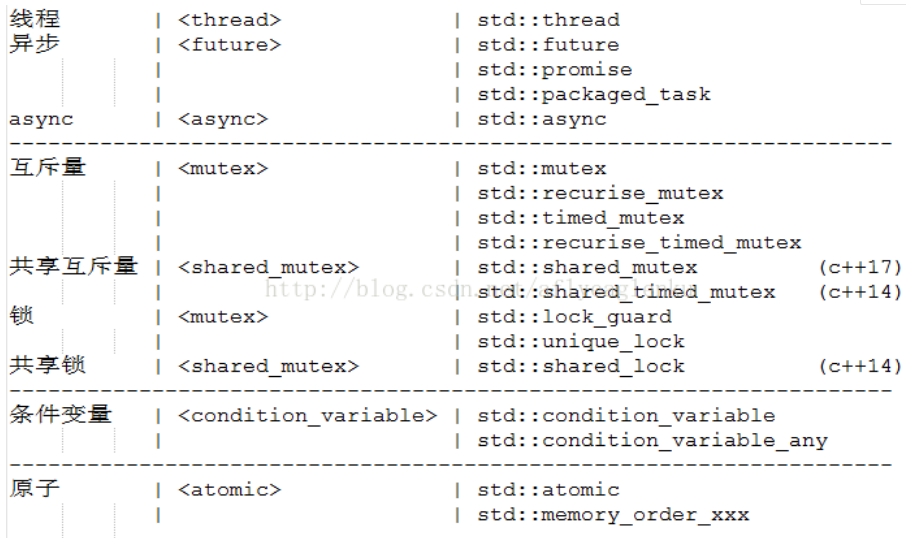
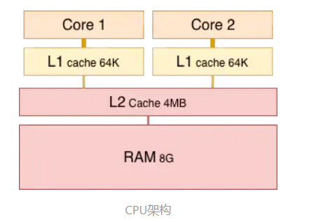
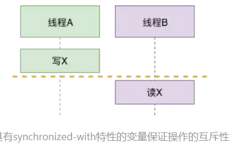

<center><font size = 45>C++并发</font></center>

## 基本概念

1. **并发**：同一时间段，多个任务都在执行 (单位时间内不一定同时执行)，宏观上同时执行

2. **并行**：单位时间内，多个任务同时执行

3. **进程**

   进程是程序的一次执行过程，是系统运行程序的基本单位，因此进程是动态的。系统运行一个程序即是一个进程从创建，运行到消亡的过程。

4. **线程**

   线程与进程相似，但线程是一个比进程更小的执行单位。一个进程在其执行的过程中可以产生多个线程。与进程不同的是同类的多个线程共享进程的资源

5. **上下文切换**

   CPU 采取的策略是为每个线程分配时间片并轮转的形式。当一个线程的时间片用完的时候就会重新处于就绪状态让给其他线程使用，这个过程就属于一次上下文切换。概括来说就是：当前任务在执行完 CPU 时间片切换到另一个任务之前会先保存自己的状态，以便下次再切换回这个任务时，可以再加载这个任务的状态。**任务从保存到再加载的过程就是一次上下文切换**。

6. **同步**

   发出一个功能调用时，在没有得到结果之前，该调用就不返回。也就是必须一件一件事做，等前一件做完了才能做下一件事.

7. **异步**

   异步的概念和同步相对。当一个异步过程调用发出后，调用者不能立刻得到结果。实际处理这个调用的部件在完成后，通过状态、通知和回调来通知调用者

8. **阻塞** 

   阻塞调用是指调用结果返回之前，当前线程会被挂起。调用线程只有在得到结果之后才会返回。

9. **非阻塞**

   非阻塞调用指在不能立刻得到结果之前，该调用不会阻塞当前线程。

##### 线程与进程的区别

线程是进程划分成的更小的运行单位。线程和进程最大的不同在于基本上各进程是独立的，而各线程则不一定，因为同一进程中的线程极有可能会相互影响。线程执行开销小，但不利于资源的管理和保护；而进程正相反

##### 锁机制

1. **悲观锁**，**悲观锁认为自己在使用数据的时候一定有别的线程来修改数据，因此在获取数据的时候会先加锁**，确保数据不会被别的线程修改

2. **乐观锁** ，**乐观锁认为自己在使用数据时不会有别的线程修改数据，所以不会添加锁，**只是在更新数据的时候去判断之前有没有别的线程更新了这个数据，**最常采用的是CAS算法**

3. **CAS**（Compare And Swap）

   CAS的原理是拿期望的值和原本的一个值作比较，如果相同则更新成新的值。即每次修改时都需要拿期望值去比较

##### 阻塞非阻塞同步异步的区别

同步和异步关注的是消息通信机制，而阻塞和非阻塞关注的是程序在等待调用结果（消息，返回值）时的状态


## 多线程相关

##### `pthread.h`

`pthread.h`是标准库，C++11没有添加多线程之前的在Linux上用的多线程库

##### `windows.h`

在windows上的多线程支持要包含`windows.h`

##### `std::thread`

原先使用多线程只能用系统的API，无法解决跨平台问题。从C++11开始语言层面上的多线程，标准库里已经包含了对线程的支持，`std::thread`是C++11标准库中的多线程的支持库C++11 新标准中引入了五个头文件来支持多线程编程

它们分别是 `<atomic>, <thread>, <mutex>, <condition_variable>` 和 `<future>`。



1. `<thread>`：该头文件主要声明了 `std::thread` **线程类**，另外 `std::this_thread` 命名空间也在该头文件中。
2. `<future>`：**异步类相关**，该头文件主要声明了 `std::promise`, `std::package_task` 两个 Provider 类，以及 `std::future` 和 `std::shared_future` 两个 Future 类，另外还有一些与之相关的类型和函数，`std::async()` 函数就声明在此头文件中。
4. `<mutex>`：该头文件主要声明了**与互斥量(Mutex)相关的类**，包括 `std::mutex_*` 一系列类，`std::lock_guard`, `std::unique_lock`, 以及其他的类型和函数。
5. `<condition_variable>`：该头文件主要声明了**与条件变量相关的类**，包括 `std::condition_variable` 和 `std::condition_variable_any`。
5. `<atomic>`：该头文主要声明了两个类, `std::atomic` 和 `std::atomic_flag`，另外还声明了一套 C 风格的原子类型和与 C 兼容的**原子操作的函数**。


## 线程的状态

#### 生命周期

1. 新建状态：创建了一个线程之后,该线程就处于新建状态
2. 就绪状态：启动方法之后,该线程处于就绪状态
3. 运行状态 ：处于就绪状态的线程获得了CPU资源，开始运行
4. 阻塞状态：线程主动放弃CPU资源 
5. 线程死亡：线程结束

#### 线程死锁

线程死锁描述的是这样一种情况：多个线程同时被阻塞，它们中的一个或者全部都在等待某个资源被释放。由于线程被无限期地阻塞，因此程序不可能正常终止。如下图所示，线程 A 持有资源 2，线程 B 持有资源 1，他们同时都想申请对方的资源，所以这两个线程就会互相等待而进入死锁状态。


死锁必须具备以下四个条件：

1. 互斥条件：该资源任意一个时刻只由一个线程占用。
2. 请求与保持条件：一个进程因请求资源而阻塞时，对已获得的资源保持不放。
3. 不剥夺条件:线程已获得的资源在末使用完之前不能被其他线程强行剥夺，只有自己使用完毕后才释放资源。
4. 循环等待条件:若干进程之间形成一种头尾相接的循环等待资源关系

#### 避免线程死锁

我上面说了产生死锁的四个必要条件，为了避免死锁，我们只要破坏产生死锁的四个条件中的其中一个就可以了。现在我们来挨个分析一下：

1. **破坏互斥条件** ：这个条件我们没有办法破坏，因为我们用锁本来就是想让他们互斥的（临界资源需要互斥访问）。
2. **破坏请求与保持条件** ：一次性申请所有的资源。
3. **破坏不剥夺条件** ：占用部分资源的线程进一步申请其他资源时，如果申请不到，可以主动释放它占有的资源。
4. **破坏循环等待条件** ：靠按序申请资源来预防。按某一顺序申请资源，释放资源则反序释放。破坏循环等待条件。


## thread 线程

`std::thread` **代表了一个线程对象，** 在 `<thread>` 头文件中声明。`<thread>` 头文件主要声明了 `std::thread` 类，声明了 `swap`，`get_id`，`yield`，`sleep_until` 以及 `sleep_for` 等辅助函数

| 构造函数               | 声明                                                         | 意义                                                         |
| ---------------------- | ------------------------------------------------------------ | ------------------------------------------------------------ |
| 默认构造函数           | thread() noexcept;                                           | 创建一个空的 `std::thread` 执行对象                          |
| 初始化构造函数         | template <class Fn, class... Args> explicit thread(Fn&& **fn**, Args&&... **args**); | 创建一个 `std::thread` 对象，该 `std::thread` 对象可被 `joinable`，新产生的线程会调用 `fn` 函数，该函数的参数由 `args` 给出。 |
| 拷贝构造函数 [deleted] | thread(const thread&) = delete;                              | 被禁用，意味着 `std::thread` 对象不可拷贝构造。              |
| `Move` 构造函数        | thread(thread&& x) noexcept;                                 | `move `构造函数，调用成功之后 `x` 不代表任何 `std::thread` 执行对象。详情见右值引用、`std::move` |

#### 成员函数

1. `std::thread  joinable()`函数，用于检测线程是否有效。

   `joinable`：代表该线程是可执行线程。

   `not-joinable `：通常一下几种情况会导致线程成为`not-joinable`

   - 由`thread`的缺省构造函数构造而成(`thread()`没有参数)
   - 该`thread`被`move`过（包括`move`构造和`move`赋值）
   - 该线程调用过`join`或者`detach`

2. `join`：创建线程执行线程函数，调用该函数会阻塞当前线程，直到线程执行完`join`才返回。

3. `detach`: 将当前线程对象所代表的执行实例与该线程对象分离，使得线程的执行可以单独进行。`detach`调用之后，目标线程就成为了守护线程，驻留后台运行，与之关联的`std::thread`对象失去对目标线程的关联，无法再通过`std::thread`对象取得该线程的控制权。

4. `get_id`：得到当前线程ID

5. `swap`: 交换两个线程对象所代表的底层句柄。

#### `std::this_thread` 函数

1. `get_id`：得到当前线程ID
2. `yield`: 当前线程放弃执行，操作系统调度另一线程继续执行。
3. `sleep`：`sleep_until` 以及 `sleep_for` 线程休眠至某个指定的时刻或某个时间片段，该线程才被重新唤醒。

```c++
#include <iostream>
#include <utility>
#include <thread>
#include <chrono>
#include <functional>
#include <atomic>
 
void f1(int n)
{
    for (int i = 0; i < 5; ++i) {
        std::cout << "Thread " << n << " executing\n";
        std::this_thread::sleep_for(std::chrono::milliseconds(10));
    }
}
 
void f2(int& n)
{
    for (int i = 0; i < 5; ++i) {
        std::cout << "Thread 2 executing\n";
        ++n;
        std::this_thread::sleep_for(std::chrono::milliseconds(10));
    }
}
 
int main()
{
    int n = 0;
    std::thread t1; // t1 is not a thread
    std::thread t2(f1, n + 1); // pass by value
    std::thread t3(f2, std::ref(n)); // pass by reference
    std::thread t4(std::move(t3)); // t4 is now running f2(). t3 is no longer a thread
    t2.join();
    t4.join();
    std::cout << "Final value of n is " << n << '\n';
}
```


## Mutex 互斥量

#### 互斥量与信号量

1. **互斥量**

   `Mutex` **又称互斥量**也称之为互斥锁，用来保证在任一时刻只能有一个线程访问该对象，每个线程在对资源操作前都尝试先加锁，成功加锁才能操作，操作结束后解锁，C++11 中与` Mutex `**相关的类（包括锁类型）和函数**都声明在 `<mutex>` 头文件中

2. **信号量**

   **互斥量用于线程的互斥**，**信号量用于线程的同步。**信号量是指在互斥的基础上（大多数情况），通过其它机制实现访问者对资源的有序访问。在大多数情况下，同步已经实现了互斥，特别是所有写入资源的情况必定是互斥的。少数情况是指可以允许多个访问者同时访问资源，因此**互斥量值只能为0/1，信号量值可以为非负整数**

#### Mutex 系列类

1. `std::mutex`

   **最基本的 Mutex 类，**该类提供了最基本的上锁和解锁操作。同时，基本的互斥量不允许某个线程在已获得互斥量的情况下重复对该互斥量进行上锁操作，所以重复上锁将会导致死锁（结果通常未定义的）。

2. `std::recursive_mutex`

   **递归 Mutex 类**，与 `std::mutex` 功能基本相同，但是允许互斥量的拥有者（通常是某个线程）重复对该互斥量进行上锁操作而不会产生死锁，但必须保证上锁和解锁的次数相同。

3. `std::time_mutex`

   **定时 Mutex 类，**与 `std::mutex` 功能基本相同，但是提供了两个额外的定时上锁操作，`try_lock_for` 和 `try_lock_until`，即某个线程在规定的时间内对互斥量进行上锁操作，如果在规定的时间内获得了锁则返回 `true`, 超时则返回 `false`，在本章后面的内容中我会介绍`try_lock_for` 和 `try_lock_until`两个上锁函数之间细微的差异。

4. `std::recursive_timed_mutex`

   **定时递归 Mutex 类**，既提供了重复上锁功能，又提供了定时上锁的特性（即在规定的时间内没有获得锁则返回 `false`），相当于 `std::recursive_mutex` 和 `std::time_mutex` 的组合。

#### Lock 类

C++11 标准中定义了两种与互斥量相关的 RAII（资源获取即初始化）技术。

RAII原理：如果希望保持对某个重要资源的跟踪，那么创建一个对象，并将资源生命周期与对象的生命周期相关联。最简单的RAII形式是创建这样一个对象：构造函数中获取一份资源，析构函数中则释放资源

1. `std::lock_guard`

   与 Mutex RAII 相关，方便线程对互斥量上锁。即在某个 `lock_guard` 对象的声明周期内，它所管理的锁对象会一直保持上锁状态；而 `lock_guard` 的生命周期结束之后，它所管理的锁对象会被解锁

2. `std::unique_lock`

   对象以独占所有权的方式管理 `mutex` 对象的上锁和解锁操作，所谓独占所有权，就是没有其他的 `unique_lock` 对象同时拥有某个 `mutex` 对象的所有权。与 Mutex RAII 相关，方便线程对互斥量上锁，但提供了更好的上锁和解锁控制。

#### 锁类型相关的Tag类

1. `std::adopt_lock_t`，一个空的标记类，定义如下：`struct adopt_lock_t {};`，该类型的常量对象`adopt_lock`（`adopt_lock` 是一个常量对象，定义如下：`constexpr adopt_lock_t adopt_lock {};`，`constexpr` 是 C++11 中的新关键字） 通常作为参数传入给 `unique_lock` 或 `lock_guard` 的构造函数。
2. `std::defer_lock_t`，一个空的标记类，定义如下：`struct defer_lock_t {};`，该类型的常量对象`defer_lock`（`defer_lock` 是一个常量对象，定义如下：`constexpr defer_lock_t defer_lock {};`） 通常作为参数传入给`unique_lock` 或 `lock_guard` 的构造函数。
3. `std::try_to_lock_t`，一个空的标记类，定义如下：`struct try_to_lock_t {};`，该类型的常量对象`try_to_lock`（`try_to_lock` 是一个常量对象，定义如下：`constexpr try_to_lock_t try_to_lock {};`） 通常作为参数传入给`unique_lock` 或 `lock_guard` 的构造函数。。

#### 成员函数

1. `std::try_lock`，尝试同时对多个互斥量上锁。线程调用也会出现`lock`的三种情况
2. `std::lock`，同时对多个互斥量上锁。调用线程将锁住该互斥量。线程调用该函数会发生下面 3 种情况：
   - 如果该互斥量当前没有被锁住，则调用线程将该互斥量锁住，直到调用 unlock之前，该线程一直拥有该锁。
   - 如果当前互斥量被其他线程锁住，则当前的调用线程被阻塞住
   -  如果当前互斥量被当前调用线程锁住，则会产生死锁(deadlock)
3. `unlock`， 解锁，释放对互斥量的所有权。
4. `std::call_once`，如果多个线程需要同时调用某个函数，`call_once` 可以保证多个线程对该函数只调用一次


## Condition 条件变量

#### 概念

**条件变量是线程的另外一种同步机制**，这些同步对象为线程提供了会合的场所，即线程交互时的一个线程给另外的一个或者多个线程发送消息，我们指定在条件变量这个地方发生，一个线程用于修改这个变量使其满足其它线程继续往下执行的条件，其它线程则接收条件已经发生改变的信号。C++11利用条件变量 `std::condition_variable` 进行线程同步的应用实例，`Linux` 下使用 `pthread` 库中的 `pthread_cond_*()` 函数提供了与条件变量相关的功能

当 `std::condition_variable` 对象的某个 `wait` 函数被调用的时候，它使用 `std::unique_lock`(封装 `std::mutex`) 来锁住当前线程。当前线程会一直被阻塞，直到另外一个线程在相同的 `std::condition_variable` 对象上调用了 `notification` 函数来唤醒当前线程

#### 函数

1. `wait()`函数

   - `void wait (unique_lock<mutex>& lck);`

     当前线程调用 `wait()` 后将被阻塞(此时当前线程应该获得了锁（`lck`）, 直到另外某个线程调用 `notify_*` 唤醒了当前线程，在线程被阻塞时，该函数会自动调用 `lck.unlock()` 释放锁，使得其他被阻塞在锁竞争上的线程得以继续执行。

   - `template <class Predicate> void wait (unique_lock<mutex>& lck, Predicate pred);`

     设置了 `Predicate`，只有当 `pred` 条件为 `false` 时调用 `wait()` 才会阻塞当前线程，并且在收到其他线程的通知后只有当 `pred` 为 `true` 时才会被解除阻塞。

2. `std::condition_variable::notify_one()`

   唤醒某个等待(`wait`)线程。如果当前没有等待线程，则该函数什么也不做，如果同时存在多个等待线程，则唤醒某个线程是不确定的

3. `std::condition_variable::notify_all()` 

   唤醒所有的等待(`wait`)线程。如果当前没有等待线程，则该函数什么也不做

4. `std::notify_all_at_thread_exit`

   当调用该函数的线程退出时，所有在 cond 条件变量上等待的线程都会收到通知

5. 唤醒所有的等待(`wait`)线程。如果当前没有等待线程，则该函数什么也不做


## Future 异步

异步的概念和同步相对。当一个异步过程调用发出后，调用者不能立刻得到结果。实际处理这个调用的部件在完成后，通过状态、通知和回调来通知调用者。与C++ 11异步任务相关的类主要在`<future>`头文件中，此外 `std::async` 也可以作为异步任务的提供者，不过 `std::async` 并不是类，而是函数

#### 主要类和函数

1. Providers 类：`std::promise`, `std::package_task`
2. Futures 类：`std::future`, `std::shared_future`.
3. Providers 函数：`std::async()`
4. 其他类型：`std::future_error`, `std::future_errc`, `std::future_status`, `std::launch`.

#### 异步任务提供者（Providers)

1. `std::promise`：它可以在某一时刻设置共享状态的值

   `std::promise` 对象可以保存某一类型 T 的值，该值可被 future 对象读取（可能在另外一个线程中），因此 promise 也提供了一种线程同步的手段，在 promise 对象构造时可以和一个共享状态（通常是std::future）相关联，并可以在相关联的共享状态(`std::future`)上保存一个类型为 T 的值。

2. `std::package_task`：它在某一时刻通过调用被包装的任务来设置共享状态的值

   `std::packaged_task` 包装一个可调用的对象，并且允许异步获取该可调用对象产生的结果

3. `std::async()` ：是一个函数

#### Future类

`std::future `用来获取异步任务的结果，因此可以把它当成一种简单的线程间同步的手段。一个有效(`valid`)的 `std::future` 对象通常由三种 Provider 创建，并和某个共享状态相关类


## Atomic 原子类型

原子类型对象的主要特点就是从不同线程访问不会导致数据竞争，意味着多个线程访问同一个资源时，有且仅有一个线程能对资源进行操作。通常情况下原子操作可以通过互斥的访问方式来保证

1. `std::atomic_flag`

   `atomic_flag` 一种简单的原子布尔类型，只支持两种操作，`test_and_set` 和 `clear`。

2. `std::atomic`

   满足其他需求(如 `store`, `load`, `exchange`, `compare_exchange`

   


## 内存模型

#### 分类

1. **静态内存模型**：主要是类(或结构)对象在内存中的布局。也就是类(或结构)成员在内存中是如何存放的。C++11有一些定义及工具用来对内存布局进行操作，更复杂的类(或结构)对象的内存布局请参考Stanley B.Lippman的《深度探索C++对象模型》。
2. **动态内存模型**：是从行为方面来看，多个线程对同一个对象同时读写时所做的约束，该模型理解起来要复杂一些，涉及了内存、Cache、CPU各个层次的交互，尤其是在多核系统中为了保证多线程环境下执行的正确性，需要对读写事件加以严格限制。std::memory_order就是这用来做这事的，它实际上是程序员、编译器以及CPU之间的契约，遵守契约后大家各自优化，从而可能提高程序性能。

#### 为什么需要内存模型 



多核情况下为了获取更高的性能，会对语句进行执行顺序上的优化(类似CPU乱序)。避免方案当然是`std::mutex`，但是当程序对代码执行效率要求很高，`std::mutex`不满足时，就需要`std::atomic`，但`std::atomic`无法发现错误

#### C++11的内存模型

在正式介绍memory_order之前，我们先来看两个概念：synchronized-with和happends-before。

- 行为：**synchronized-with**

  这是std::atomic生效的前提之一。假设X是一个atomic变量。如果线程A写了变量X, 线程B读了变量X，那么我们就说线程A、B间存在synchronized-with关系。C++11默认的原子操作(memory_order_seq_cst)就是synchronized-with的，保证了对X的读和写是互斥的，不会同时发生。

  

- 结果：**happens-before**

   happens-before指明了后发生的动作会看到先发生的动作的结果。还是上图，当线程B读取X时，读到的一定是写入后的X值，而不会是其它情况。happends-before具有*传递性*。如果A happens-before B，B happens-before C，那么A happends-before C

- **4种内存模型**

  | 序号 | 内存模型  | memory_order值                                               | **备注** |
  | ---- | --------- | ------------------------------------------------------------ | -------- |
  | 1    | 宽松      | memory_order_relaxed                                         |          |
  | 2    | 释放-获取 | memory_order_acquire<br/>memory_order_release<br/>memory_order_acq_rel |          |
  | 3    | 释放-消费 | memory_order_consume                                         | C++20起  |
  | 4    | 顺序一致  | memory_order_seq_cst                                         |          |

  1. **宽松**

     在原子变量上采用relaxed ordering的操作不参与synchronized-with关系。Relaxed ordering的限定范围是同线程，在同一线程内对**同一原子变量**的访问不可以被重排，仍保持happens-before关系，但这与别的线程无关(不同线程间的同一原子变量的操作没有happens-before关系)。Relaxed ordering适用于**只要求原子操作，不需要其它同步保障**的情况。该操作典型的应用场景是程序计数器：

  2. **释放-获取**

     Release-acquire中没有全序关系，但它提供了一些同步方法。在这种序列模型下，原子操作对应的内存操作为：

     | 序号 |      原子操作      | 对应的内存操作                 | memory_order枚举值                                           |
     | :--: | :----------------: | ------------------------------ | ------------------------------------------------------------ |
     |  1   |        load        | acquire                        | memory_order_acquire                                         |
     |  2   |       store        | release                        | memory_order_release                                         |
     |  3   | fetch_add exchange | acquire 或 release 或 两者都是 | memory_order_acquire memory_order_release memory_order_acq_rel |
     | ...  |        ...         | ...                            | ...                                                          |

     Release-acquire中同步是成对出现的，仅建立在释放和获取同一原子对象的线程之间。其它线程有可能看到不一样的内存访问顺序。在我们常用的x86系统(强顺序系统)上，释放-获取顺序对于多数操作是自动进行的，无需为此同步模式添加额外的CPU指令。但在弱顺序系统(如ARM)上，必须使用特别的CPU加载或内存栅栏指令。

     Release-acquire有一个特点：线程A中所有发生在release x之前的写操作(包括非原子或宽松原子)，对在线程B acquire x之后都可见。本来A、B间读写操作顺序不定。这么一同步，在x这个点前后，A、B线程之间有了个顺序关系，称作inter-thread happens-before。

     一个释放-获取同步的例子是`std::mutex`：线程A释放锁而线程B获得它时，发生于线程A环境的临界区(释放之前)中的所有内存写入操作，对于线程B(获得之后)均可见。

  3. **释放-消费**

     释放-消费顺序的规范正在修订中，C++标准暂不鼓励使用memory_order_consume。此处不过多介绍

  4. **顺序一致**

     顺序一致性原子操作是全序的，可以看作是释放-获取操作的加强版，它与释放-获取顺序相同的方式排序内存(在一个线程中先发生于存储的任何结果都变成进行加载的线程中的可见副效应)的同时，还对所有内存操作建立单独全序。它意味着将程序看做是一个简单的序列。如果对于一个原子变量的所有操作都是顺序一致的，那么多线程程序的行为就像是这些操作都以一种特定顺序被单线程程序执行。


## 并发数据结构

理解底层数据结构 ，理解底层机制是，加锁还是写CAS，锁的粒度是什么，还是写时拷贝

1. `concurrentqueue`

   


## 应用场景

#### 生产者消费者模型

1. 单对单
2. 单对多
3. 多对单
4. 多对多


## 参考链接

C++11多线程-内存模型：https://www.jianshu.com/p/7d237771dc94

Cplusplus-Concurrency-In-Practice：https://github.com/forhappy/Cplusplus-Concurrency-In-Practice

C++并发编程-博客园：https://www.cnblogs.com/huty/p/8516997.html

