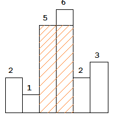

<center><font size = 45>LeetCode</font></center>

## 题序

- [01~10](#01)

- [11~20](#11)

- [21~30](#21)

- [31~40](#31)

- [41~50](#41)

- [51~60](#51)

- [61~70](#61)

- [71~80](#71)

- [81~90](#81)

- [91~100](#91)

- [101~110](#101)

- [111~120](#111)

- [121~130](#121)

- [131~140](#131)

- [141~148](#141)

  

## 01

求给定二叉树的最小深度。最小深度是指树的根结点到最近叶子结点的最短路径上结点的数量。

#### 思路

1. 若节点为空则返回为0，若节点的左右节点为空则返回为1，若节点左节点或右节点为空则返回 1+ run(), 否则返回最小值 

```c++
int run(TreeNode* root) {
    if(root == nullptr)
        return 0;
    else if(root->left == nullptr && root->right == nullptr)
        return 1;
    else if(root->right == nullptr)
        return 1 + run(root->left);
    else if(root->left == nullptr)
        return 1 + run(root->right);
    else
        return 1 + min(run(root->left), run(root->right));
}
```

## 02

计算逆波兰表达式

计算逆波兰式（后缀表达式）的值，运算符仅包含"+","-","*"和"/"，被操作数可能是整数或其他表达式

#### 思路

1. 使用一个栈进行操作，碰到+-*/就取栈顶的两个元素进行操作，否则就将数进行入栈操作

```c++
    int evalRPN(vector<string>& tokens) {
        // write code here
        if(tokens.empty())
            return 0;
        stack<int> stk;
        for(auto x : tokens) {
            if(x == "+" || x == "-" || x == "/" || x == "*") {
                if(stk.size() < 2)
                    return 0;
                int a = stk.top();
                stk.pop();
                int b = stk.top();
                stk.pop();
                int c = 0;
                if(x == "+") 
                    c = a + b;
                else if (x == "-")
                    c = b - a;
                else if (x == "*")
                    c = a * b;
                else 
                    c = b / a;
                stk.push(c);
            } else {
                stk.push(atoi(x.c_str()));
            }
        }
        return stk.top();
    }
```

## 03

#### 思路


```c++

```


## 04

在(nlogn)的时间内使用常数级空间复杂度对链表进行排序

#### 思路

1. 使用归并排序
2. 对链表需要将链表分开即找到中间节点，即使用快慢指针

```c++
 ListNode* sortList(ListNode* head) {
     // write code here
     if(!head || !head->next)
         return head;
     ListNode *p = head;
     ListNode *q = head->next;
     while(q && q->next) {
         p = p->next;
         q = q->next->next;
     }
     ListNode *left = sortList(p->next);
     p->next = nullptr;
     ListNode *right = sortList(head);
     return merge(left, right);
 }

ListNode* merge(ListNode* left, ListNode* right) {
    ListNode* head = new ListNode(0);
    ListNode *p = head;
    while(left && right) {
        if(left->val < right->val) {
            p->next = left;
            left = left->next;
        } else {
            p->next = right;
            right = right->next;
        }
        p = p->next;
    }
    if(left)
        p->next = left;
    if(right)
        p->next = right;
    return head->next;
}
```


## 05


#### 思路


```c++

```


## 06

给出一个二叉树，返回这个二叉树的后序遍历

#### 思路

1. 递归方法
2. 非递归方法，使用栈进行操作

```c++
//method 1
vector<int> res;
vector<int> postorderTraversal(TreeNode* root) {
    // write code here
    if(root != nullptr) {
        if(root->left != nullptr)
            postorderTraversal(root->left);
        if(root->right != nullptr)
            postorderTraversal(root->right);
        res.push_back(root->val);
    }
    return res;
}
//method 2
...
```

## 07

求给定的二叉树的前序遍历。

#### 思路

1. 递归方法
2. 非递归方法，使用栈进行操作

```c++
//method 1
vector<int> res;
vector<int> preorderTraversal(TreeNode* root) {
    // write code here
    if(root != nullptr) {
        res.push_back(root->val);
        if(root->left != nullptr)
            preorderTraversal(root->left);
        if(root->right != nullptr)
            preorderTraversal(root->right);
    }
    return res;
}
//method 2
...
```


## 08


#### 思路


```c++

```


## 09

将给定的单链表\ L *L*： L_0→L_1→…→L_{n-1}→L_ n*L*0→*L*1→…→*L**n*−1→*L**n*
重新排序为：L_0→L_n →L_1→L_{n-1}→L_2→L_{n-2}→…*L*0→*L**n*→*L*1→*L**n*−1→*L*2→*L**n*−2→…
要求使用原地算法，不能改变节点内部的值，需要对实际的节点进行交换。
例如：
对于给定的单链表{1,2,3,4}，将其重新排序为{1,4,2,3}.

#### 思路

1. 找到链表的中间节点
2. 将后一段链表利用头插头逆序
3. 前后两段链表各进行取一个，合并成新的链表 

```c++

```


## 10

对于一个给定的链表，返回环的入口节点，如果没有环，返回null

拓展：

你能给出不利用额外空间的解法么？

#### 思路

1. 利用map，有环时一定能够找到
2. 使用快慢指针原理，快指针比慢指针多走两步，套圈原理

```c++
//mehtod 1
ListNode *detectCycle(ListNode *head) {
    if(!head)
        return head;
    map<ListNode*, int> node_map;
    ListNode *p = head;
    while(p) {
        auto itor = node_map.find(p);
        if(itor != node_map.end()) {
            return p;
        } else {
            node_map.insert(make_pair(p, 1));
            p = p->next;
        }
    }
    return nullptr;
}
//method 2


```

## 11

判断给定的链表中是否有环，解法与第10题基本类似

扩展：你能给出不利用额外空间的解法么？

#### 思路

1. 利用map，有环时一定能够找到
2. 使用快慢指针原理，快指针比慢指针多走两步，套圈原理

```c++
//method 1
bool hasCycle(ListNode *head) {
    if(!head)
        return head;
    map<ListNode*, int> node_map;
    ListNode* p = head;
    while(p) {
        auto itor = node_map.find(p);
        if(itor != node_map.end()) {
            return true;
        } else {
            node_map.insert(make_pair(p, 1));
            p = p->next;
        }
    }
    return false;
}
//method 2

```


## 12


#### 思路


```c++

```


## 13


#### 思路


```c++

```


## 14

现在有一个整数类型的数组，数组中只有一个元素只出现一次，其余元素都出现三次。你需要找出只出现一次的元素

**注意：**你需要给出一个线性时间复杂度的算法，你能在不使用额外内存空间的情况下解决这个问题么？

#### 思路

1. Single Number的本质，就是用一个数记录每个bit出现的次数，如果一个bit出现两次就归0，这种运算采用二进制底下的位操作^是很自然的。
2. Single Number II中，如果能定义三进制底下的某种位操作，也可以达到相同的效果，Single Number II中想要记录每个bit出现的次数，一个数搞不定就加两个数，用ones来记录只出现过一次的bits，用twos来记录只出现过两次的bits，ones&twos实际上就记录了出现过三次的bits，这时候我们来模拟进行出现3次就抵消为0的操作，抹去ones和twos中都为1的bits。

```c++

```


## 15

现在有一个整数类型的数组，数组中素只有一个元素只出现一次，其余的元素都出现两次。

**注意：**你需要给出一个线性时间复杂度的算法，你能在不使用额外内存空间的情况下解决这个问题么？

#### 思路

1. 使用map来统计元素出现的次数
2. 使用异或，相等的元素进行异或得到是零，因此唯一不重复的数是数组最终异或的结果

```c++
int singleNumber(int* A, int n) {
    // write code here
    if(n == 0)
        return -1;
    int res = 0;
    for(int i = 0; i < n; i++) {
        res ^= A[i];
    }
    return res;
}
```


## 16

有N个小朋友站在一排，每个小朋友都有一个评分

你现在要按以下的规则给孩子们分糖果：

- 每个小朋友至少要分得一颗糖果
- 分数高的小朋友要他比旁边得分低的小朋友分得的糖果多

你最少要分发多少颗糖果？

#### 思路

1. 动态规划
2. 与前面的邻居比较，前向遍历权重数组ratings，如果ratings[i]>ratings[i-1]，则A[i]=A[i-1]+1；
3. 与后面的邻居比较，后向遍历权重数组ratings，如果ratings[i]>ratings[i+1]且A[i] <=A[i+1]+1，则更新A，A[i]=A[i+1]+1；
4. 对A求和即为最少需要的糖果。

```c++
int candy(vector<int>& ratings) {
    // write code here
    if(ratings.empty())
        return 0;
    int *res = new int[ratings.size()];
    for(int i = 0; i < ratings.size(); i++)
        res[i] = 1;
    for(int i = 1; i < ratings.size(); i++) {
        if(ratings[i] > ratings[i-1])
            res[i] = res[i-1] + 1;
    }
    //
    for(int i = ratings.size() - 2; i >= 0; i--) {
        if(ratings[i] > ratings[i+1] && res[i] <= res[i+1])
            res[i] = res[i+1] + 1;
    }
    int sum = 0;
    for(int i = 0; i < ratings.size(); i++) {
        sum += res[i];
    }
    return sum;
}
```


## 17


#### 思路


```c++

```


## 18


#### 思路


```c++

```


## 19


#### 思路


```c++

```


## 20


#### 思路


```c++

```


## 21


#### 思路


```c++

```


## 22

给定一个二叉树，请计算节点值之和最大的路径的节点值之和是多少。
这个路径的开始节点和结束节点可以是二叉树中的任意节点
例如：
给出以下的二叉树，

返回的结果为6

#### 思路

1. 广度遍历， 每一层的结果等当前结果乘以10，加上下一层的左右节点的值 
2. 深度遍历，使用堆栈

```c++
//method 1
int sumNumbers(TreeNode* root) {
    // write code here
    int res = 0;
    if(root == nullptr) {
        return res; 
    }
    return preorder_traverse(root, res);
}

int preorder_traverse(TreeNode* root, int res) {
    if(root == nullptr)
        return 0;
    res = res * 10 + root->val;
    if(root->left == nullptr && root->right == nullptr)
        return res;
    return preorder_traverse(root->left, res) + preorder_traverse(root->right, res);
}

//method 2
```


## 23


#### 思路


```c++

```


## 24


#### 思路


```c++

```


## 25


#### 思路


```c++

```


## 26


#### 思路


```c++

```


## 27


#### 思路


```c++

```


## 28


#### 思路


```c++

```


## 29


#### 思路


```c++

```


## 30


#### 思路


```c++

```


## 31

给出一个三角形，计算从三角形顶部到底部的最小路径和，每一步都可以移动到下面一行相邻的数字，

例如，给出的三角形如下：

```
[↵     [2],↵    [3,4],↵   [6,5,7],↵  [4,1,8,3]↵]
```

最小的从顶部到底部的路径和是2 + 3 + 5 + 1 = 11。

注意：如果你能只用O（N）的额外的空间来完成这项工作的话，就可以得到附加分，其中N是三角形中的行总数。

#### 思路

1. 

```c++

```


## 32

给出一个索引k，返回杨辉三角的第k行

例如，k=3，

返回[1,3,3,1].

备注：

你能将你的算法优化到只使用O(k)的额外空间吗?

#### 思路

按行进行模拟，先赋入第一行的初始值， 后续的行当为起始或最终的值其为1， 其它均为res[i] = res[i] + res[i-1]

```c++
vector<int> getRow(int rowIndex) {
    // write code here
    vector<int> res= {1};
    if(rowIndex == 0)
        return res;
    for(int i = 1; i <= rowIndex; i++) {
        int row_cnt = i + 1;
        vector<int> v2(row_cnt);
        for(int j = 0; j < row_cnt; j++) {
            if(j == 0 || j == row_cnt - 1)
                v2[j] = 1;
            else
                v2[j] = res[j-1] + res[j];
        }
        res.clear();
        res.assign(v2.begin(), v2.end());
        v2.clear();
    }
    return res;
}
```

## 33

给出一个值numRows，生成杨辉三角的前numRows行

例如，给出 numRows = 5,

```
返回     [1],↵    [1,1],↵   [1,2,1],↵  [1,3,3,1],↵ [1,4,6,4,1]↵]
```

#### 思路

1. 按行进行模拟，先赋入第一行的初始值， 后续的行当为起始或最终的值其为1， 其它均为res[i] = res[i] + res[i-1]

```c++
vector<vector<int> > generate(int numRows) {
    // write code here
    vector<vector<int>> res;
    if(numRows == 0)
        return res;
    vector<int> v = {1};
    res.push_back(v);
    for(int i = 1; i < numRows; i++) {
        int rows_cnt = i + 1;
        vector<int> tmp(rows_cnt);
        for(int j = 0; j < rows_cnt; j++) {
            if(j == 0 || j == rows_cnt - 1){
                tmp[j] = 1;
            } else {
                vector<int> v = res[i-1];
                tmp[j] = v[j] + v[j-1];
            }
        }
        res.push_back(tmp);
    }
    return res;
}
```


## 34


#### 思路


```c++

```


## 35


#### 思路


```c++

```


## 36


#### 思路


```c++

```


## 37


#### 思路


```c++

```


## 38


#### 思路


```c++

```


## 39


#### 思路


```c++

```


## 40

给定一个单链表，其中的元素按升序排序，请将它转化成平衡二叉搜索树（BST）

#### 思路

此题相对于41题 ，就是需要找到链表的中间节点，此时可用快慢指针进行查找

```c++

```


## 41

给出一个升序排序的数组，将其转化为平衡二叉搜索树（BST）.

输入
[-1,0,1,2]
输出
{1,0,2,-1}

#### 思路

这道题是二分查找树的题目，要把一个有序数组转换成一颗二分查找树。从本质来看，如果把一个数组看成一棵树（也就是以中点为根，左右为左右子树，依次下去），数组就等价于一个二分查找树。所以如果要构造这棵树，那就是把中间元素转化为根，然后递归构造左右子树。
```c++
TreeNode* sortedArrayToBST(vector<int>& num) {
    // write code here
    if(num.empty())
        return nullptr;
    int left = 0, right = num.size() - 1;
    return getNode(num, left, right);
}

TreeNode* getNode(std::vector<int> num, int left, int right) {
    if(left > right)
        return nullptr;
    if(left == right)
        return new TreeNode(num[left]);
    int mid = left + (right - left + 1) / 2;
    TreeNode *root = new TreeNode(num[mid]);
    root->left = getNode(num, left, mid - 1);
    root->right = getNode(num, mid + 1, right);
    return root;
}
```


## 42

给定一个二叉树，返回该二叉树由底层到顶层的层序遍历，（从左向右，从叶子节点到根节点，一层一层的遍历）

例如：给定的二叉树是{3,9,20,#,#,15,7}, 遍历的结果是：[[15,7],[9,20],[3]]

#### 思路

1. 层序遍历采用队列的思路

```c++

```


## 43

给出一棵树的中序和后序遍历，请构造这颗二叉树

#### 思路


```c++

```


## 44

给出一棵树的前序遍历和中序遍历，请构造这颗二叉树

#### 思路


```c++

```


## 45

求给定二叉树的最大深度，最大深度是指树的根结点到最远叶子结点的最长路径上结点的数量。

#### 思路


```c++

```


## 46

给定一个二叉树，返回该二叉树的之字形层序遍历，（第一层从左向右，下一层从右向左，一直这样交替）
例如：给定的二叉树是{3,9,20,#,#,15,7},

#### 思路


```c++

```


## 47

给定一个二叉树，返回该二叉树层序遍历的结果，（从左到右，一层一层地遍历）
例如：给定的二叉树是{3,9,20,#,#,15,7},

#### 思路


```c++

```


## 48

给定一棵二叉树，判断琪是否是自身的镜像（即：是否对称）

#### 思路

1. 节点的左子树的右子树相等，且左子树的右子树等于右子树的左子树，采用递归进行求解

```c++
bool isSymmetric(TreeNode *root) {
    if(root == nullptr)
        return true;
    return method(root->left, root->right);
}

bool method(TreeNode *left, TreeNode *right) {
    if(left == nullptr && right == nullptr)
        return true;
    if(left == nullptr)
        return false;
    if(right == nullptr)
        return false;
    if(left->val == right->val) {
        return method(left->left, right->right) && method(left->right, right->left);
    }
    return false;
}

```

## 49

给出两个二叉树，请写出一个判断两个二叉树是否相等的函数。

判断两个二叉树相等的条件是：两个二叉树的结构相同，并且相同的节点上具有相同的值。

#### 思路

1. 要么p和q都为空，否则p和q的节点值相同，且其左右子树节点也相同。使用递归

```c++
bool isSameTree(TreeNode* p, TreeNode* q) {
    // write code here
    if(p == nullptr && q == nullptr)
        return true;
    if(p == nullptr)
        return false;
    if(q == nullptr)
        return false;
    if(p->val == q->val) {
        return isSameTree(p->left, q->left) && isSameTree(p->right, q->right);
    }
    return false;
}
```

## 50

二叉搜索树（BST）中的两个节点被错误地交换了，请在不改变树的结构的情况下恢复这棵树。

输入: [1,3,null,null,2]

  1
 /
 3
 \
  2

输出: [3,1,null,null,2]

  3
 /
 1
 \
  2

#### 思路

1. 

```c++

```


## 51


#### 思路


```c++

```


## 52


#### 思路


```c++

```


## 53


#### 思路


```c++

```


## 54


#### 思路


```c++

```


## 55


#### 思路


```c++

```


## 56


#### 思路


```c++

```


## 57


#### 思路


```c++

```


## 58


#### 思路


```c++

```


## 59


#### 思路


```c++

```


## 60


#### 思路


```c++

```

## 61

给出两个有序的整数数组 和 ，请将数组 合并到数组 中，变成一个有序的数组注意：
可以假设 数组有足够的空间存放 数组的元素， 和 中初始的元素数目分别为 和 

#### 思路

1. 由两个数据从后往前比较，不用开辟额外空间
2. 方法与“we are happy" 替换为 ”we%10are%10happy"字符串替换题类似，都是从后往前计算

```c++
void merge(int A[], int m, int B[], int n) {
    while(m > 0 && n > 0) {
        if(A[m-1] > B[n-1]) {
            A[m+n-1] = A[m-1];
            m--;
        } else {
            A[m+n-1] = B[n-1];
            n--;
        }
    }
    while(n > 0) {
        A[n - 1] = B[n - 1];
        n--;
    }
    return ;
}
```


## 62


#### 思路


```c++

```


## 63

划分链表 

给出一个链表和一个值 ，以 为参照将链表划分成两部分，使所有小于 的节点都位于大于或等于 的节点之前。
两个部分之内的节点之间要保持的原始相对顺序。
例如：
给出 1\to 4 \to 3 \to 2 \to 5 \to 21→4→3→2→5→2 和 \ x = 3 x=3,
返回 1\to 2 \to 2 \to 4 \to 3 \to 51→2→2→4→3→5.

#### 思路

1. 构建两个链表头结点，分别存放大于X的数，和小于x的数。最后再将两者进行连接即可

```C++
ListNode* partition(ListNode* head, int x) {
    // write code here
    if(!head)
    return head;
    ListNode *h1 = new ListNode(0);
    ListNode *h2 = new ListNode(0);
    ListNode *p = head, *p1 = h1, *p2 = h2;
    while(p) {
    ListNode *next = p->next;
    if(p->val < x) {
    p1->next = p;
    p1 = p1->next;
    p1->next = nullptr;
    } else {
    p2->next = p;
    p2 = p2->next;
    p2->next = nullptr;
    }
    p = next;
    }
    p1->next = h2->next;
    return h1->next;
}
```

## 64


#### 思路


```c++

```


## 65

给出n个数字，代表直方图的条高，直方图每一条的宽度为1，请计算直方图中最大矩形的面积



#### 思路


```c++

```


## 66

给出一个升序排序的链表，删除链表中的所有重复出现的元素，只保留原链表中只出现一次的元素。
例如：
给出的链表为1 \to 2\to 3\to 3\to 4\to 4\to51→2→3→3→4→4→5, 返回1\to 2\to51→2→5.
给出的链表为1\to1 \to 1\to 2 \to 31→1→1→2→3, 返回2\to 32→3.

#### 思路

1. 构造一个新的头节点，利前驱，当前，下一节点进行操作即可

```c++
ListNode* deleteDuplicates(ListNode* head) {
    // write code here
    if(head == nullptr)
        return nullptr;
    ListNode *nhead = new ListNode(0);
    nhead->next = head;
    ListNode *p = nhead;
    while(p && p->next && p->next->next) {
        ListNode *s = p, *m = s->next, *e = m->next;
        if(m->val == e->val) {
            while(e && m->val == e->val) {
                m = m->next;
                e = e->next;    
            }
            p->next = e;
        } else {
            p = p->next;
        }
    }
    return nhead->next;
}
```

## 67


#### 思路


```c++

```


## 68


#### 思路


```c++

```


## 69


#### 思路


```c++

```


## 70


#### 思路

```c++

```


## 71


#### 思路


```c++

```


## 72


#### 思路


```c++

```


## 73


#### 思路


```c++

```


## 74

现在有一个包含n个物体的数组，其中物体颜色为颜色为红色、白色或蓝色，请对这个数组进行排序，让相同颜色的物体相邻，颜色的顺序为红色，白色，蓝色。我们用0,1,2分别代表颜色红，白，蓝

#### 思路

1. 一个非常直接的解法是两步的计数排序的算法

   首先：遍历一遍数组，记录0,1,2的数量，然后重写这个数组，先将0写入，再将1写入，再将2写入

```c++
void sortColors(int A[], int n) {
    if(n == 0)
        return ;
    int red = 0, white = 0, blue = 0;
    for(int i = 0; i < n; i++) {
        if(A[i] == 0)
            red++;
        else if(A[i] == 1)
            white++;
        else
            blue++;
    }
    int i = 0;
    while(i < red) {
        A[i++] = 0;
    }
    white += i;
    while(i < white) {
        A[i++] = 1;
    }
    blue += i;
    while(i < blue) {
        A[i++] = 2;
    }
}
```

## 75

请写出一个高效的在m*n矩阵中判断目标值是否存在的算法，矩阵具有如下特征：

每一行的数字都从左到右排序同，每一行的第一个数字都比上一行最后一个数字大

例如：对于下面的矩阵：

```
[
    [1,   3,  5,  7],
    [10, 11, 16, 20],
    [23, 30, 34, 50]
]
```

要搜索的目标值为3，返回true；

#### 思路

1. 简单方法，从右上角直接开始查找，大于就往下查行增加 ，小于就往左查列减少。

```c++
bool searchMatrix(vector<vector<int> >& matrix, int target) {
    // write code here
    int row = matrix.size();
    int col = matrix[0].size();
    if(col == 0 || row == 0)
        return false;
    int i = 0, j = col - 1;
    while(i < row && j >= 0) {
        if(matrix[i][j] < target)
            i++;
        else if(matrix[i][j] > target)
            j--;
        else
            return true;
    }
    return false;
}
```

## 76

给定一个m*n的矩阵，如果有一个元素是0，就把该元素所在的行和列上的元素全置为0，要求使用原地算法。

#### 思路

1. 找到0的位置并通过数组来记录其的行与列

```c++
void setZeroes(vector<vector<int> > &matrix) {
    int row = matrix.size();
    int col = matrix[0].size();
    if(row == 0 || col == 0)
        return ;
    std::vector<int> rowarr, colarr;
    for(int i = 0; i < row; i++) {
        for(int j = 0; j < col; j++) {
            if(matrix[i][j] == 0) {
                rowarr.push_back(i);
                colarr.push_back(j);
            }
        }
    }
    for(auto i : rowarr) {
        for(int j = 0; j < col; j++) 
            matrix[i][j] = 0;
    }
    for(auto i : colarr) {
        for(int j = 0; j < row; j++)
            matrix[j][i] = 0;
    }
}
```

## 77


#### 思路


```c++

```


## 78


#### 思路


```c++

```


## 79

你在爬楼梯，需要n步才能爬到楼梯顶部

每次你只能向上爬1步或者2步。有多少种方法可以爬到楼梯顶部？

#### 思路

1. 动态规划思路
2. 在第一层时只有一种，第二层时可以从一来也可以直接到二
3. 而在三层时，其可能从二来，可以从一来，所以公式即为 dp[i] = dp[i-1] + dp[i - 2]; 类似于斐波那契数列

```c++
int climbStairs(int n) {
    // write code here
    if(n == 0)
        return 0;
    if(n == 1)
        return 1;
    if(n == 2)
        return 2;
    int dp[n + 1];
    memset(dp, 0, sizeof(dp));
    dp[1] = 1; dp[2] = 2;
    for(int i = 3; i <= n; i++) {
        dp[i] = dp[i-1] + dp[i-2];
    }
    return dp[n];
}
```

## 80

实现函数 int sqrt(int x). 计算并返回x的平方根

#### 思路

1. 使用二分法不断的进行查找，注意此题mid 应为 x / mid， 不能乘法否则会溢出

```c++
int sqrt(int x) {
    if(x == 0)
        return 0;
    int left = 1, right = x;
    while(left <= right) {
        int mid = (left + right) / 2;
        if(mid == x / mid)
            return mid;
        else {
            if(mid < x / mid) {
                left = mid + 1;
            } else {
                right = mid - 1;
            }
        }
    }
    return right;
}
```


## 81

给定一个单词数组和长度L，将该单词数组中文本两端对齐(左边和右边)，使每一行都有L个字符。
你要在每一行中尽可能多地填充单词。在必要时填充额外的空格' '，使每行正好有L个字符。
单词之间的额外空格要尽可能均匀地分布。如果一行的空格数不能在单词之间平均分配，请在左边分配更多的空格
对于最后一行文本，它应该左对齐，并且单词之间不插入额外的空格。

例如,

单词数组为:["This", "is", "an", "example", "of", "text", "justification."]

L:16.

返回

[
   "This    is    an",
   "example  of text",
   "justification.  "
]

#### 思路


```c++

```


## 82


#### 思路


```c++

```


## 83


#### 思路


```c++

```


## 84

给出两个用字符串表示的二进制数，返回他们的和（也用字符串表示）

例如：

a ="11"
b ="1"
返回"100".

#### 思路

1.  加完之后在反转

```c++
string addBinary(string a, string b) {
    // write code here
    string res;
    int a_len = a.size(), b_len = b.size();
    std::reverse(a.begin(), a.end());
    std::reverse(b.begin(), b.end());
    int i = 0, j = 0;
    bool carry = false;
    while(i < a_len || j < b_len) {
        int val1 = 0, val2 = 0, temp = 0;
        if(i < a_len)
            val1 = a[i++] - '0';
        if(j < b_len)
            val2 = b[j++] - '0';
        temp = val1 + val2;
        if(carry)
            temp += 1;
        carry = temp >= 2 ? true : false;
        res.append(std::to_string(temp % 2));
    }
    if(carry)
        res.append("1");
    std::reverse(res.begin(), res.end());
    return res;
}
```

## 85

将两个有序的链表合并为一个新链表，要求新的链表是通过拼接两个链表的节点来生成的。

#### 思路

1. 直接合并即可

```c++
ListNode* mergeTwoLists(ListNode* l1, ListNode* l2) {
    // write code here
    if(!l1 && !l2)
        return nullptr;
    ListNode *nhead = new ListNode(0);
    ListNode *p1 = l1, *p2 = l2, *p = nhead;
    while(p1 && p2) {
        if(p1->val <= p2->val) {
            ListNode *next = p1->next;
            p1->next = nullptr;
            p->next = p1;
            p = p->next;
            p1 = next;
        } else {
            ListNode *next = p2->next;
            p2->next = nullptr;
            p->next = p2;
            p = p->next;
            p2 = next;
        }
    }
    if(p1) {
        p->next = p1;
    }
    if(p2) {
        p->next = p2;
    }
    return nhead->next;
}
```


## 86

给定一个由非负整数填充的m x n的二维数组，现在要从二维数组的左上角走到右下角，请找出路径上的所有数字之和最小的路径。
注意：你每次只能向下或向右移动。

#### 思路

1.  动态规划四步，数组构建，初始值 ，递推方程结果  `dp[i][j] = min(dp[i-1][j], dp[i][j-1]) + grid[i][j];`

```c++
int minPathSum(vector<vector<int> >& grid) {
    // write code here
    if(grid.empty() || grid[0].empty())
        return 0;
    int row = grid.size(), col = grid[0].size();
    int dp[row][col];
    memset(dp, 0, sizeof(dp));
    dp[0][0] = grid[0][0];
    for(int i = 1; i < row; i++) 
        dp[i][0] = dp[i-1][0] + grid[i][0];
    for(int i = 1; i < col; i++)
        dp[0][i] = dp[0][i-1] + grid[0][i];
    for(int i = 1; i < row; i++) {
        for(int j = 1; j < col; j++) {
            dp[i][j] = min(dp[i-1][j], dp[i][j-1]) + grid[i][j];
        }
    }
    return dp[row-1][col-1];
}
```


## 87

继续思考题目"Unique Paths": 如果在图中加入了一些障碍，有多少不同的路径？

分别用0和1代表空区域和障碍

例如：下图表示有一个障碍在3*3的图中央。

```
[
    [0,0,0],
    [0,1,0],
    [0,0,0]
]
```

有2条不同的路径   备注：m和n不超过100.

#### 思路

1. 动态规划

```c++

```


## 88

一个机器人在m×n大小的地图的左上角（起点，下图中的标记“start"的位置）。

机器人每次向下或向右移动。机器人要到达地图的右下角。（终点，下图中的标记“Finish"的位置）。

可以有多少种不同的路径从起点走到终点？

#### 思路

1. 动态规则，动态规划三步：定义数组 ，初始值 ，寻找数组元素之间的关系 dp[n] = dp[n-1] *
2. 需要了解二维数组的构建，初始化等方式， 及动态构建的方式

```c++
int uniquePaths(int m, int n) {
    // write code here
    if(m == 0 || n == 0)
        return 0;
    int dp[m][n];
    memset(dp, 0, sizeof(dp));
    for(int i = 0; i < m; i++)
        dp[i][0] = 1;
    for(int i = 0; i < n; i++)
        dp[0][i] = 1;
    for(int i = 1; i < m; i++) {
        for(int j = 1; j < n; j++) {
            dp[i][j] = dp[i-1][j] + dp[i][j-1];
        }
    }
    return dp[m-1][n-1];
}
```


## 89


#### 思路


```c++

```


## 90


#### 思路


```c++

```

## 91


#### 思路


```c++

```


## 92

给出一个只包含大小写字母和空格的字符串s，请返回字符串中最后一个单词的长度，如果字符串中没有最后一个单词，则返回0 注意：单词的定义是仅由非空格字符组成的字符序列。

例如：s ="Hello World",返回5。

#### 思路

1. 可以通地strlen就字符串的长度，然后从后往前数

```c++
int lengthOfLastWord(const char *s) {
    if(!s)
        return 0;
    int res = 0;
    int len = strlen(s);
    for(int i = len - 1; i >= 0; i--) {
        if(s[i] == ' ') {
            if(res)
                break;
        }
        else
            res++;
    }
    return res;
}
```

## 93

给定一组不重叠的时间区间，在时间区间中插入一个新的时间区间(如果有重叠的话就合并区间)。这些时间区间初始是根据它们的开始时间排序的。

示例1:给定时间区间[1,3]，[6,9]，在这两个时间区间中插入时间区间[2,5]，并将它与原有的时间区间合并，变成[1,5],[6,9].

示例2：给定时间区间[1,2],[3,5],[6,7],[8,10],[12,16],在这些时间区间中插入时间区间[4,9]，并将它与原有的时间区间合并，变成[1,2],[3,10],[12,16]   这是因为时间区间[4,9]覆盖了时间区间[3,5],[6,7],[8,10].

#### 思路

1. 顺序遍历这处数组，如果新组左值大于原且右值，直接加入
2. 如果新组右值大于新组左值，则需要进行合并
3. 将后续未合并的添加的结果中

```c++
vector<Interval> insert(vector<Interval> &intervals, Interval newInterval) {
    std::vector<Interval> res;
    if(intervals.empty()) {
        res.push_back(newInterval);
        return res;
    }
    int idx = 0;
    while(idx < intervals.size() && newInterval.start > intervals[idx].end) { //新组左值大于原组右值直接加入
        res.push_back(intervals[idx++]);
    }
    while(idx < intervals.size() && newInterval.end >= intervals[idx].start) {//否则，需要进行合并
        newInterval.start = min(intervals[idx].start, newInterval.start);
        newInterval.end = max(intervals[idx].end, newInterval.end);
        idx++;
    }
    res.push_back(newInterval);
    while(idx < intervals.size()) 
        res.push_back(intervals[idx++]);
    return res;
}
```


## 94

给出一组区间，请合并所有重叠的区间。
例如，
给出[1,3],[2,6],[8,10],[15,18],
返回[1,6],[8,10],[15,18].

#### 思路

1. 类似于93题 

```c++
vector<Interval> merge(vector<Interval> &intervals) {
    std::vector<Interval> res;
    if(intervals.empty())
        return res;
    std::sort(intervals.begin(), intervals.end(), [](Interval v1, Interval v2){
        return v2.start > v1.start;
    });
    res.push_back(intervals[0]);
    int i = 1, j = 0;
    while(i < intervals.size()) {
        if(intervals[i].start > res[j].end) {
            res.push_back(intervals[i]);
            j++;
        } else if(intervals[i].end >= res[j].start) {
            res[j].start = min(intervals[i].start, res[j].start);
            res[j].end = max(intervals[i].end, res[j].end);
        }
        i++;
    }
    return res;
}
```


## 95

给出一个非负整数数组，你最初在数组第一个元素的位置，数组中的元素代表你在这个位置可以跳跃的最大长度，判断你是否能到达数组最后一个元素的位置

例如

A =[2,3,1,1,4], 返回 true.

A =[3,2,1,0,4], 返回 false.

#### 思路


```c++

```


## 96


#### 思路


```c++

```


## 97


#### 思路


```c++

```


## 98


#### 思路


```c++

```


## 99


#### 思路


```c++

```


## 100

请实现函数 pow(x, n).

Implement pow(x, n).

#### 思路

 题目当然不会是一个简单的循环就能AC的，
* 首先要注意符号的问题，负数n次幂要取倒数，
* 其次是时间复杂度的问题，可通过设置一个中间变量tmp记录平方值，来折半计算，将O(n)降为O(logn)
* 当指数为偶数时，直接 tmp *= tmp 即可，当指数为奇数时，除了tmp *= tmp 外， 结果还要乘上自己一次

```c++
double pow(double x, double n) {
    double res = 1.0;
    double tmp = x;
    for(int i = (int)abs(n); i > 0; i /= 2) {
        if(i % 2 != 0)
            res *= tmp;
        tmp *= tmp;
    }
    return (n > 0 ? res : 1/res);
}
```


## 101

给出一个字符串数组，返回所有互为“换位词（anagrams）”的字符串的组合。（换位词就是包含相同字母，但字母顺序可能不同的字符串）备注：所有的输入都是小写字母

例如：

输入["tea","nat","ate","eat","tan"]

返回`[["ate", "eat","tea"],["nat","tan"]]`

#### 思路

1. 关键点是对数组每个元素即字符串进行排序，这样换位词始终为一个词

```c++

```

## 102


#### 思路


```c++

```

## 103

给出一组可能包含重复项的数字，返回该组数字的所有排列

例如；

[1,1,2]的排列如下：
[1,1,2],[1,2,1], [2,1,1].

#### 思路

1. 深度优先搜索遍历，使用一个标记来标记该位是否被使用过
2. 先要对数组进行排序， 如果i  = i - 1就表示已经使用过了，就没必要再使用了

```c++
 void permu(vector<vector<int>> &res, vector<int> &tmp, vector<int> &num, int *bit) {
        if(tmp.size() >= num.size()) {
            res.push_back(tmp);
            return ;
        }
        for(int i = 0; i < num.size(); i++) {
            if(bit[i])
                continue;
            if(i > 0 && num[i] == num[i - 1] && !bit[i - 1])
                continue;
            tmp.push_back(num[i]);
            bit[i] = 1;
            permu(res, tmp, num, bit);
            bit[i] = 0;
            tmp.pop_back();
        }
    }
    vector<vector<int> > permuteUnique(vector<int> &num) {
        vector<vector<int>> res;
        if(num.empty())
            return res;
        vector<int> tmp;
        int len = num.size();
        int bit[len];
        sort(num.begin(), num.end());
        memset(bit, 0, sizeof(bit));
        permu(res, tmp, num, bit);
        return res;
    }
```


## 104

给出一组数字，返回该组数字的所有排列

例如：

[1,2,3]的所有排列如下
[1,2,3],[1,3,2],[2,1,3],[2,3,1],[3,1,2], [3,2,1].

#### 思路

1. 深度优先搜索遍历，使用一个标记来标记该位是否被使用过

```c++
void dfs(vector<vector<int>> &res, vector<int> &tmp, vector<int> &num, int *bit, int idx) {
    if(idx >= num.size()) {
        res.push_back(tmp);
        return ;
    }
    for(int i = 0; i < num.size(); i++) {
        if(!bit[i]) {
            tmp.push_back(num[i]);
            bit[i] = 1;
            dfs(res, tmp, num, bit, idx + 1);
            bit[i] = 0;
            tmp.pop_back();
        }
    }
}

vector<vector<int> > permute(vector<int> &num) {
    vector<vector<int>> res;
    if(num.empty())
        return res;
    int len = num.size();
    int bit[len];
    memset(bit, 0, sizeof(bit));
    vector<int> tmp;
    dfs(res, tmp, num, bit, 0);
    return res;
}
```


## 105


#### 思路


```c++

```


## 106


#### 思路


```c++

```


## 107


#### 思路


```c++

```


## 108


#### 思路


```c++

```


## 109

给出一个无序的整数型数组，求不在给定数组里的最小的正整数，例如：

给出的数组为[1,2,0] 返回3,

给出的数组为[3,4,-1,1] 返回2.

#### 思路

基于计数排序的思路。对0,1,2,...,n范围内的数把他放到对应的下标处。比如对于元素i放到下标i-1处，然后对数组从前往后遍历，找到第一个不匹配的，即是最小缺失正数。

```c++
int firstMissingPositive(int* A, int n) {
    // write code here
    if (n < 1)
        return 1;
    for (int i = 0; i < n; i++){
        if (A[i] > 0 && A[i] <= n && A[i] != A[A[i] - 1]){//注意这里防止重复元素的出现
            swap(A[i], A[A[i]-1]);
            i--;
        }
    }
    for (int i = 0; i < n; i++){
        if (A[i] != i + 1)
            return i + 1;
    }
    return n + 1;
}
```


## 110

给出一组候选数\ C *C* 和一个目标数\ T *T*，找出候选数中起来和等于\ T *T* 的所有组合。\ C *C* 中的每个数字在一个组合中只能使用一次。

例如：给定的候选数集是[10,1,2,7,6,1,5]，目标数是8，解集是：

[1, 7]
[1, 2, 5]
[2, 6]
[1, 1, 6]

#### 思路

1. 采用深度遍历，若target减小到0时则加入结果，小于0则直接返回
2. 其中需要对结果进行去重

```c++
vector<vector<int>> res;
vector<vector<int> > combinationSum2(vector<int> &num, int target) {
    if(num.empty())
        return res;
    sort(num.begin(), num.end());
    vector<int> tmp;
    dfs(num, 0, target, tmp);
    return res;
}

void dfs(vector<int> &num, int idx, int target, vector<int> &tmp) {
    if(target == 0) {
        vector<int> v(tmp);
        res.push_back(v);
        return ;
    }
    if(target < 0) {
        return ;
    }

    for(int i = idx; i < num.size(); i++) {
        if(i > idx && num[i] == num[i - 1])
            continue;
        tmp.push_back(num[i]);
        dfs(num, i + 1, target - num[i], tmp);
        tmp.pop_back();
    }
}
```

## 111

给出一组候选数C和一个目标数T，找出候选数中加起来和等于T的所有组合。C中的数字在组合中可以被无限次使用，

例如：给定的候选数集是[2,3,6,7]，目标数是7

解集是：

[7]
[2, 2, 3]

#### 思路

1. 深度遍历

```c++
vector<vector<int> > combinationSum(vector<int> &candidates, int target){
    sort(candidates.begin(), candidates.end());
    vector<vector<int> > result;
    vector<int> item;
    dfs(candidates, item, result, target, 0);
    return result;
}

void dfs(vector<int> &candidates, vector<int>& item, vector<vector<int> >& result,
         int gap, int start){
    if (gap == 0) {
       result.push_back(item);
    	return; 
    } 
    for (int i = start; i < candidates.size(); ++i){
        if (gap < candidates[i])
            return;

        item.push_back(candidates[i]);
        dfs(candidates, item, result, gap - candidates[i], i);
        item.pop_back();
    }
}
```

## 112

ount-and-say数列的前几项如下：1, 11, 21, 1211, 111221, ...

1读作“1个1”或11，11读作“2个1“或者21、21读作”1个2，1个1“或者1211、给出一个整数n，请给出序列的第n项

注意：序列中的数字用字符串表示

#### 思路

1. 按思路做即可

```c++
string countAndSay(int n) {
    // write code here
    string pre = "1";
    if(n == 1)
        return pre;
    string curr = "";
    for(int i = 2; i <= n; i++) {
        int len = pre.size();
        int j = 0;
        while (j < len) {
            int cnt = 0;
            char ch = pre[j];
            while (pre[j] == ch) {
                cnt++;
                j++;
            }
            curr.push_back(cnt + '0');
            curr.push_back(ch);
        }
        pre.clear();
        pre = curr;
        curr.clear();
    }
    return pre;
}
```

## 113


#### 思路


```c++

```


## 114


#### 思路


```c++

```


## 115

给出一个有序的数组和一个目标值，如果数组中存在该目标值，则返回该目标值的下标。如果数组中不存在该目标值，则返回如果将该目标值插入这个数组应该插入的位置的下标
假设数组中没有重复项。
下面给出几个样例：
[1,3,5,6], 5 → 2
[1,3,5,6], 2 → 1
[1,3,5,6], 7 → 4
[1,3,5,6], 0 → 0

#### 思路

1. 二分查找

```c++
int searchInsert(int* A, int n, int target) {
    // write code here
    int left = 0, right = n - 1, mid = (left + right) / 2;
    while(left <= right) {
        if(target > A[mid]) {
            left = mid + 1;
        } else if(target < A[mid]) {
            right = mid - 1;
        } else {
            return mid;
        }
        mid = (left + right) / 2;
    }
    return left;
}
```


## 116

给出一个有序数组，请在数组中找出目标值的起始位置和结束位置，你的算法的时间复杂度应该在O(log n)之内

如果数组中不存在目标，返回[-1, -1].

例如：给出的数组是[5, 7, 7, 8, 8, 10]，目标值是8,  返回[3, 4].

#### 思路

1. 使用二分法进行查找

```c++
vector<int> searchRange(int* A, int n, int target) {
    std::vector<int> res;
    if(!A)
        return res;
    int left = 0, right = n - 1, mid =(left + right) / 2;
    while(left <= right) {
        if(target > A[mid])
            left = mid + 1;
        else if(target < A[mid])
            right = mid - 1;
        else {
            int s = mid, e = mid;
            while(s >= 0 && A[s] == target)
                left--;
            while(e < n && A[e] == target)
                right--;
            res.push_back(s + 1);
            res.push_back(e - 1);
            return res;
        }
        mid = (left + right) / 2;
    }
    res.push_back(-1);
    res.push_back(-1);
    return res;

}
```


## 117


#### 思路


```c++

```


## 118


#### 思路


```c++

```


## 119


#### 思路


```c++

```


## 120


#### 思路


```c++

```

## 121


#### 思路


```c++

```

## 122


#### 思路


```c++

```

## 123

给定一个数组和一个值，使用就地算法将数组中所有等于这个值的元素删除，并返回新数组的长度。

元素的顺序可以更改。你不用去关心大于当前数组长度的空间里面存储的值

#### 思路

1. 每次找到目标值时都和尾部节点进行交换，并且尾部指针向前移，最终返回尾部指针所在的位置

```c++
int removeElement(int A[], int n, int elem) {
    if(n == 0)
        return 0;
    int len = n - 1, i = len;
    while(i >= 0) {
        if(A[i] == elem) {
            int temp = A[i];
            A[i] = A[len];
            A[len] = temp;
            len--;
        }
        i--;
    }
    return len + 1;
}
```


## 124

给定一个已排序的数组，使用就地算法将重复的数字移除，使数组中的每个元素只出现一次，返回新数组的长度。不能为数组分配额外的空间，你必须使用常熟级空间复杂度的就地算法。

例如，给定输入数组 A=[1,1,2]，你给出的函数应该返回length=2，A数组现在是[1,2]。

#### 思路

1. 使用一个值来标定当前最小值 ， 遍历时不断与这个值进行比较，不断的进行赋值 

```c++
int removeDuplicates(int A[], int n) {
    if(n == 0)
        return 0;
    int val = 1 << 31;
    int idx = 0;
    for(int i = 0; i < n; i++) {
        if(A[i] > val) {
            A[idx++] = A[i];
            val = A[i];
        }
    }
    return idx;
}
```


## 125

将给出的链表中的节点每\ k *k* 个一组翻转，返回翻转后的链表
如果链表中的节点数不是\ k *k* 的倍数，将最后剩下的节点保持原样
你不能更改节点中的值，只能更改节点本身。
要求空间复杂度 \ O(1) *O*(1)

例如：

给定的链表是1\to2\to3\to4\to51→2→3→4→5

对于 \ k = 2 *k*=2, 你应该返回 2\to 1\to 4\to 3\to 52→1→4→3→5

对于 \ k = 3 *k*=3, 你应该返回 3\to2 \to1 \to 4\to 53→2→1→4→5

#### 思路

1. 快慢指针，快指针首先到达尾端，慢指针往前走时将其放在快指针后

```c++
ListNode* reverseKGroup(ListNode* head, int k) {
    // write code here
    if(!head)
        return nullptr;
    ListNode *nhead = new ListNode(0);
    nhead->next = head;
    ListNode *pre = nhead, *curr = head, *temp = nullptr;
    int len = 0;
    while(head) {
        len++;
        head = head->next;
    }
    for(int i = 0; i < len / k; i++) {
        for(int j = 1; j < k; j++) {
            temp = curr->next;
            curr->next = temp->next;
            temp->next = pre->next;
            pre->next = temp;
        }
        pre = curr;
        curr = curr->next;
    }
    return nhead->next;
}
```


## 126

将给定的链表中每两个相邻的节点交换一次，返回链表的头指针
例如,
给出1->2->3->4，你应该返回链表2->1->4->3。
你给出的算法只能使用常量级的空间。你不能修改列表中的值，只能修改节点本身

#### 思路

1. 

```c++

```


## 127

合并\ k *k* 个已排序的链表并将其作为一个已排序的链表返回。分析并描述其复杂度。

#### 思路

1. 基于两个链接的合并，不断的进行两两合并

```c++

```


## 128

给出n对括号，请编写一个函数来生成所有的由n对括号组成的合法组合。

例如，给出n=3，解集为："((()))", "(()())", "(())()", "()(())", "()()()"

#### 思路


```c++

```


## 129

给出一个仅包含字符'(',')','{','}','['和']',的字符串，判断给出的字符串是否是合法的括号序列
括号必须以正确的顺序关闭，"()"和"()[]{}"都是合法的括号序列，但"(]"和"([)]"不合法

#### 思路

1. 使用栈进行操作， ([{都进行入栈操作， 而右边括号的都进行栈顶出栈操作，看是否会匹配

```c++

```


## 130

给定一个链表，删除链表的倒数第n个节点并返回链表的头指针

#### 思路

1. 快慢指针

```c++

```

## 131


#### 思路


```c++

```

## 132


#### 思路


```c++

```

## 133


#### 思路


```c++

```


## 134


#### 思路


```c++

```


## 135


#### 思路


```c++

```


## 136


#### 思路


```c++

```


## 137


#### 思路


```c++

```


## 138


#### 思路


```c++

```

## 139


#### 思路


```c++

```


## 140

在不使用额外的内存空间的条件下判断一个整数是否是回文数字

提示：负整数可以是回文吗？（比如-1）

#### 思路

1. 首先计算数字共有多少位，然后高低同时开始比较

```c++
bool isPalindrome(int x) {
    // write code here
    if(x < 0)
        return false;
    if(x == 0)
        return true;
    int temp = x, cnt = 0;
    while(temp > 0) {
        temp /= 10;
        cnt++;
    }
    int left = 1, right = cnt, x1 = x, x2 = x;
    while(right > left) {
        int res1 = x1 % 10;	//低位
        x1 /= 10;
        left++;
        int res2 = x2/pow(10, right - 1); //高位
        x2 -= res2 * pow(10, right - 1);
        right--;
        if(res1 != res2)
            return false;
    }
    return true;
}
```

## 141

将给出的整数x翻转。
例1:x=123，返回321
例2:x=-123，返回-321

#### 思路

1. 先判断正负，通过取余找到每一位，并通过字符串进行反转

```c++
int reverse(int x) {
    if(x == 0)
        return 0;
    bool flag = x < 0 ? true : false;
    x = abs(x);
    std::string s;
    while(x > 0) {
        int val = x % 10;
        s.append(std::to_string(val));
        x /= 10;
    }
    x = std::stoi(s);
    return flag ? -x : x;
}    
```


## 142

将给出的整数x翻转。
例1:x=123，返回321
例2:x=-123，返回-321

你有思考过下面的这些问题么？

如果整数的最后一位是0，那么输出应该是什么？比如10,100

#### 思路

1. 先判断正负， 再用字符串进行转换

```c++
int reverse(int x) {
    // write code here
    if(x == 0)
        return 0;
    bool flag = x > 0 ? false : true;
    x = abs(x);
    std::string s = "";
    while(x > 0) {
        s.append(std::to_string(x % 10));
        x /= 10;
    }
    x = std::stoi(s);
    return flag ? -x : x;
}
```


## 143

#### 思路


```c++

```


## 144


#### 思路

想法一：

从回文串的对称点开始，依次向左向右比较，不相同的时候停止遍历，直到找出最大的长度的回文子串。

（1）回文子串长度为奇数：对称点只有一个字符

（2）回文子串长度为偶数：对称点有两个字符

时间复杂度为O(n^2):对称点的数量为O(n),每次查找的时间也为O(n),所有总时间复杂度为O(n^2) */

想法二：

```c++

```


## 145

给定两个代表非负数的链表，数字在链表中是反向存储的（链表头结点处的数字是个位数，第二个结点上的数字是十位数...），求这个两个数的和，结果也用链表表示。

输入：(2 -> 4 -> 3) + (5 -> 6 -> 4)

输出： 7 -> 0 -> 8

#### 思路

1.  两数相加，注意进位和当l1与l2长度不一致时的情况
2. 另外还要注意，长度一样时最后结果有进位的情况，例如5+5

```c++
ListNode* addTwoNumbers(ListNode* l1, ListNode* l2) {
    // write code here
    if(l1 == nullptr && l2 == nullptr)
        return nullptr;
    ListNode *head = new ListNode(0);
    ListNode *p = head, *p1 = l1, *p2 = l2;
    bool carry = false;
    while(p1 && p2) {
        int val = p1->val + p2->val;
        if(carry) {
            val += 1;
            carry = false;
        }
        ListNode *node = new ListNode(val % 10);
        p->next = node;
        carry = val >= 10 ? true : false;
        p1 = p1->next;
        p2 = p2->next;
        p = p->next;
    }
    while(p1) {
        int val = p1->val;
        if(carry) {
            val += 1;
            carry = false;
        }
        ListNode *node = new ListNode(val % 10);
        p->next = node;
        p = p->next;
        carry = val >= 10 ? true : false;
        p1 = p1->next;
    }
    while(p2) {
        int val = p2->val;
        if(carry) {
            val += 1;
            carry = false;
        }
        ListNode *node = new ListNode(val % 10);
        p->next = node;
        p = p->next;
        carry = val >= 10 ? true : false;
        p2 = p2->next;
    }
    if(!p1 && !p2 && carry) {
        ListNode *node = new ListNode(1);
        p->next = node;
    }
    return head->next;
}
```

## 146

给定一个字符串，找出最长的不具有重复字符的子串的长度。例如，“abcabcbb”不具有重复字符的最长子串是“abc”，长度为3。对于“bbbbb”，最长的不具有重复字符的子串是“b”，长度为1。

#### 思路

1. 使用left, right来标定不重复区别的界限，right - left + 1 即为不重复的长度
2. 使用map来确定最新的元素的下标
3. 每当发现重复元素的下标，就需要更新map的值 

```c++
int lengthOfLongestSubstring(string s) {
    // write code here
    if(s.empty())
        return 0;
    const char *arr = s.c_str();
    std::map<char, int> char_idx;
    int max_length = 0;
    for(int left = 0, right = 0; right < s.size(); right++) {
        auto itor = char_idx.find(arr[right]);
        if(itor == char_idx.end()) {
            char_idx.insert(std::make_pair(arr[right], right));
        } else {
            left = max(left, itor->second + 1);
            itor->second = right;
        }
        max_length = max(max_length, right - left + 1);
    }
    return max_length;
}
```


## 147

有两个大小分别为m和n的有序数组A和B。请找出这两个数组的中位数。你需要给出时间复杂度在O(log (m+n))以内的算法。

#### 思路

1. 合并两个有序数据后
2. 如果是奇数，直接取中间位
3. 如果是偶数，取中间位两位的平均值 

```c++
double findMedianSortedArrays(int A[], int m, int B[], int n) {
    std::vector<double> res;
    for(int i = 0; i < max(m, n); i++) {
        if(i < m) {
            res.push_back(A[i]);
        }
        if(i < n) {
            res.push_back(B[i]);
        }
    }
    std::sort(res.begin(), res.end());
    bool single = res.size() % 2 == 1;
    int index = res.size() / 2;
    return single ? res[index] : (res[index] + res[index - 1]) / 2;
}
```

## 148

给出一个整数数组，请在数组中找出两个加起来等于目标值的数，

你给出的函数twoSum 需要返回这两个数字的下标（index1，index2），需要满足 index1 小于index2.。注意：下标是从1开始的

假设给出的数组中只存在唯一解

例如：

给出的数组为 {2, 7, 11, 15},目标值为9
输出 index1=1, index2=2

#### 思路

1. 遍历数组使用map对数组中的数及其下标值进行存储

```c++
vector<int> twoSum(vector<int>& numbers, int target) {
    // write code here
    std::vector<int> res(2);
    if(numbers.empty())
        return res;
    std::map<int, std::vector<int>> mmap;
    for(int i = 0 ; i < numbers.size(); i++) {
        auto itor = mmap.find(numbers[i]);
        if(itor == mmap.end()) {
            std::vector<int> v;
            v.push_back(i);
            mmap.insert(std::make_pair(numbers[i], v));
        } else {
            itor->second.push_back(i);
        }
    }
    for(int i = 0; i < numbers.size(); i++) {
        int val = target - numbers[i];
        auto itor = mmap.find(val);
        if(itor != mmap.end()) {
            if(val != numbers[i]) {
                res[0] = i + 1;
                res[1] = itor->second[0] + 1;
                break;
            } else if(val == numbers[i] && itor->second.size() >= 2) {
                res[0] = itor->second[0] + 1;
                res[1] = itor->second[1] + 1;
                break;
            }
        }
    }
    std::sort(, res.end());
    return res;
}
```
