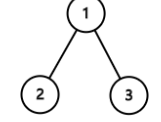

<center><font size = 45>LeetCode</font></center>

## 题序

- [01~10](#01)

- [11~20](#11)

- [21~30](#21)

- [31~40](#31)

- [41~50](#41)

- [51~60](#51)

- [61~70][#61]

- [71~80][#71]

- [81~90][#81]

- [91~100][#91]

- [101~110][#101]

- [111~120][#111]

- [121~130][#121]

- [131~140][#131]

- [141~148][#141]

  

## 01

求给定二叉树的最小深度。最小深度是指树的根结点到最近叶子结点的最短路径上结点的数量。

#### 思路

1. 若节点为空则返回为0，若节点的左右节点为空则返回为1，若节点左节点或右节点为空则返回 1+ run(), 否则返回最小值 

```c++
int run(TreeNode* root) {
    if(root == nullptr)
        return 0;
    else if(root->left == nullptr && root->right == nullptr)
        return 1;
    else if(root->right == nullptr)
        return 1 + run(root->left);
    else if(root->left == nullptr)
        return 1 + run(root->right);
    else
        return 1 + min(run(root->left), run(root->right));
}
```

## 02

计算逆波兰表达式

计算逆波兰式（后缀表达式）的值，运算符仅包含"+","-","*"和"/"，被操作数可能是整数或其他表达式

#### 思路

1. 使用一个栈进行操作，碰到+-*/就取栈顶的两个元素进行操作，否则就将数进行入栈操作

```c++
    int evalRPN(vector<string>& tokens) {
        // write code here
        if(tokens.empty())
            return 0;
        stack<int> stk;
        for(auto x : tokens) {
            if(x == "+" || x == "-" || x == "/" || x == "*") {
                if(stk.size() < 2)
                    return 0;
                int a = stk.top();
                stk.pop();
                int b = stk.top();
                stk.pop();
                int c = 0;
                if(x == "+") 
                    c = a + b;
                else if (x == "-")
                    c = b - a;
                else if (x == "*")
                    c = a * b;
                else 
                    c = b / a;
                stk.push(c);
            } else {
                stk.push(atoi(x.c_str()));
            }
        }
        return stk.top();
    }
```

## 03

#### 思路


```c++

```


## 04

在(nlogn)的时间内使用常数级空间复杂度对链表进行排序

#### 思路

1. 使用归并排序
2. 对链表需要将链表分开即找到中间节点，即使用快慢指针

```c++
 ListNode* sortList(ListNode* head) {
     // write code here
     if(!head || !head->next)
         return head;
     ListNode *p = head;
     ListNode *q = head->next;
     while(q && q->next) {
         p = p->next;
         q = q->next->next;
     }
     ListNode *left = sortList(p->next);
     p->next = nullptr;
     ListNode *right = sortList(head);
     return merge(left, right);
 }

ListNode* merge(ListNode* left, ListNode* right) {
    ListNode* head = new ListNode(0);
    ListNode *p = head;
    while(left && right) {
        if(left->val < right->val) {
            p->next = left;
            left = left->next;
        } else {
            p->next = right;
            right = right->next;
        }
        p = p->next;
    }
    if(left)
        p->next = left;
    if(right)
        p->next = right;
    return head->next;
}
```


## 05


#### 思路


```c++

```


## 06

给出一个二叉树，返回这个二叉树的后序遍历

#### 思路

1. 递归方法
2. 非递归方法，使用栈进行操作

```c++
//method 1
vector<int> res;
vector<int> postorderTraversal(TreeNode* root) {
    // write code here
    if(root != nullptr) {
        if(root->left != nullptr)
            postorderTraversal(root->left);
        if(root->right != nullptr)
            postorderTraversal(root->right);
        res.push_back(root->val);
    }
    return res;
}
//method 2
...
```

## 07

求给定的二叉树的前序遍历。

#### 思路

1. 递归方法
2. 非递归方法，使用栈进行操作

```c++
//method 1
vector<int> res;
vector<int> preorderTraversal(TreeNode* root) {
    // write code here
    if(root != nullptr) {
        res.push_back(root->val);
        if(root->left != nullptr)
            preorderTraversal(root->left);
        if(root->right != nullptr)
            preorderTraversal(root->right);
    }
    return res;
}
//method 2
...
```


## 08


#### 思路


```c++

```


## 09

将给定的单链表\ L *L*： L_0→L_1→…→L_{n-1}→L_ n*L*0→*L*1→…→*L**n*−1→*L**n*
重新排序为：L_0→L_n →L_1→L_{n-1}→L_2→L_{n-2}→…*L*0→*L**n*→*L*1→*L**n*−1→*L*2→*L**n*−2→…
要求使用原地算法，不能改变节点内部的值，需要对实际的节点进行交换。
例如：
对于给定的单链表{1,2,3,4}，将其重新排序为{1,4,2,3}.

#### 思路

1. 找到链表的中间节点
2. 将后一段链表利用头插头逆序
3. 前后两段链表各进行取一个，合并成新的链表 

```c++

```


## 10

对于一个给定的链表，返回环的入口节点，如果没有环，返回null

拓展：

你能给出不利用额外空间的解法么？

#### 思路

1. 利用map，有环时一定能够找到
2. 使用快慢指针原理，快指针比慢指针多走两步，套圈原理

```c++
//mehtod 1
ListNode *detectCycle(ListNode *head) {
    if(!head)
        return head;
    map<ListNode*, int> node_map;
    ListNode *p = head;
    while(p) {
        auto itor = node_map.find(p);
        if(itor != node_map.end()) {
            return p;
        } else {
            node_map.insert(make_pair(p, 1));
            p = p->next;
        }
    }
    return nullptr;
}
//method 2


```

## 11

判断给定的链表中是否有环，解法与第10题基本类似

扩展：你能给出不利用额外空间的解法么？

#### 思路

1. 利用map，有环时一定能够找到
2. 使用快慢指针原理，快指针比慢指针多走两步，套圈原理

```c++
//method 1
bool hasCycle(ListNode *head) {
    if(!head)
        return head;
    map<ListNode*, int> node_map;
    ListNode* p = head;
    while(p) {
        auto itor = node_map.find(p);
        if(itor != node_map.end()) {
            return true;
        } else {
            node_map.insert(make_pair(p, 1));
            p = p->next;
        }
    }
    return false;
}
//method 2

```


## 12


#### 思路


```c++

```


## 13


#### 思路


```c++

```


## 14

现在有一个整数类型的数组，数组中只有一个元素只出现一次，其余元素都出现三次。你需要找出只出现一次的元素

**注意：**你需要给出一个线性时间复杂度的算法，你能在不使用额外内存空间的情况下解决这个问题么？

#### 思路

1. Single Number的本质，就是用一个数记录每个bit出现的次数，如果一个bit出现两次就归0，这种运算采用二进制底下的位操作^是很自然的。
2. Single Number II中，如果能定义三进制底下的某种位操作，也可以达到相同的效果，Single Number II中想要记录每个bit出现的次数，一个数搞不定就加两个数，用ones来记录只出现过一次的bits，用twos来记录只出现过两次的bits，ones&twos实际上就记录了出现过三次的bits，这时候我们来模拟进行出现3次就抵消为0的操作，抹去ones和twos中都为1的bits。

```c++

```


## 15

现在有一个整数类型的数组，数组中素只有一个元素只出现一次，其余的元素都出现两次。

**注意：**你需要给出一个线性时间复杂度的算法，你能在不使用额外内存空间的情况下解决这个问题么？

#### 思路

1. 使用map来统计元素出现的次数
2. 使用异或，相等的元素进行异或得到是零，因此唯一不重复的数是数组最终异或的结果

```c++
int singleNumber(int* A, int n) {
    // write code here
    if(n == 0)
        return -1;
    int res = 0;
    for(int i = 0; i < n; i++) {
        res ^= A[i];
    }
    return res;
}
```


## 16

有N个小朋友站在一排，每个小朋友都有一个评分

你现在要按以下的规则给孩子们分糖果：

- 每个小朋友至少要分得一颗糖果
- 分数高的小朋友要他比旁边得分低的小朋友分得的糖果多

你最少要分发多少颗糖果？

#### 思路

1. 动态规划
2. 与前面的邻居比较，前向遍历权重数组ratings，如果ratings[i]>ratings[i-1]，则A[i]=A[i-1]+1；
3. 与后面的邻居比较，后向遍历权重数组ratings，如果ratings[i]>ratings[i+1]且A[i] <=A[i+1]+1，则更新A，A[i]=A[i+1]+1；
4. 对A求和即为最少需要的糖果。

```c++
int candy(vector<int>& ratings) {
    // write code here
    if(ratings.empty())
        return 0;
    int *res = new int[ratings.size()];
    for(int i = 0; i < ratings.size(); i++)
        res[i] = 1;
    for(int i = 1; i < ratings.size(); i++) {
        if(ratings[i] > ratings[i-1])
            res[i] = res[i-1] + 1;
    }
    //
    for(int i = ratings.size() - 2; i >= 0; i--) {
        if(ratings[i] > ratings[i+1] && res[i] <= res[i+1])
            res[i] = res[i+1] + 1;
    }
    int sum = 0;
    for(int i = 0; i < ratings.size(); i++) {
        sum += res[i];
    }
    return sum;
}
```


## 17


#### 思路


```c++

```


## 18


#### 思路


```c++

```


## 19


#### 思路


```c++

```


## 20


#### 思路


```c++

```


## 21


#### 思路


```c++

```


## 22

给定一个二叉树，请计算节点值之和最大的路径的节点值之和是多少。
这个路径的开始节点和结束节点可以是二叉树中的任意节点
例如：
给出以下的二叉树，

返回的结果为6

#### 思路

1. 广度遍历， 每一层的结果等当前结果乘以10，加上下一层的左右节点的值 
2. 深度遍历，使用堆栈

```c++
//method 1
int sumNumbers(TreeNode* root) {
    // write code here
    int res = 0;
    if(root == nullptr) {
        return res; 
    }
    return preorder_traverse(root, res);
}

int preorder_traverse(TreeNode* root, int res) {
    if(root == nullptr)
        return 0;
    res = res * 10 + root->val;
    if(root->left == nullptr && root->right == nullptr)
        return res;
    return preorder_traverse(root->left, res) + preorder_traverse(root->right, res);
}

//method 2
```


## 23


#### 思路


```c++

```


## 24


#### 思路


```c++

```


## 25


#### 思路


```c++

```


## 26


#### 思路


```c++

```


## 27


#### 思路


```c++

```


## 28


#### 思路


```c++

```


## 29


#### 思路


```c++

```


## 30


#### 思路


```c++

```


## 31

给出一个三角形，计算从三角形顶部到底部的最小路径和，每一步都可以移动到下面一行相邻的数字，

例如，给出的三角形如下：

```
[↵     [2],↵    [3,4],↵   [6,5,7],↵  [4,1,8,3]↵]
```

最小的从顶部到底部的路径和是2 + 3 + 5 + 1 = 11。

注意：如果你能只用O（N）的额外的空间来完成这项工作的话，就可以得到附加分，其中N是三角形中的行总数。

#### 思路

1. 

```c++

```


## 32

给出一个索引k，返回杨辉三角的第k行

例如，k=3，

返回[1,3,3,1].

备注：

你能将你的算法优化到只使用O(k)的额外空间吗?

#### 思路

按行进行模拟，先赋入第一行的初始值， 后续的行当为起始或最终的值其为1， 其它均为res[i] = res[i] + res[i-1]

```c++
vector<int> getRow(int rowIndex) {
    // write code here
    vector<int> res= {1};
    if(rowIndex == 0)
        return res;
    for(int i = 1; i <= rowIndex; i++) {
        int row_cnt = i + 1;
        vector<int> v2(row_cnt);
        for(int j = 0; j < row_cnt; j++) {
            if(j == 0 || j == row_cnt - 1)
                v2[j] = 1;
            else
                v2[j] = res[j-1] + res[j];
        }
        res.clear();
        res.assign(v2.begin(), v2.end());
        v2.clear();
    }
    return res;
}
```

## 33

给出一个值numRows，生成杨辉三角的前numRows行

例如，给出 numRows = 5,

```
返回     [1],↵    [1,1],↵   [1,2,1],↵  [1,3,3,1],↵ [1,4,6,4,1]↵]
```

#### 思路

1. 按行进行模拟，先赋入第一行的初始值， 后续的行当为起始或最终的值其为1， 其它均为res[i] = res[i] + res[i-1]

```c++
vector<vector<int> > generate(int numRows) {
    // write code here
    vector<vector<int>> res;
    if(numRows == 0)
        return res;
    vector<int> v = {1};
    res.push_back(v);
    for(int i = 1; i < numRows; i++) {
        int rows_cnt = i + 1;
        vector<int> tmp(rows_cnt);
        for(int j = 0; j < rows_cnt; j++) {
            if(j == 0 || j == rows_cnt - 1){
                tmp[j] = 1;
            } else {
                vector<int> v = res[i-1];
                tmp[j] = v[j] + v[j-1];
            }
        }
        res.push_back(tmp);
    }
    return res;
}
```


## 34


#### 思路


```c++

```


## 35


#### 思路


```c++

```


## 36


#### 思路


```c++

```


## 37


#### 思路


```c++

```


## 38


#### 思路


```c++

```


## 39


#### 思路


```c++

```


## 40


#### 思路


```c++

```


## 41


#### 思路


```c++

```


## 42


#### 思路


```c++

```


## 43


#### 思路


```c++

```


## 44


#### 思路


```c++

```


## 45


#### 思路


```c++

```


## 46


#### 思路


```c++

```


## 47


#### 思路


```c++

```


## 48


#### 思路


```c++

```


## 49


#### 思路


```c++

```


## 50


#### 思路


```c++

```


## 51


#### 思路


```c++

```


## 52


#### 思路


```c++

```


## 53


#### 思路


```c++

```


## 54


#### 思路


```c++

```


## 55


#### 思路


```c++

```


## 56


#### 思路


```c++

```


## 57


#### 思路


```c++

```


## 58


#### 思路


```c++

```


## 59


#### 思路


```c++

```


## 60


#### 思路


```c++

```

## 61

给出两个有序的整数数组 和 ，请将数组 合并到数组 中，变成一个有序的数组注意：
可以假设 数组有足够的空间存放 数组的元素， 和 中初始的元素数目分别为 和 

#### 思路

1. 由两个数据从后往前比较，不用开辟额外空间
2. 方法与“we are happy" 替换为 ”we%10are%10happy"字符串替换题类似，都是从后往前计算

```c++
void merge(int A[], int m, int B[], int n) {
    while(m > 0 && n > 0) {
        if(A[m-1] > B[n-1]) {
            A[m+n-1] = A[m-1];
            m--;
        } else {
            A[m+n-1] = B[n-1];
            n--;
        }
    }
    while(n > 0) {
        A[n - 1] = B[n - 1];
        n--;
    }
    return ;
}
```


## 62


#### 思路


```c++

```


## 63


#### 思路


```

```


## 64


#### 思路


```c++

```


## 65


#### 思路


```c++

```


## 66


#### 思路


```c++

```

## 67


#### 思路


```c++

```


## 68


#### 思路


```c++

```


## 69


#### 思路


```c++

```


## 70


#### 思路

```c++

```


## 71


#### 思路


```c++

```


## 72


#### 思路


```c++

```


## 73


#### 思路


```c++

```


## 74


#### 思路


```c++

```


## 75


#### 思路


```c++

```


## 76


#### 思路


```c++

```


## 77


#### 思路


```c++

```


## 78


#### 思路


```c++

```


## 79


#### 思路


```c++

```


## 80


#### 思路


## 81


#### 思路


```c++

```


## 82


#### 思路


```c++

```


## 83


#### 思路


```c++

```


## 84


#### 思路


```c++

```


## 85


#### 思路


```c++

```


## 86


#### 思路


```c++

```


## 87


#### 思路


```c++

```


## 88


#### 思路


```c++

```


## 89


#### 思路


```c++

```


## 90


#### 思路


## 91


#### 思路


```c++

```


## 92


#### 思路


```c++

```


## 93


#### 思路


```c++

```


## 94


#### 思路


```c++

```


## 95


#### 思路


```c++

```


## 96


#### 思路


```c++

```


## 97


#### 思路


```c++

```


## 98


#### 思路


```c++

```


## 99


#### 思路


```c++

```


## 100


#### 思路

```c++

```


## 101


#### 思路


```c++

```

## 102


#### 思路


```c++

```

## 103


#### 思路


```c++

```


## 104


#### 思路


```c++

```


## 105


#### 思路


```c++

```


## 106


#### 思路


```c++

```


## 107


#### 思路


```c++

```


## 108


#### 思路


```c++

```


## 109


#### 思路


```c++

```


## 110


#### 思路


```c++

```


## 111


#### 思路


```c++

```

## 112


#### 思路


```c++

```

## 113


#### 思路


```c++

```


## 114


#### 思路


```c++

```


## 115


#### 思路


```c++

```


## 116


#### 思路


```c++

```


## 117


#### 思路


```c++

```


## 118


#### 思路


```c++

```


## 119


#### 思路


```c++

```


## 120


#### 思路


```c++

```

## 121


#### 思路


```c++

```

## 122


#### 思路


```c++

```

## 123


#### 思路


```c++

```


## 124


#### 思路


```c++

```


## 125


#### 思路


```c++

```


## 126


#### 思路


```c++

```


## 127


#### 思路


```c++

```


## 128


#### 思路


```c++

```


## 129


#### 思路


```c++

```


## 130


#### 思路


```c++

```

## 131


#### 思路


```c++

```

## 132


#### 思路


```c++

```

## 133


#### 思路


```c++

```


## 134


#### 思路


```c++

```


## 135


#### 思路


```c++

```


## 136


#### 思路


```c++

```


## 137


#### 思路


```c++

```


## 138


#### 思路


```c++

```

## 139


#### 思路


```c++

```


## 140


#### 思路


```c++

```


## 141


#### 思路


```c++

```


## 142


#### 思路


```c++

```


## 140


#### 思路


```c++

```


## 143

#### 思路


```c++

```


## 144


#### 思路


```c++

```


## 145


#### 思路


```c++

```


## 146


#### 思路


```c++

```


## 147


#### 思路


```c++

```


## 148

给出一个整数数组，请在数组中找出两个加起来等于目标值的数，

你给出的函数twoSum 需要返回这两个数字的下标（index1，index2），需要满足 index1 小于index2.。注意：下标是从1开始的

假设给出的数组中只存在唯一解

例如：

给出的数组为 {2, 7, 11, 15},目标值为9
输出 index1=1, index2=2

#### 思路

1. 

```c++

```


