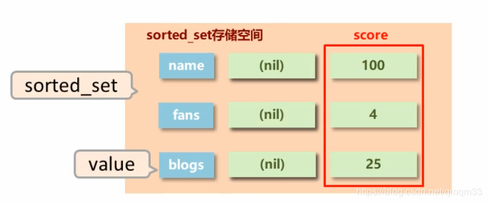
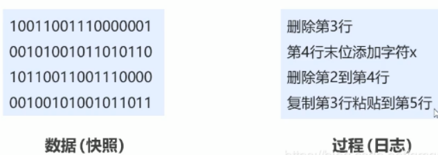
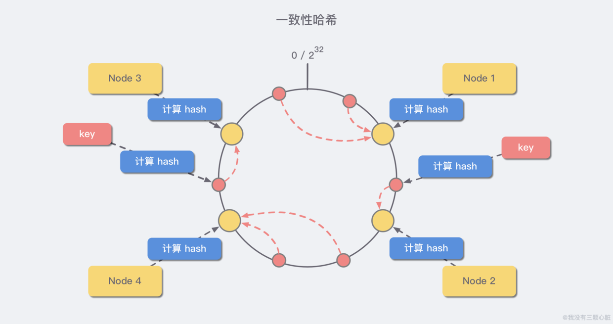

Redis基础

## Redis概念

Redis(REmote DIctinary Server)是用C语言开发的一个开源的高性能键值对(key-value)NoSql类型数据库，其默认端口为6379

## Redis的应用

1. 缓存：为热点数据加速查询（主要场景）、如热点商品、热点新闻、热点资讯、推广类等提高访问量信息等

（2）任务队列、如秒杀、抢购、购票等

（3）即时信息查询，如各位排行榜、各类网站访问统计、公交到站信息、在线人数信息（聊天室、网站）、设备信号等

（4）时效性信息控制，如验证码控制，投票控制等

（5）分布式数据共享，如分布式集群构架中的session分离

（6）消息队列

（7）分布式锁

Redis数据存储格式

Redis自身是一个Map，其中所有的数据都是采用key:value的形式存储数据类型

存储的数据的类型，也就是value部分的类型，key部分永远都是字符串

Key概念

key永远是一个字符串，通过key获取redis中保存的数据，约定key值设定为：表名：主键名：主键值：字段名。eg: order:id:29437595:name

Key基本操作

del key //删除指定key exists key //获取key是否存在 type key //获取key的类型 //查询key keys pattern // * 匹配任意数量的符号； ？ 匹配一个任意符号；  []匹配一个指定符号 key *[st]er:? //查询以任意字符串开头er结尾的，中间包含一个字母的s或t //对所有key排序 sort //help help @generic

Key的时效性控制

//为指定key设置有效期 expire key seconds pexpire key milliseconds expireat key timestamp pexpireat key millinseconds-timestamp //获取key有效时间 ttl key pttl key //切换key从时效性转换为永久性 persist key

Redis 数据类型（5种常用）

(1)string --> String

(2)hash --> Hashmap

(3)list --> LinkList

(4)set --> HashSet

(5)sorted_set --> TreeSet

数据类型——string

存储内容：通常使用字符串，如果字符串以整数的形式展示，可以作为数字操作使用

注意事项

（1）数据计算：string在redis内部存储默认就是一个字符串，当遇到增减类操作incr,decr时会转成数值型进行计算

（2）原子性：redis所有的操作都是原子性的，采用单线程处理所有业务，命令是一个一个执行的，因此无需考虑并发带来的数据影响。

（3）范围：按数值进行操作的数据，如果原始数据不能转成数值，或超过了redis数值上线范围，将会报错。9223372036854775807 (java中long型数据最大值，Long.MAX_VALUE)

基本操作

set key value //添加/修改数据 get key //获取数据 del key//删除数据 mset key1 valueq key2 value2 …//添加/修改多个数据 mget key1 key2 …//获取多个数据 strlen key//获取数据字符个数（字符串长度） append key value//追加信息到原始信息后部（如果原始信息存在就追加，否则新建） //设置数值数据增加指定范围的值 incr key incrby key increment incrbyfloat key increment //设置数值数据减少指定范围的值 decr key decrby key increment //时效性设置:控制数据的生命周期，通过数据是否失效控制业务行为，适用于所有具有时效性限定控制的操作 setex key seconds value psetex key milliseconds value

数据类型——Hash

一个存储空间保存多少个键值对数据

底层结构：底层使用哈希表结构实现数据存储，底层结构图如下

注意事项

(1)数据存储：hash类型下的value只能存储字符串，不允许存储其他类型数据，不存在嵌套现象。如果数据未获取到，对应的值为(nil)

(2)键值对：每个hash可以存储232-1个键值对,

(3)效率： hash类型十分贴近对象的数据存储形式，并且可以灵活添加删除对象属性。但hash设计初中不是为了存储大量对象而设计的，切记不可滥用，更不可以将hash作为对象列表使用。hgetall操作可以获取全部属性，如果内部fiekd过多，遍历整体数据效率就会很低，有可能成为数据访问瓶颈

基本操作

hset key field value //添加/修改数据 hget key field //获取数据 hgetall key //获取所有数据 hdel key field1 [field2]//删除数据 hmset key field1 value1 field2 calue2//添加/修改多个数据 hmget key field1 field2 …//获取多个数据 hlen key//获取哈希表中字段的数量 hexists key field//获取哈希表中是否存在指定的字段 hkeys key //获取哈希表中是否存在指定的字段 hvals key hincrby key field increment //设置指定字段的数值数据增加指定范围的值 hincrbyfloat key field increment

list类型

存储多个数据，并对数据进入存储空间的顺序进行区分

底层结构：保存多个数据，底层使用双向链表存储结构实现

基本操作：

添加/修改数据 lpush key value1 [value2] … rpush key value1 [value2] … 获取数据 lrange key start stop lindex key index llen key 删除并移除数据 lpop key rpop key list 类型数组扩展操作 规定时间内获取并移除数据 blpop key1 [key2] timeout brpop key1 [key2] timeout 移除指定数据 lrem key count value

Set类型

存储大量的数据，在查询方面提供更高的效率

底层结构：与hash存储结构完全相同，仅存储键，不存储值（nil),并且值式不允许重复的

基本操作

//添加数据 sadd key menber1 [member2] //获取全部数据 smembers key //删除数据 srem key member1 [member2] //获取集合数据总量 scard key //判断集合中是否包含指定数据 sismember key member //随机获取集合中指定数量的数据 srandmember key [count] //随机获取集合中的某个数据并将该数据移出集合 spop key //求两个集合的交、并、差集 sinter key1 [key2] sunion key1 [key2] sdiff key1 [key2] //求两个集合的交、并、差集并存储到指定集合中 sinterstore destination key1 [key2] sunionstore destination key1 [key2] sdiffstore destination key1 [key2] //将指定数据从原始集合移动到目标集合中 smove source destination member

数据类型——sorted_set

新的存储模型，可以保存可排序的数据

底层结构：在set的存储结构基础上添加可排序字段。底层结构图如下：

基本操作

//添加数据 zadd key score1 member1 [score2 member2] //获取全部数据 zrange key start stop [WITHSCORES]  zrevrange key start stop [WITHSCORES] //删除数据 zrem key member [member …]  //按条件获取数据 zrangebyscore key min max [WITHSCORES] [LIMIT]  zrevrangebyscore key max min [WITHSCORES] //条件删除 zremrangebyrank key start stop //  zremrangebyscore key min max //获取集合数据总量 zcard key // zcount key min max //集合交、并操作 zinterstore destination numkeys key [key …] zunionstore destination numkeys key [key …] //获取数据对应的索引（排名） zrank key member zrevrank key member //score 值获取与修改 zscore key member zincrby key increment member

db 基本操作

Redis为每个服务器提供有16个数据库，编号从0-15,每个数据库之间的数据互相独立

//切换数据库 select index //其他操作 quit ping echo message //数据移动 move key db //数据清除 dbsize flushdb flushall

Jedis

Jedis是Redis官方推荐的Java链接工具

Redis- 进阶

一、持久化

利用永久性存储介质将数据进行保存，在特定的事件将保存的数据进行恢复的工作机制称为持久化

形式

(1)RDB：将当前数据状态进行保存，快照形式，存储数据结果，存储而是简单，关注点在数据

(2)AOF：将数据的操作过程进行保存，日志形式，存储操作过程，存储格式复杂，关注点在数据的操作过程 

RDB三种指令

（1）save指令：手动执行一次保存操作

Redis是单线程的，所有命令都会在类似队列中排好队，不建议使用save指令，因为save指令的执行会阻塞当前Redis服务器，直到当前RDB过程完成位置，有可能会造成长时间阻塞，线上环境不建议使用

（2）bgsave指令：手动启动后台保存操作，但不是立即执行，bgsave命令是针对save阻塞问题做的优化

原理：

（3）save配置：满足限定时间范围内ke的变化数量达到指定数量即进行持久化

save second changes // second：监控时间范围 changes：监控key的变化量

原理：

三种启动方式对比

RDB特殊形式

（1）全量复制 ：主从复制中会提到

（2）服务器运行过程中重启 ： debug reload

（3）关闭服务器时指定保存数据：shutdown save

AOF

以独立日志的方式记录每次写命令，重启时再重新执行AOF文件中命令达到恢复数据的目的。与RDB相比可以简单描述为改记录数据产生的过程，AOF的主要作用是解决了数据持久化的实时性，目前已经是Redis持久化的主流方式

AOF过程

AOF写数据三种策略

（1）always(每次)：每次写入操作均同步到AOF文件中，数据零误差，性能较低

（2）everysec(每秒)：每秒将缓冲区中的指令同步到AOF文件中，数据准确性高，性能较高

再系统突然当即的情况下丢失1秒内的数据

（3）no(系统控制)：由操作系统每次同步到AOF文件的周期，整体过程不可控

AOF重写

随着命令的不断写入AOF，文件会越来越大，为了解决这个问题，Redis引入AOF重写机制压缩文件体积，AOF文件重写是将Redis进程内的数据转换为写命令同步到新AOF文件的过程，简单说就是将同样一个数据的若干个命令执行结果转换为最终结果数据对应的指令进行记录

AOF重写原理

AOF重写规则

（1）进程内已超时的数据不再写入文件

（2）忽略无效指令，重写时使用进程内数据直接生成，这样新的AOF文件只保留最终数据的写入命令，如del key1,hdel key2,srem key3,set key 222等

（3）对统一数据的多条命令合并为一条命，如 lpush list1 a ,lpush list1 b,lpush list1 c可以转化为lpush list1 a b c

AOF重写方式

（1）手动重写

bgrewriteaof

（2）自动重写

auto-aof-rewrite-min-size size auto-aof-rewrite-percentage percentage

AOF和RDB的区别：

二、Redis事务、锁

事务

一旦成功所有的成功，一个失败，所有一些列连续动作都失败

事务的基本操作

multi //开启事务 ... //加入事务的命令暂时到任务队列中，并没有立即执行 exec //执行事务 discard //取消事务

事务的注意事项

（1）语法错误 ：定义的事务中所包含的命令存在语法错误，整体事务中所有命令均不会被执行。

（2）运行错误 ：运行错误能够正确运行的命令会执行，运行错误的命令不会执行,例如对list进行incr操作

（3）回滚操作：只能手动进行事务回滚

事务锁

多个客户端有可能同时操作一组数据，并且该数据一旦被操作修改后，将不适用于继续操作在操作之前锁定要操作的数据，一旦发生变化，终止当前操作

锁

对key添加监视锁，在执行exec前如果key发生了变化，终止事务执行

watch key1 [key2…] unwatch //取消对所有key的监视

分布式锁

setnx lock-key value

利用setnx命令的返回值特征，有值则返回设置失败，无值则返回设置成功

对于返回设置成功的，拥有控制权，进行下一步的具体业务操作

对于返回设置失败的，不具有控制权，排队或等待

锁释放 

（1）del：del操作释放锁

del lock-key

（2）expire：使用expire为锁key添加时间限定，到时不释放，放弃锁

expire lock-key second pexpire lock-kay millisenconds

三、Redis删除策略

目的：在内存占用与CPU占用之间寻找一种平衡，顾此失彼都会造成整体redis性能的下降，甚至引发服务器宕机或内存泄漏。

Redis中的数据特征

具有时效性的数据，可分为

（1）永久有效的数据

（2） 已经过期的数据 或 被删除的数据 或 未定义的数据

时效性数据的存储结构

数据删除策略

（1）定时删除；（2）惰性删除；（3）定期删除

定时删除

创建一个定时器，当key设置过期时间，且过期时间到达时，由定时器任务立即执行对键的删除操作

惰性删除

概念：数据到达过期时间，不做处理。等下次访问该数据，如果未过期，返回数据；发现已经过期，删除，返回不存在

原理：其通过在调用 get name之前调用 expireIfNeeded()函数

定期删除

概念：周期性轮询redis库中时效性数据，采用随机抽取的策略，利用过期数据占比的方式删除频度

原理：

Redis启动服务器初始化时，读取配置server.hz的值，默认为10

每秒钟执行server.hz次serverCron()

删除策略对比

逐出算法

Redis使用内存存储数据，在执行每一个命令前，会调用freeMemorylfNeeded()检测内存是否充足。如果内存不满足新加入数据的最低存储要求，redis要临时删除一些数据为当前指令清理存储空间。清理数据的策略称为逐出算法。逐出数据的过程不是100%能够清理出足够的可使用的内存空间，如果不成功则反复执行。当对所有数据尝试完毕后，如果不能达到内存清理的要求，将出现错误信息

影响数据逐出的相关配置

（1）最大可使用内存：maxmemory

（2）每次选取代删除数据的个数：maxmemory-samples

（3）删除策略：maxmemory-policy

删除策略

（1）检查易失数据（可能会过期的数据集server.db[i].expires)

volatile-lru：挑选最近最少使用的数据淘汰

volatile-lfu：挑选最近使用次数最少的数据淘汰

volatile-ttl ：挑选将要过期的数据淘汰

volatile-random：任意选择数据淘汰

（2）检测全库数据（所有数据集server.db[i].dict）

allkeys-lru：挑选最近最少使用的数据态太

allkeys-lfu：挑选最近使用次数最少的数据淘汰

allkeys-random：任意选择数据淘汰

（3）放弃数据驱逐

no-enviction（驱逐）：禁止驱逐数据（redis4.0默认策略），会引发错误OOM（OutOfMemory）

四、Redis高级数据类型

（1）Bitmap；（2）HyperLogLog；（3）GEO

Bitmap

即由0或1组成的数据格式

Bitmap基本操作

setbit bits 0 getbit bits 0  //对指定key按位进行交、并、非、异或操作，并将结果保存到destKey中 bitop op destKey key1 [key2…] and or not xor //统计指定key中1的数量 bitcount key [start end]

HyperLogLog

HyoerLogLog是用来做计数统计的，运用了LogLog的算法， 得到一个基数集合，基数是数据集去重后元素的个数

(1)进行计数统计，不是集合，不保存数据，值记录数量而不是具体数据

(2)核心是计数估算算法，最终数值存在一定误差

(3)耗空间极小，每个hyperloglog key占用了12k的内存用于标记基数

(4)pfadd命令不是一次性分配12k内存使用，会随着基数的增加内存逐渐增大

(5)Pfmerge命令合并后占用的内存空间为12k,无论合并之前数据量多少

HyperLogLog基本操作

//添加数据 pfadd key element [element …] //统计数据 pfcount key [key …] //合并数据 pfmerge destkey sourcekey [sourcekey …]

GEO

用于计算两点之间的水平距离 

GEO基本操作

//添加坐标点 geoadd key longitude latitude member [longitude latitude member] //获取坐标点 geopos key member[member …] //计算坐标点距离 geodist key member1 member2 [unit] //根据坐标求范围内数据 georadius key longitude latitude radius radius m|km|ft|mi [withcooord] [withdist] [withhash] [count count] //根据点范围内数据 geordiusbymember key member radius m|km|ft|mi [withcooord] [withdist] [withhash] [count count] //获取指定点的对应坐标的hash值 geohash key membe [member...]

五、Redis主从复制

主从复制概念

主从复制，是指将一台 Redis 服务器的数据，复制到其他的 Redis 服务器。前者称为 主节点(master)，后者称为 从节点(slave)。且数据的复制是 单向 的，只能由主节点到从节点。Redis 主从复制支持 主从同步 和 从从同步 两种，后者是 Redis 后续版本新增的功能，以减轻主节点的同步负担。一个master可以拥有多个slave，一个slave只对应一个master。master执行写数据操作，出现变化的数据自动同步到slave读数据（可忽略），slave:读数据，禁上写数据。

主从复制主要的作用

（1）数据冗余： 主从复制实现了数据的热备份，是持久化之外的一种数据冗余方式。

（2）故障恢复： 当主节点出现问题时，可以由从节点提供服务，实现快速的故障恢复 (实际上是一种服务的冗余)。

（3）负载均衡： 在主从复制的基础上，配合读写分离，可以由主节点提供写服务，由从节点提供读服务 （即写 Redis 数据时应用连接主节点，读 Redis 数据时应用连接从节点），分担服务器负载。尤其是在写少读多的场景下，通过多个从节点分担读负载，可以大大提高 Redis 服务器的并发量。

（4）高可用基石： 除了上述作用以外，主从复制还是哨兵和集群能够实施的 基础，因此说主从复制是 Redis 高可用的基础。

主从复制工作流程

（1）建立链接阶段（即准备阶段）

（2）数据同步阶段

（3）命令传播阶段

建立链接阶段

建立链接阶段使用授权访问

数据同步阶段工作流程

（1）全量复制 

（2）增量复制 

命令传播阶段

当master数据库状态被修改后，导致主从服务器数据库状态不一致，此时需要让主从数据同步到一致的状态，同步的动作成为命令传播master将接受到的数据变更命令发送给slave，slave接受命令后执行命令。

部分复制的三个要素

（1）服务器的运行id (run id)

每台机器都有用于识别的40位16进制的ID，用于标识各个Redis

（2）复制缓冲区

复制缓冲区，又名复制积压缓冲区，时一个先进先出（FIFO）的队列，用于存储服务器执行过的命令，每次传播命令，master会将传播的命令记录下来，并存储在复制缓冲区

复制缓冲区默认存储空间大小是1M，由于存储空间大小是固定的，当入队元素的数量大于队列长度时，最先入队的元素会被弹出，而新元素会被放入队列

（3）主从服务器复制偏移量（offset）

其概念是一个数字，描述复制缓冲区中的指令字节位置。分为：master复制偏移量：记录发送给所有slave的指令字节对应的位置（多个）和slave复制偏移量：记录slave接受master发送过来的指令字节对应的位置（一个），作为同步信息，对比master与slave的差异，当slave断线后，恢复数据使用

心跳机制

进入命令传播阶段后，master与slave间需要进行信息交换，使用心跳机制进行维护，实现双方连接保持在线。

master发出周期性（由repl-ping-slave-period决定）的发出PING指令来判断slave是否在线，slave心跳指令回复REPLCONF ACK{offset}，作用1：汇报slave自己的复制偏移量，获取最新的数据变更指令

六、Redis哨兵

哨兵（sentinel) 是一个分布式系统，用于对主从结构中的每台服务器进行监控，当出现故障时通过投票机制选择新的master并将所有slave连接到新的master。哨兵也是一台redis服务器，只是不提供数据服务，通常哨兵配置数量为单数

哨兵的作用

（1）监控

不断地检查master和slave是否正常运行

master存活检测、master与slave运行情况检测

（2）通知（提醒）

当被监控地服务器出现问题时，向其他（哨兵间，客户端）发送通知

（3）自动故障转移

断开master与slave连接，选取一个slave作为master,将其他slave连接到新的master，并告知客户端新的服务器地址

哨兵的目的：主从切换

哨兵在进行主从切换过程中经历三个阶段

（1）监控

（2）通知

（3）故障转移

阶段一： 监控阶段

阶段二：通知阶段

阶段三：故障转移阶段

选择领头哨兵

处置阶段

七、Redis 集群

集群就是使用网络将若干台计算机联通起来，并提供统一的管理方式，使其对外呈现单机的服务效果。

集群基本原理

Redis 集群中内置了 16384 个哈希槽。当客户端连接到 Redis 集群之后，会同时得到一份关于这个 集群的配置信息，当客户端具体对某一个 key 值进行操作时，会计算出它的一个 Hash 值，然后把结果对 16384 求余数，这样每个 key 都会对应一个编号在 0-16383 之间的哈希槽，Redis 会根据节点数量 大致均等 的将哈希槽映射到不同的节点。

再结合集群的配置信息就能够知道这个 key 值应该存储在哪一个具体的 Redis 节点中，如果不属于自己管，那么就会使用一个特殊的 MOVED 命令来进行一个跳转，告诉客户端去连接这个节点以获取数据：

GET x -MOVED 3999 127.0.0.1:6381

MOVED 指令第一个参数 3999 是 key 对应的槽位编号，后面是目标节点地址，MOVED 命令前面有一个减号，表示这是一个错误的消息。客户端在收到 MOVED 指令后，就立即纠正本地的 槽位映射表，那么下一次再访问 key 时就能够到正确的地方去获取了。

集群的主要作用

（1）数据分区： 数据分区 (或称数据分片) 是集群最核心的功能。集群将数据分散到多个节点，一方面 突破了 Redis 单机内存大小的限制，存储容量大大增加；另一方面 每个主节点都可以对外提供读服务和写服务，大大提高了集群的响应能力。Redis 单机内存大小受限问题，在介绍持久化和主从复制时都有提及，例如，如果单机内存太大，bgsave 和 bgrewriteaof 的 fork 操作可能导致主进程阻塞，主从环境下主机切换时可能导致从节点长时间无法提供服务，全量复制阶段主节点的复制缓冲区可能溢出……

（2）高可用： 集群支持主从复制和主节点的 自动故障转移 （与哨兵类似），当任一节点发生故障时，集群仍然可以对外提供服务。

数据分区方案简析

方案一：哈希值 % 节点数

哈希取余分区思路非常简单：计算 key 的 hash 值，然后对节点数量进行取余，从而决定数据映射到哪个节点上。

不过该方案最大的问题是，当新增或删减节点时，节点数量发生变化，系统中所有的数据都需要 重新计算映射关系，引发大规模数据迁移。

方案二：一致性哈希分区

一致性哈希算法将 整个哈希值空间 组织成一个虚拟的圆环，范围是 *[0 , 232-1]*，对于每一个数据，根据 key 计算 hash 值，确数据在环上的位置，然后从此位置沿顺时针行走，找到的第一台服务器就是其应该映射到的服务器：

与哈希取余分区相比，一致性哈希分区将 增减节点的影响限制在相邻节点。以上图为例，如果在 node1 和 node2 之间增加 node5，则只有 node2 中的一部分数据会迁移到 node5；如果去掉 node2，则原 node2 中的数据只会迁移到 node4 中，只有 node4 会受影响。

一致性哈希分区的主要问题在于，当 节点数量较少 时，增加或删减节点，对单个节点的影响可能很大，造成数据的严重不平衡。还是以上图为例，如果去掉 node2，node4 中的数据由总数据的 1/4 左右变为 1/2 左右，与其他节点相比负载过高。

方案三：带有虚拟节点的一致性哈希分区

该方案在 一致性哈希分区的基础上，引入了 虚拟节点 的概念。Redis 集群使用的便是该方案，其中的虚拟节点称为 槽（slot）。槽是介于数据和实际节点之间的虚拟概念，每个实际节点包含一定数量的槽，每个槽包含哈希值在一定范围内的数据。

在使用了槽的一致性哈希分区中，槽是数据管理和迁移的基本单位。槽 解耦 了 数据和实际节点之间的关系，增加或删除节点对系统的影响很小。仍以上图为例，系统中有 4 个实际节点，假设为其分配 16 个槽(0-15)；

槽 0-3 位于 node1；4-7 位于 node2；以此类推....

如果此时删除 node2，只需要将槽 4-7 重新分配即可，例如槽 4-5 分配给 node1，槽 6 分配给 node3，槽 7 分配给 node4；可以看出删除 node2 后，数据在其他节点的分布仍然较为均衡。

消息类型

节点间发送的消息主要分为 5 种：meet 消息、ping 消息、pong 消息、fail 消息、publish 消息。不同的消息类型，通信协议、发送的频率和时机、接收节点的选择等是不同的：

MEET 消息： 在节点握手阶段，当节点收到客户端的 CLUSTER MEET 命令时，会向新加入的节点发送 MEET 消息，请求新节点加入到当前集群；新节点收到 MEET 消息后会回复一个 PONG 消息。

PING 消息： 集群里每个节点每秒钟会选择部分节点发送 PING 消息，接收者收到消息后会回复一个 PONG 消息。PING 消息的内容是自身节点和部分其他节点的状态信息，作用是彼此交换信息，以及检测节点是否在线。PING 消息使用 Gossip 协议发送，接收节点的选择兼顾了收敛速度和带宽成本，具体规则如下：(1)随机找 5 个节点，在其中选择最久没有通信的 1 个节点；(2)扫描节点列表，选择最近一次收到 PONG 消息时间大于 cluster_node_timeout / 2 的所有节点，防止这些节点长时间未更新。

PONG消息： PONG 消息封装了自身状态数据。可以分为两种：第一种 是在接到 MEET/PING 消息后回复的 PONG 消息；第二种 是指节点向集群广播 PONG 消息，这样其他节点可以获知该节点的最新信息，例如故障恢复后新的主节点会广播 PONG 消息。

FAIL 消息： 当一个主节点判断另一个主节点进入 FAIL 状态时，会向集群广播这一 FAIL消息；接收节点会将这一 FAIL 消息保存起来，便于后续的判断。

PUBLISH 消息： 节点收到 PUBLISH 命令后，会先执行该命令，然后向集群广播这一消息，接收节点也会执行该 PUBLISH 命令。

八、企业级解决方案

缓存预热、缓存雪崩、缓存击穿、缓存穿透

缓存预热

缓存预热就是系统启动前，提前将相关的缓存数据直接加载到缓存系统。避免在用户请求的时候，先查询数据库，然后再将数据缓存的问题

缓存雪崩

缓存同一时间大面积的失效，所以，后面的请求都会落到数据库上，造成数据库短时间内承受大量请求而崩掉。

解决方案：

事前：尽量保证整个 redis 集群的高可用性，发现机器宕机尽快补上。选择合适的内存淘汰策略。

事中：本地 ehcache 缓存 + hystrix 限流&降级，避免 MySQL 崩掉

事后：利用 redis 持久化机制保存的数据尽快恢复缓存

缓存击穿

缓存击穿就是单个高热数据过期的瞬间，数据访问较大，未命中redis后，发起了大量对同一数据的数据库访问，导致对数据库服务器造成压力。配合雪崩处理策略即可

缓存穿透

缓存穿透说简单点就是大量请求的 key 根本不存在于缓存中，导致请求直接到了数据库上，根本没有经过缓存这一层。举个例子：某个黑客故意制造我们缓存中不存在的 key 发起大量请求，导致大量请求落到数据库。

解决方案：

1）缓存无效 key : 如果缓存和数据库都查不到某个 key 的数据就写一个到 redis 中去并设置过期时间，具体命令如下：SET key value EX 10086。这种方式可以解决请求的 key 变化不频繁的情况，如果黑客恶意攻击，每次构建不同的请求 key，会导致 redis 中缓存大量无效的 key 。

2）布隆过滤器：把所有可能存在的请求的值都存放在布隆过滤器中，当用户请求过来，我会先判断用户发来的请求的值是否存在于布隆过滤器中。不存在的话，直接返回请求参数错误信息给客户端，存在的话才会走下面的流程