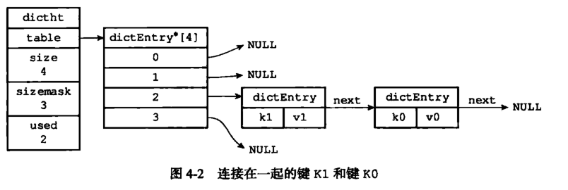
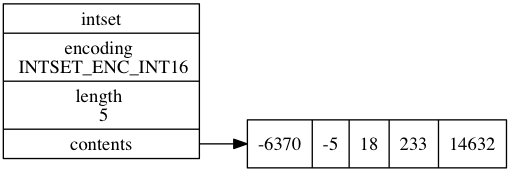
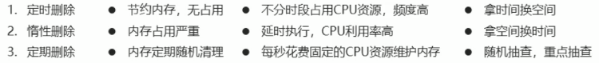
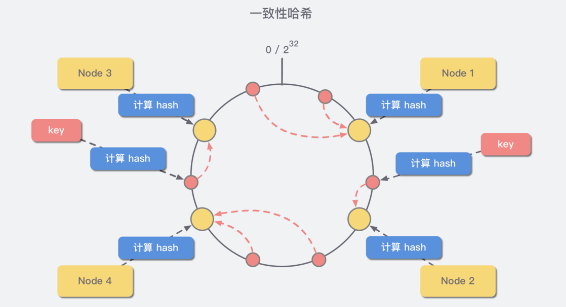

<center><font size=45>Redis基础</font></center>

## Redis

#### 概念

Redis(Remote Dictinary Server)是用C语言开发的一个开源的高性能键值对(key-value)NoSql类型数据库，其默认**端口为6379**。Redis内部使用文件事件处理器 `file event handler`，这个文件事件处理器是单线程的，所以 Redis 才叫做单线程的模型。它采用 IO 多路复用机制同时监听多个 socket，根据 socket 上的事件来选择对应的事件处理器进行处理。

#### 与MemCached比较

**共同点** ：

1. 都是基于内存的缓存。
2. 都有过期策略。
3. 两者的性能都非常高。

**区别** ：

1. **Redis 支持更丰富的数据类型（支持更复杂的应用场景）**。Redis 不仅仅支持简单的 k/v 类型的数据，同时还提供 list，set，zset，hash 等数据结构的存储。Memcached 只支持最简单的 k/v 数据类型。
2. **Redis 支持数据的持久化，可以将内存中的数据保持在磁盘中，重启的时候可以再次加载进行使用,而 Memecache 把数据全部存在内存之中。**
3. **Redis 有灾难恢复机制。** 因为可以把缓存中的数据持久化到磁盘上。
4. **Redis 在服务器内存使用完之后，可以将不用的数据放到磁盘上。但是，Memcached 在服务器内存使用完之后，就会直接报异常。**
5. **Memcached 没有原生的集群模式，需要依靠客户端来实现往集群中分片写入数据；但是 Redis 目前是原生支持 cluster 模式的.**
6. **Memcached 是多线程，非阻塞 IO 复用的网络模型；Redis 使用单线程的多路 IO 复用模型。** （Redis 6.0 引入了多线程 IO ）
7. **Redis 支持发布订阅模型、Lua脚本、事务等功能，而Memcached不支持。并且，Redis支持更多的编程语言。**

#### 应用场景

1. **缓存**：为热点数据加速查询（主要场景）、如热点商品、热点新闻、热点资讯、推广类等提高访问量信息等
2. **任务队列**、如秒杀、抢购、购票等
3. **即时信息查询**，如各位排行榜、各类网站访问统计、公交到站信息、在线人数信息（聊天室、网站）、设备信号等
4. **时效性信息控制**，如验证码控制，投票控制等
5. **分布式数据共享**，如分布式集群构架中的session分离
6. **消息队列**
7. **分布式锁**

#### Redis数据存储格式

Redis自身是一个Map，其中所有的数据都是**采用key:value的形式存储数据类型**，存储的数据的类型，也就是value部分的类型，**key部分永远都是字符串**

## KEY

#### 概念

Redis中，**Key永远是一个字符串**，通过key获取redis中保存的数据，**作缓存时**特别地约定key值设定为：表名：主键名：主键值：字段名。

```json
{order : id : 29437595 : name：age}
```

#### Key基本操作

```shell
del key //删除指定key 
exists key //获取key是否存在 
type key //获取key的类型 

//查询
key keys pattern // * 匹配任意数量的符号； ？ 匹配一个任意符号；  []匹配一个指定符号
key *[st]er:? //查询以任意字符串开头er结尾的，中间包含一个字母的s或t 

sort //对所有key排序 

//help 
help @generic
```

#### Key的时效性控制

```shell
//为指定key设置有效期 
expire key seconds 
pexpire key milliseconds 
expireat key timestamp 
pexpireat key millinseconds-timestamp 

//获取key有效时间 
ttl key pttl key 

//切换key从时效性转换为永久性 
persist key
```


## 数据类型

| Redis数据类型（共五种） | 类比Java中的数据类型 |
| :---------------------: | :------------------: |
|         string          |        String        |
|          hash           |       HashMap        |
|          list           |       LinkList       |
|           set           |       HashSet        |
|       sorted_set        |       TreeSet        |

#### 1. String

> **常用命令:** set,get,decr,incr,mget 等。

**String 数据结构是简单的 key-value 类型**，value 其实不仅可以是 String，也可以是数字。 常规 key-value 缓存应用； 常规计数：微博数，粉丝数等。

#### 2. Hash

> **常用命令：** hget,hset,hgetall 等。

**hash 是一个 string 类型的 field 和 value 的映射表**，hash 特别适合用于存储对象，后续操作的时候，你可以直接仅仅修改这个对象中的某个字段的值。 比如我们可以 hash 数据结构来存储用户信息，商品信息等等。比如下面我就用 hash 类型存放了我本人的一些信息：

```
key=JavaUser293847
value={
  “id”: 1,
  “name”: “SnailClimb”,
  “age”: 22,
  “location”: “Wuhan, Hubei”
}
Copy to clipboardErrorCopied
```

#### 3.List

> **常用命令:** lpush,rpush,lpop,rpop,lrange 等

**list 就是链表**，Redis list 的应用场景非常多，也是 Redis 最重要的数据结构之一，比如微博的关注列表，粉丝列表，消息列表等功能都可以用 Redis 的 list 结构来实现。

Redis list 的实现为一个双向链表，即可以支持反向查找和遍历，更方便操作，不过带来了部分额外的内存开销。

另外可以通过 lrange 命令，就是从某个元素开始读取多少个元素，可以基于 list 实现分页查询，这个很棒的一个功能，基于 Redis 实现简单的高性能分页，可以做类似微博那种下拉不断分页的东西（一页一页的往下走），性能高。

#### 4. Set

> **常用命令：** sadd,spop,smembers,sunion 等

Redis 中的 **set 类型是一种无序集合，集合中的元素没有先后顺序。**

当你需要存储一个列表数据，又不希望出现重复数据时，set 是一个很好的选择，并且 set 提供了判断某个成员是否在一个 set 集合内的重要接口，这个也是 list 所不能提供的。可以基于 set 轻易实现交集、并集、差集的操作。

比如：在微博应用中，可以将一个用户所有的关注人存在一个集合中，将其所有粉丝存在一个集合。Redis 可以非常方便的实现如共同关注、共同粉丝、共同喜好等功能。这个过程也就是求交集的过程，具体命令如下：

```
sinterstore key1 key2 key3     将交集存在key1内Copy to clipboardErrorCopied
```

#### 5. Sort Set 

> **常用命令：** zadd,zrange,zrem,zcard 等

和 set 相比，sorted set 增加了一个权重参数 score，使得集合中的元素能够按 score **进行有序排列。**

**举例：** 在直播系统中，实时排行信息包含直播间在线用户列表，各种礼物排行榜，弹幕消息（可以理解为按消息维度的消息排行榜）等信息，适合使用 Redis 中的 Sorted Set 结构进行存储。


## Redis底层数据结构

#### 字符串

却不是 C 语言中的字符串（即以空字符’\0’结尾的字符数组），它是自己构建了一种名为 简单动态字符串（simple dynamic string,SDS）的抽象类型，并将 SDS 作为 Redis的默认字符串表示。

```c++
struct sdshdr{
     int len; //记录buf数组中已使用字节的数量   //等于 SDS 保存字符串的长度
     int free; //记录 buf 数组中未使用字节的数量
     char buf[]; //字节数组，用于保存字符串
}
```

#### 链表

是一种常用的数据结构，C 语言内部是没有内置这种数据结构的实现，所以Redis自己构建了链表的实现

```c++
typedef  struct listNode{
       struct listNode *prev; //前置节点
       struct listNode *next; //后置节点
       void *value;         //节点的值
}listNode
```

#### 字典

字典又称为符号表或者关联数组、或映射（map），是一种用于保存键值对的抽象数据结构。字典中的每一个键 key 都是唯一的，通过 key 可以对值来进行查找或修改。C 语言中没有内置这种数据结构的实现，所以字典依然是 Redis自己构建的。



#### 跳跃表

跳跃表（skiplist）是一种有序数据结构，它通过在每个节点中维持多个指向其它节点的指针，从而达到快速访问节点的目的。具有如下性质


#### 整数集合



整数集合（intset）是Redis用于保存整数值的集合抽象数据类型，它可以保存类型为int16_t、int32_t 或者int64_t 的整数值，并且保证集合中不会出现重复元素。 content的数组中的数从小到大进行存放到

```c++
typedef struct intset{
     uint32_t encoding;    //编码方式
     uint32_t length;   //集合包含的元素数量
     int8_t contents[];   //保存元素的数组
}intset;
```

#### 压缩列表

压缩列表（ziplist）是Redis为了节省内存而开发的，是由一系列特殊编码的连续内存块组成的顺序型数据结构，一个压缩列表可以包含任意多个节点（entry），每个节点可以保存一个字节数组或者一个整数值。

压缩列表的原理：压缩列表并不是对数据利用某种算法进行压缩，而是将数据按照一定规则编码在一块连续的内存区域，目的是节省内存


## db 基本操作

Redis**默认端口6379**，为每个服务器**提供有16个数据库**，编号从0-15,每个数据库之间的数据互相独立

```
//切换数据库 
select index 
//其他操作 
quit ping echo message 
move key db //数据移动 
dbsize flushdb flushall //数据清除 
```

## Jedis

Jedis是Redis官方推荐的Java链接工具


## 持久化

概念：**利用永久性存储介质将数据进行保存**，在特定的事件将保存的数据进行恢复的工作机制称为持久化

#### 形式

1. **RDB：**将当前数据状态进行保存，快照形式，存储数据结果，存储而是简单，关注点在数据
2. **AOF：**将数据的操作过程进行保存，以日志形式，存储操作过程，存储格式复杂，关注点在数据的操作过程，与RDB相比可以简单描述为改记录数据产生的过程，AOF的主要作用是解决了数据持久化的实时性，目前已经是Redis持久化的主流方式

#### RDB写策略

1. **save指令**：**手动执行一次保存操作**，Redis是单线程的，所有命令都会在类似队列中排好队，不建议使用save指令，因为save指令的执行会阻塞当前Redis服务器，直到当前RDB过程完成位置，有可能会造成长时间阻塞，线上环境不建议使用

2. **bgsave指令**：手动启动后台保存操作，但不是立即执行，bgsave命令是针对save阻塞问题做的优化，原理是通过调用 Fork函数生成子进程

3. **save配置方式**：满足限定时间范围内ke的变化数量达到指定数量即进行持久化，**操作需要对数据产生真的影响的**

   ```
   save second changes // second：监控时间范围 changes：监控key的变化量
   ```

#### AOF写策略

1. **always(每次)**：每次写入操作均同步到AOF文件中，数据零误差，性能较低
2. **everysec(每秒)**：每秒将缓冲区中的指令同步到AOF文件中，数据准确性高，性能较高
3. **no(系统控制)**：由操作系统每次同步到AOF文件的周期，整体过程不可控

#### AOF重写

随着命令的不断写入AOF，文件会越来越大，Redis引入AOF重写机制压缩文件体积，AOF文件重写是将Redis进程内的数据转换为写命令同步到新AOF文件的过程，**简单说就是将同样一个数据的若干个命令执行结果转换为最终结果数据对应的指令进行记录**

##### AOF重写规则

1. 进程内已超时的数据不再写入文件

2. 忽略无效指令，重写时使用进程内数据直接生成，这样新的AOF文件只保留最终数据的写入命令，如del key1,hdel key2,srem key3,set key 222等

3. 对统一数据的多条命令合并为一条命令，

   ```
   lpush list1 a ,lpush list1 b,lpush list1 c可以转化为lpush list1 a b c
   ```

##### AOF重写方式

1. **手动重写**： bgrewriteaof
2. **自动重写**：auto-aof-rewrite-min-size size   /   auto-aof-rewrite-percentage percentage


## Redis事务

#### 事务

**概念**：一旦成功所有的成功，一个失败，所有一些列连续动作都失败

```
multi //开启事务 
... //加入事务的命令暂时到任务队列中，并没有立即执行 
exec //执行事务 
discard //取消事务
```

##### 注意事项

1. **语法错误** ：定义的事务中所包含的命令存在语法错误，整体事务中所有命令均不会被执行。
2. **运行错误** ：运行错误能够正确运行的命令会执行，运行错误的命令不会执行,例如对list进行incr操作
3. **回滚操作**：只能手动进行事务回滚

#### 事务锁

多个客户端有可能同时操作一组数据，并且该数据一旦被操作修改后，将不适用于继续操作在操作之前锁定要操作的数据，一旦发生变化，终止当前操作

##### 锁

对key添加监视锁，在执行exec前如果**key发生了变化**，终止事务执行

```
watch key1 [key2…] 
unwatch //取消对所有key的监视
```

#### 分布式锁

```
setnx lock-key value
```

利用setnx命令的返回值特征，有值则返回设置失败，无值则返回设置成功

1. **返回设置成功**，拥有控制权，进行下一步的具体业务操作
2. **返回设置失败**，不具有控制权，排队或等待

##### 锁释放 

1. **del：**del操作释放锁

   ```
   del lock-key
   ```

2. **expire：**使用expire为锁key添加时间限定，到时不释放，放弃锁

   ```
   expire lock-key second pexpire lock-kay millisenconds
   ```

   

## Redis删除策略

**目的：**在内存占用与CPU占用之间寻找一种平衡，顾此失彼都会造成整体redis性能的下降，甚至引发服务器宕机或内存泄漏。

**数据特征**，具有时效性的数据，可分为

1. 永久有效的数据
2. 已经过期的数据 或 被删除的数据 或 未定义的数据

##### 数据删除策略

1. **定时删除**：创建一个定时器，当key设置过期时间，且过期时间到达时，由定时器任务立即执行对键的删除操作
2. **惰性删除**：数据到达过期时间，不做处理。等下次访问该数据，如果未过期，返回数据；发现已经过期，删除，返回不存在。其通过在调用 get name之前调用 expireIfNeeded()函数
3. **定期删除**：周期性轮询redis库中时效性数据，采用随机抽取的策略，利用过期数据占比的方式删除频度

##### 删除策略对比




## 逐出算法

**逐出算法：**Redis使用内存存储数据，在执行每一个命令前，会调用freeMemorylfNeeded()检测内存是否充足。如果内存不满足新加入数据的最低存储要求，redis要临时删除一些数据为当前指令清理存储空间。逐出数据的过程不是100%能够清理出足够的可使用的内存空间，如果不成功则反复执行。当对所有数据尝试完毕后，如果不能达到内存清理的要求，将出现错误信息

#### 影响数据逐出的相关配置

1. 最大可使用内存：`maxmemory`
2. 每次选取代删除数据的个数：`maxmemory-samples`
3. 删除策略：`maxmemory-policy`

#### 删除策略

1. **检查易失数据**（可能会过期的数据集server.db[i].expires)
   - volatile-lru：挑选最近最少使用的数据淘汰 
   - volatile-lfu：挑选最近使用次数最少的数据淘汰
   - volatile-ttl ：挑选将要过期的数据淘汰
   - volatile-random：任意选择数据淘汰
2. **检测全库数据**（所有数据集server.db[i].dict）
   - allkeys-lru：挑选最近最少使用的数据淘汰
   - allkeys-lfu：挑选最近使用次数最少的数据淘汰
   - allkeys-random：任意选择数据淘汰
3. **放弃数据驱逐**
   - no-enviction（驱逐）：禁止驱逐数据（redis4.0默认策略），会引发错误OOM（OutOfMemory）

## Redis高级数据类型

#### 1. Bitmap

即由**0或1组成的数据格式**

```
setbit bits 0 
getbit bits 0  

//对指定key按位进行交、并、非、异或操作，并将结果保存到destKey中 
bitop op destKey key1 [key2…] and or not xor 

//统计指定key中1的数量 
bitcount key [start end]
```

#### 2. HyperLogLog

HyoerLogLog是用来**做计数统计的，运用了LogLog的算法**， 得到一个基数集合，基数是数据集去重后元素的个数

```
//添加数据 
pfadd key element [element …] 
//统计数据 
pfcount key [key …] 
//合并数据 
pfmerge destkey sourcekey [sourcekey …]
```

##### 特点

1. 进行计数统计，不是集合，不保存数据，值记录数量而不是具体数据
2. 核心是计数估算算法，最终数值存在一定误差
3. 耗空间极小，每个hyperloglog key占用了12k的内存用于标记基数
4. pfadd命令不是一次性分配12k内存使用，会随着基数的增加内存逐渐增大
5. Pfmerge命令合并后占用的内存空间为12k,无论合并之前数据量多少

#### 3. GEO

用于计算两点之间的**水平距离** 

```
//添加坐标点 
geoadd key longitude latitude member [longitude latitude member] 
//获取坐标点 
geopos key member[member …] 
//计算坐标点距离 
geodist key member1 member2 [unit] 
//根据坐标求范围内数据 
georadius key longitude latitude radius radius m|km|ft|mi [withcooord] [withdist] [withhash] [count count] //根据点范围内数据 
geordiusbymember key member radius m|km|ft|mi [withcooord] [withdist] [withhash] [count count] 
//获取指定点的对应坐标的hash值 
geohash key membe [member...]
```

## 主从复制

#### 主从复制概念

**主从复制，**是指将一台 Redis 服务器的数据，复制到其他的 Redis 服务器。前者称为**主节点**(master)，后者称为**从节点**(slave)。且数据的复制是单向的，只能由主节点到从节点。Redis 主从复制支持**主从同步和从从同步**两种，后者是 Redis 后续版本新增的功能，以减轻主节点的同步负担。

特别地，一个master可以拥有多个slave，一个slave只对应一个master。master执行写数据操作，出现变化的数据自动同步到slave读数据（可忽略），slave:读数据，禁上写数据。

#### 作用

1. 数据冗余： 主从复制实现了数据的热备份，是持久化之外的一种数据冗余方式。
2. 故障恢复： 当主节点出现问题时，可以由从节点提供服务，实现快速的故障恢复 (实际上是一种服务的冗余)。
3. 负载均衡： 在主从复制的基础上，配合读写分离，可以由主节点提供写服务，由从节点提供读服务 （即写 Redis 数据时应用连接主节点，读 Redis 数据时应用连接从节点），分担服务器负载。尤其是在写少读多的场景下，通过多个从节点分担读负载，可以大大提高 Redis 服务器的并发量。
4. 高可用基石： 除了上述作用以外，主从复制还是哨兵和集群能够实施的 基础，因此说主从复制是 Redis 高可用的基础。

#### 工作流程

1. 建立链接阶段（即准备阶段）
2. 数据同步阶段
   * 全量复制 
   * 增量复制 
3. 命令传播阶段
   * 部分复制 ：当master数据库状态被修改后，导致主从服务器数据库状态不一致，此时需要让主从数据同步到一致的状态，同步的动作成为命令传播master将接受到的数据变更命令发送给slave，slave接受命令后执行命令。

#### 部分复制的三个要素

1. **服务器的运行id** (run id)：每台机器都有用于识别的40位16进制的ID，用于标识各个Redis

2. **复制缓冲区**：又名复制积压缓冲区，时一个先进先出（FIFO）的队列，用于存储服务器执行过的命令，每次传播命令，master会将传播的命令记录下来，并存储在复制缓冲区

   复制缓冲区默认存储空间大小是1M，由于存储空间大小是固定的，当入队元素的数量大于队列长度时，最先入队的元素会被弹出，而新元素会被放入队列

3. 主从服务器**复制偏移量**（offset）

   其概念是一个数字，描述复制缓冲区中的指令字节位置。分为：master复制偏移量：记录发送给所有slave的指令字节对应的位置（多个）和slave复制偏移量：记录slave接受master发送过来的指令字节对应的位置（一个），作为同步信息，对比master与slave的差异，当slave断线后，恢复数据使用

#### 心跳机制

**作用：**进入命令传播阶段后，master与slave间需要进行信息交换，使用心跳机制进行维护，实现双方连接保持在线。

**具体过程：**master发出周期性（由repl-ping-slave-period决定）的发出PING指令来判断slave是否在线，slave心跳指令回复REPLCONF ACK{offset}，作用1：汇报slave自己的复制偏移量，获取最新的数据变更指令

## 哨兵

**哨兵sentinel** 也是一个分布式系统，用于对主从结构中的每台服务器进行监控**主从切换**，当出现故障时通过投票机制选择新的master并将所有slave连接到新的master。哨兵也是一台redis服务器，只是不提供数据服务，通常哨兵配置数量为单数

##### 作用也是运行过程

1. **监控**：不断地检查master和slave是否正常运行，master存活检测、master与slave运行情况检测
2. **通知**（提醒）：当被监控地服务器出现问题时，向其他（哨兵间，客户端）发送通知
3. **故障转移**：断开master与slave连接，选取一个slave作为master,将其他slave连接到新的master，并告知客户端新的服务器地址

## Redis集群

#### 集群介绍

集群就是使用网络将**若干台计算机联通起来**，并提供统一的管理方式，使其对外呈现单机的服务效果。

##### 基本原理

Redis 集群中内置了 **16384 个哈希槽**。当客户端连接到 Redis 集群之后，会同时得到一份关于这个 集群的配置信息，当客户端具体对某一个 key 值进行操作时，会计算出它的一个 Hash 值，然后把结果对 16384 求余数，这样每个 key 都会对应一个编号在 0-16383 之间的哈希槽，**Redis 会根据节点数量大致均等的将哈希槽映射到不同的节点**，再结合集群的配置信息就能够知道这个 key 值应该存储在哪一个具体的 Redis 节点中。

##### 节点查找

如果**节点不属于当前主机**，那么将使用**MOVED 命令执行跳转**，告诉客户端去连接这个节点以获取数据：

```
GET x -MOVED 3999 127.0.0.1:6381
```

MOVED 指令第一个参数 3999 是 key 对应的槽位编号，后面是目标节点地址，MOVED 命令前面有一个减号，表示这是一个错误的消息。客户端在收到 MOVED 指令后，就立即纠正本地的 槽位映射表，那么下一次再访问 key 时就能够到正确的地方去获取了。

#### 主要作用

1. **数据分区：** 数据分区 (或称数据分片) 是集群最核心的功能。集群将数据分散到多个节点，一方面 突破了 Redis 单机内存大小的限制，存储容量大大增加；另一方面 每个主节点都可以对外提供读服务和写服务，大大提高了集群的响应能力。Redis 单机内存大小受限问题，在介绍持久化和主从复制时都有提及，例如，如果单机内存太大，bgsave 和 bgrewriteaof 的 fork 操作可能导致主进程阻塞，主从环境下主机切换时可能导致从节点长时间无法提供服务，全量复制阶段主节点的复制缓冲区可能溢出…
2. **高可用**： 集群支持主从复制和主节点的 自动故障转移 （与哨兵类似），当任一节点发生故障时，集群仍然可以对外提供服务。

#### 数据分区方案简析

##### 1. 哈希值取余分区

**概念**：哈希取余分区思路非常简单，计算 key 的 hash 值，然后对节点数量进行取余，从而决定数据映射到哪个节点上。

**问题**：当新增或删减节点时将**发生Rehash**。即节点数量发生变化，系统中所有的数据都需要重新计算映射关系，引发大规模数据迁移。

##### 2. 一致性哈希分区



**概念：**一致性哈希算法将整个哈希值空间组织成虚拟的圆环，范围是[0 , 232-1]，对于每一个数据，根据 key 计算hash值，从而确定数据在环上的位置，然后从此位置沿顺时针行走，找到的第一台服务器就是其应该映射到的服务器。

**优点：**与哈希取余分区相比，一致性哈希分区将 增减节点的影响限制在相邻节点。以上图为例，如果在 node1 和 node2 之间增加 node5，则只有 node2 中的一部分数据会迁移到 node5；如果去掉 node2，则原 node2 中的数据只会迁移到 node4 中，只有 node4 会受影响。

**问题：**当节点数量较少时，增加或删减节点，对单个节点的影响可能很大，造成数据的严重不平衡，使得某个节点负载过高

##### 3. 带有虚拟节点的一致性哈希分区

**概念**：在一致性哈希分区的基础上，引入了 虚拟节点的概念。Redis 集群使用的便是该方案，其中的虚拟节点称为槽。槽是介于数据和实际节点之间的虚拟概念，每个实际节点包含一定数量的槽，每个槽包含哈希值在一定范围内的数据。

在使用了槽的一致性哈希分区中，槽是数据管理和迁移的基本单位。槽解耦了 数据和实际节点之间的关系，增加或删除节点对系统的影响很小。仍以上图为例，系统中有 4 个实际节点，假设为其分配 16 个槽(0-15)；槽 0-3 位于 node1；4-7 位于 node2；以此类推....如果此时删除 node2，只需要将槽 4-7 重新分配即可，例如槽 4-5 分配给 node1，槽6分配给 node3，槽 7 分配给 node4；可以看出删除 node2 后，数据在其他节点的分布仍然较为均衡。

## 企业级解决方案

主要分为四类问题：**缓存预热、缓存雪崩、缓存击穿、缓存穿透**，重点关注**缓存雪崩、缓存穿透**

#### 1. 缓存预热

**缓存预热**就是系统启动前，提前将相关的缓存数据直接加载到缓存系统。避免在用户请求的时候，先查询数据库，然后再将数据缓存的问题

#### 2. 缓存击穿

**缓存击穿**就是单个高热数据过期的瞬间，数据访问较大，未命中redis后，发起了大量对同一数据的数据库访问，导致对数据库服务器造成压力。配合雪崩处理策略即可

#### 3. 缓存雪崩

**概念**：**缓存同一时间大面积的失效**，所以，后面的请求都会落到数据库上，造成数据库短时间内承受大量请求而崩掉。

**解决方案：**

1. **事前：**尽量保证整个 redis 集群的高可用性，发现机器宕机尽快补上。选择合适的内存淘汰策略。
2. **事中：**本地 ehcache 缓存 + hystrix 限流&降级，避免 MySQL 崩掉
3. **事后：**利用 redis 持久化机制保存的数据尽快恢复缓存

#### 4. 缓存穿透

**概念**：**缓存穿透**说简单点就是大量请求的 key 根本不存在于缓存中，导致请求直接到了数据库上，根本没有经过缓存这一层。举个例子：某个黑客故意制造我们缓存中不存在的 key 发起大量请求，导致大量请求落到数据库。

**解决方案：**

1. **缓存无效 key** : 如果缓存和数据库都查不到某个 key 的数据就写一个到 redis 中去并设置过期时间，具体命令如下：SET key value EX 10086。这种方式可以解决请求的 key 变化不频繁的情况，如果黑客恶意攻击，每次构建不同的请求 key，会导致 redis 中缓存大量无效的 key 。
2. **布隆过滤器**：把所有可能存在的请求的值都存放在布隆过滤器中，当用户请求过来，我会先判断用户发来的请求的值是否存在于布隆过滤器中。不存在的话，直接返回请求参数错误信息给客户端，存在的话才会走下面的流程