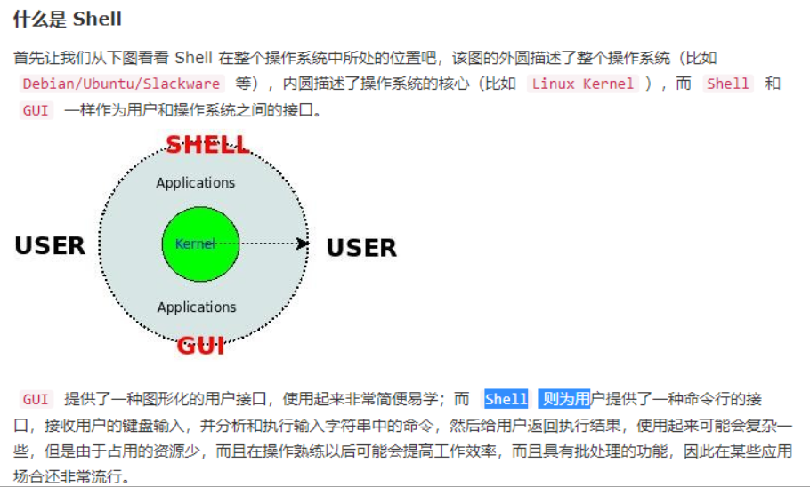

## 什么是 Shell？

简单来说“Shell编程就是对一堆Linux命令的逻辑化处理”。、



## Shell 变量

#### 三种变量：

1. 我们自己定义的变量（**自定义变量**）: 仅在当前 Shell 实例中有效，其他 Shell 启动的程序不能访问局部变量。
2. Linux已定义的环境变量（**环境变量**， 例如：$PATH, $HOME 等..., 这类变量我们可以直接使用），使用 env 命令可以查看所有的环境变量，而set命令既可以查看环境变量也可以查看自定义变量。
3. **Shell变量** ：Shell变量是由 Shell 程序设置的特殊变量。Shell 变量中有一部分是环境变量，有一部分是局部变量，这些变量保证了 Shell 的正常运行

##### 常用的环境变量:

PATH 决定了shell将到哪些目录中寻找命令或程序 HOME 当前用户主目录 HISTSIZE　历史记录数 LOGNAME 当前用户的登录名 HOSTNAME　指主机的名称 SHELL 当前用户Shell类型 LANGUGE 　语言相关的环境变量，多语言可以修改此环境变量 MAIL　当前用户的邮件存放目录 PS1　基本提示符，对于root用户是#，对于普通用户是$

#### 使用变量

1. 使用 Linux 已定义的环境变量：

   比如我们要看当前用户目录可以使用：`echo $HOME`命令；如果我们要看当前用户Shell类型 可以使用`echo $SHELL`命令。可以看出，使用方法非常简单。

2. 使用自己定义的变量`$自定义`：`hello="hello world"   echo $hello`

3. **只读变量**：`readonly variable_name`

4. **删除变量**：`unset var_name`

##### 变量名的命名的注意事项

1. 命名只能使用英文字母，数字和下划线，首个字符不能以数字开头，但是可以使用下划线（\_）开头。
2. 中间不能有空格，可以使用下划线（\_）
3. 不能使用标点符号
4. 不能使用bash里的关键字（可用help命令查看保留关键字）。


## Shell 字符串入门

字符串是shell编程中最常用最有用的数据类型，**字符串可以用单引号，也可以用双引号**。

1. 单引号字符串：` hello='Hello, I  am '$name'!'`
   - 单引号里的任何字符都会原样输出，单引号字符串中的变量是无效的；
   - 单引号字串中不能出现单独一个的单引号（对单引号使用转义符后也不行），但可成对出现，作为字符串拼接使用。
2. 双引号字符串：`hello="Hello, I  am "$name"!"`
   - 双引号里可以有变量
   - 双引号里可以出现转义字符

##### 拼接字符串：

1. 使用双引号拼接

   ```shell
   greeting="hello, "$name" !"
   greeting_1="hello, ${name} !"
   ```

2. 使用单引号拼接

   ```shell
   greeting_2='hello, '$name' !'
   greeting_3='hello, ${name} !'
   ```

##### 获取字符串长度：

1. 第一种方式：`echo ${#name} #输出 10`
2. 第二种方式：`expr length "$name";`
   Copy to clipboardErrorCopied

##### 截取子字符串:

1. 简单的字符串截取：`echo ${str:0:10} #输出:SnailClimb`
2. 根据表达式截取：s1=${var%%t*}#h

##### 查找子字符串：

```c++
string="runoob is a great site"
echo `expr index "$string" io`  # 输出 4
```


expr 命令时，表达式中的运算符左右必须包含空格，如果不包含空格，将会输出表达式本身:

expr 5+6    // 直接输出 5+6
expr 5 + 6       // 输出 11
Copy to clipboardErrorCopied
对于某些运算符，还需要我们使用符号\进行转义，否则就会提示语法错误。

expr 5 * 6       // 输出错误
expr 5 \* 6      // 输出30
Copy to clipboardErrorCopied

## Shell 数组

bash只支持一维数组（不支持多维数组），并且没有限定数组的大小。我下面给了大家一个关于数组操作的 Shell 代码示例，通过该示例大家可以知道如何创建数组、获取数组长度、获取/删除特定位置的数组元素、删除整个数组以及遍历数组。

##### 定义数组

#!/bin/bash
array=(1 2 3 4 5);

##### 获取数组长度

length=${#array[@]}

或者

length2=${#array[*]}
#输出数组长度
echo $length #输出：5
echo $length2 #输出：5

输出数组第三个元素

echo ${array[2]} #输出：3
unset array[1]# 删除下标为1的元素也就是删除第二个元素
for i in ${array[@]};do echo $i ;done # 遍历数组，输出： 1 3 4 5 
unset arr_number; # 删除数组中的所有元素
for i in ${array[@]};do echo $i ;done # 遍历数组，数组元素为空，没有任何输出内容
Copy to clipboardErrorCopied
Shell 基本运算符
说明：图片来自《菜鸟教程》


## 命令

expr

代码中的 **[]** 执行基本的算数运算

echo

printf

test

Shell中的 test 命令用于检查某个条件是否成立，它可以进行数值、字符和文件三个方面的测试。

## 运算符

1. 算数运算符
2. 关系运算符
3. 布尔运算符
4. 字符串运算符
5. 文件测试运算符

我以加法运算符做一个简单的示例（注意：不是单引号，是反引号）：

#!/bin/bash
a=3;b=3;
val=`expr $a + $b`
#输出：Total value : 6
echo "Total value : $val"
Copy to clipboardErrorCopied
关系运算符
关系运算符只支持数字，不支持字符串，除非字符串的值是数字。

shell关系运算符

通过一个简单的示例演示关系运算符的使用，下面shell程序的作用是当score=100的时候输出A否则输出B。

#!/bin/bash
score=90;
maxscore=100;
if [ $score -eq $maxscore ]
then
   echo "A"
else
   echo "B"
fi
Copy to clipboardErrorCopied
输出结果：

B
Copy to clipboardErrorCopied
逻辑运算符
逻辑运算符

示例：

#!/bin/bash
a=$(( 1 && 0))

输出：0；逻辑与运算只有相与的两边都是1，与的结果才是1；否则与的结果是0

echo $a;
Copy to clipboardErrorCopied
布尔运算符
布尔运算符

这里就不做演示了，应该挺简单的。

字符串运算符
 字符串运算符

简单示例：


#!/bin/bash
a="abc";
b="efg";
if [ $a = $b ]
then
   echo "a 等于 b"
else
   echo "a 不等于 b"
fi
Copy to clipboardErrorCopied
输出：

a 不等于 b
Copy to clipboardErrorCopied
文件相关运算符
文件相关运算符

使用方式很简单，比如我们定义好了一个文件路径file="/usr/learnshell/test.sh" 如果我们想判断这个文件是否可读，可以这样if [ -r $file ] 如果想判断这个文件是否可写，可以这样-w $file，是不是很简单。

## shell流程控制

if 条件语句
简单的 if else-if else 的条件语句示例

#!/bin/bash
a=3;
b=9;
if [ $a -eq $b ]
then
   echo "a 等于 b"
elif [ $a -gt $b ]
then
   echo "a 大于 b"
else
   echo "a 小于 b"
fi
Copy to clipboardErrorCopied
输出结果：

a 小于 b
Copy to clipboardErrorCopied
相信大家通过上面的示例就已经掌握了 shell 编程中的 if 条件语句。不过，还要提到的一点是，不同于我们常见的 Java 以及 PHP 中的 if 条件语句，shell if 条件语句中不能包含空语句也就是什么都不做的语句。

for 循环语句
通过下面三个简单的示例认识 for 循环语句最基本的使用，实际上 for 循环语句的功能比下面你看到的示例展现的要大得多。

输出当前列表中的数据：

for loop in 1 2 3 4 5
do
    echo "The value is: $loop"
done
Copy to clipboardErrorCopied
产生 10 个随机数：

#!/bin/bash
for i in {0..9};
do 
   echo $RANDOM;
done
Copy to clipboardErrorCopied
输出1到5:

通常情况下 shell 变量调用需要加 $,但是 for 的 (()) 中不需要,下面来看一个例子：

#!/bin/bash
for((i=1;i<=5;i++));do
    echo $i;
done;
Copy to clipboardErrorCopied
while 语句
基本的 while 循环语句：

#!/bin/bash
int=1
while(( $int<=5 ))
do
    echo $int
    let "int++"
done
Copy to clipboardErrorCopied
while循环可用于读取键盘信息：

echo '按下 <CTRL-D> 退出'
echo -n '输入你最喜欢的电影: '
while read FILM
do
    echo "是的！$FILM 是一个好电影"
done
Copy to clipboardErrorCopied
输出内容:

按下 <CTRL-D> 退出
输入你最喜欢的电影: 变形金刚
是的！变形金刚 是一个好电影
Copy to clipboardErrorCopied
无限循环：

while true
do
    command
done
Copy to clipboardErrorCopied

## shell 函数

##### 不带参数没有返回值的函数

#!/bin/bash
hello(){
    echo "这是我的第一个 shell 函数!"
}
echo "-----函数开始执行-----"
hello
echo "-----函数执行完毕-----"
Copy to clipboardErrorCopied

##### 有返回值的函数

输入两个数字之后相加并返回结果：

#!/bin/bash
funWithReturn(){
    echo "输入第一个数字: "
    read aNum
    echo "输入第二个数字: "
    read anotherNum
    echo "两个数字分别为 $aNum 和 $anotherNum !"
    return $(($aNum+$anotherNum))
}
funWithReturn
echo "输入的两个数字之和为 $?"
Copy to clipboardErrorCopied
输出结果：

输入第一个数字: 
1
输入第二个数字: 
2
两个数字分别为 1 和 2 !
输入的两个数字之和为 3
Copy to clipboardErrorCopied

##### 带参数的函数

#!/bin/bash
funWithParam(){
    echo "第一个参数为 $1 !"
    echo "第二个参数为 $2 !"
    echo "第十个参数为 $10 !"
    echo "第十个参数为 ${10} !"
    echo "第十一个参数为 ${11} !"
    echo "参数总数有 $# 个!"
    echo "作为一个字符串输出所有参数 $* !"
}
funWithParam 1 2 3 4 5 6 7 8 9 34 73
Copy to clipboardErrorCopied
输出结果：

第一个参数为 1 !
第二个参数为 2 !
第十个参数为 10 !
第十个参数为 34 !
第十一个参数为 73 !
参数总数有 11 个!
作为一个字符串输出所有参数 1 2 3 4 5 6 7 8 9 34 73 !


## 输入输出重定向


## 文件包含


