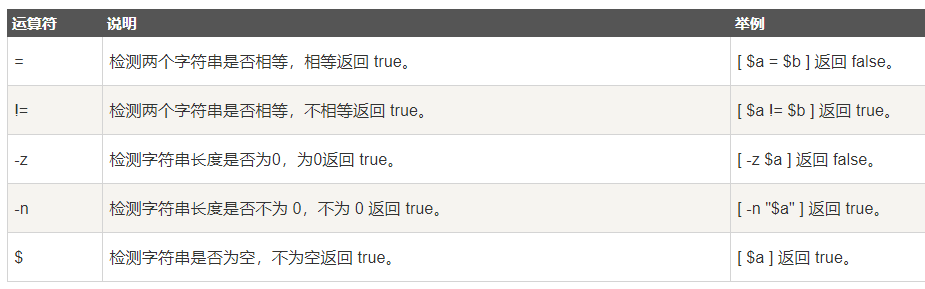

## 什么是 Shell？

简单来说“Shell编程就是对一堆Linux命令的逻辑化处理”。


## Shell 环境

只要有一个能编写代码的文本编辑器和一个能解释执行的**脚本解释器**就可以了

- Bourne Shell（/usr/bin/sh或/bin/sh）

- Bourne Again Shell（/bin/bash）

- C Shell（/usr/bin/csh）

- K Shell（/usr/bin/ksh）

- Shell for Root（/sbin/sh）

  在一般情况下，人们并不区分 Bourne Shell 和 Bourne Again Shell，所以，像 **#!/bin/sh**，它同样也可以改为 **#!/bin/bash**。

## Shell运行

1. 作为可执行程序直接运行 `./test.sh`
2. 作为解释器参数进行运行 `/bin/sh`

## Shell注释

1. 单行注释：`#`
2. 多行注释：`:<<EOF ... EOF`

## Shell 变量

#### 三种变量：

1. 我们自己定义的变量（**自定义变量**）: 仅在当前 Shell 实例中有效，其他 Shell 启动的程序不能访问局部变量。
2. Linux已定义的环境变量（**环境变量**， 例如：$PATH, $HOME 等..., 这类变量我们可以直接使用），使用 env 命令可以查看所有的环境变量，而set命令既可以查看环境变量也可以查看自定义变量。
3. **Shell变量** ：Shell变量是由 Shell 程序设置的特殊变量。Shell 变量中有一部分是环境变量，有一部分是局部变量，这些变量保证了 Shell 的正常运行

##### 常用的环境变量:

PATH 决定了shell将到哪些目录中寻找命令或程序 HOME 当前用户主目录 HISTSIZE　历史记录数 LOGNAME 当前用户的登录名 HOSTNAME　指主机的名称 SHELL 当前用户Shell类型 LANGUGE 　语言相关的环境变量，多语言可以修改此环境变量 MAIL　当前用户的邮件存放目录 PS1　基本提示符，对于root用户是#，对于普通用户是$

#### 使用变量

1. 使用 Linux 已定义的环境变量：

   比如我们要看当前用户目录可以使用：`echo $HOME`命令；如果我们要看当前用户Shell类型 可以使用`echo $SHELL`命令。可以看出，使用方法非常简单。

2. 使用自己定义的变量`$自定义`：`hello="hello world"   echo ${hello}`

3. **只读变量**：`readonly variable_name`

4. **删除变量**：`unset var_name`

##### 变量名的命名的注意事项

1. 命名只能使用英文字母，数字和下划线，首个字符不能以数字开头，但是可以使用下划线（\_）开头。
2. 中间不能有空格，可以使用下划线（\_）
3. 不能使用标点符号
4. 不能使用bash里的关键字（可用help命令查看保留关键字）。


## Shell 字符串入门

字符串是shell编程中最常用最有用的数据类型，**字符串可以用单引号，也可以用双引号**。

1. 单引号字符串：` hello='Hello, I  am '$name'!'`
   - 单引号里的任何字符都会原样输出，单引号字符串中的变量是无效的；
   - 单引号字串中不能出现单独一个的单引号（对单引号使用转义符后也不行），但可成对出现，作为字符串拼接使用。
2. 双引号字符串：`hello="Hello, I  am "$name"!"`
   - 双引号里可以有变量
   - 双引号里可以出现转义字符

##### 拼接字符串：

1. 使用双引号拼接

   ```shell
   greeting="hello, "$name" !"
   greeting_1="hello, ${name} !"
   ```

2. 使用单引号拼接

   ```shell
   greeting_2='hello, '$name' !'
   greeting_3='hello, ${name} !'
   ```

##### 获取字符串长度：

1. 第一种方式：`echo ${#name} #输出 10`
2. 第二种方式：`expr length "$name";`

##### 截取子字符串:

1. 简单的字符串截取：`echo ${str:0:10} `
2. 根据表达式截取：`s1=${var%%t*}#h`

##### 查找子字符串：

```c++
string="runoob is a great site"
echo `expr index "$string" io`  # 输出 4
```


## Shell 数组

bash只支持一维数组（不支持多维数组），并且没有限定数组的大小。关于数组操作的 Shell 代码示例，通过该示例大家可以知道如何创建数组、获取数组长度、获取/删除特定位置的数组元素、删除整个数组以及遍历数组。

##### 定义数组

 数组名=(值1 值2 ... 值n)

```shell 
array=(1 2 3 4 5);
```

##### 读取数组

`echo ${array[2]} #输出：3`

##### 获取所有数组中的数

1. echo "数组的元素为: `${my_array[*]}"`
2. echo "数组的元素为: `${my_array[@]}"`
3. **遍历数组**：`for i in ${array[@]};do echo $i ;done # ，输出： 1 3 4 5 `

##### 获取数组长度

1. `length=${#array[@]}`
2. `length=${#array[*]}`

##### 数组删除

1. 删除下标为1的元素也就是删除第二个元素 `unset array[1]`
2. 删除数组中的所有元素：`unset arr_number; `


## 命令与运算符

#### 表达式

1. **[] 表达式**

   **注意**：在 [] 表达式中，常见的 >, < 需要加转义字符，表示字符串大小比较，以 acill 码位置作为比较。不直接支持 >, < 运算符，还有逻辑运算符 || 、&& ，它需要用 -a[and] –o[or] 表示。

   - 字符串比较, 比如两个字符串是否相同， `[[ $var1 = $var2 ]]`。在进行字符串比较时，最好使用双中括号 [[ ]]. 因为单中括号可能会导致一些错误，因此最好避开它们。
   - 中括号 **[]** 与其中间的代码应该有空格隔开

2. **[[ ]] 表达式**

   **注意**：[[]] 运算符只是 [] 运算符的扩充。能够支持 >, < 符号运算不需要转义符，它还是以字符串比较大小。里面支持逻辑运算符：**|| &&** ，不再使用 **-a -o**。

#### 命令

1. **expr**

   expr 是一款表达式计算工具，使用它能完成表达式的求值操作。 推荐使用`val=$(expr 10 + 20)`，不使用\`expr 10 + 20\`

2. **echo**

    echo 指令类似，都是用于字符串的输出  `echo string`

3. **printf**

   printf 命令模仿 C 程序库（library）里的 printf() 程序。`printf  format-string  [arguments...]`

4. **test**

   Shell中的 test 命令用于检查某个条件是否成立，它可以进行数值、字符和文件三个方面的测试。 `test $num1 = $num2`

#### 运算符

1. **算数运算符**

   

   - 乘号`(*)`前边必须加反斜杠`(\)`才能实现乘法运算；

2. **关系运算符**

   关系运算符只支持数字，不支持字符串，除非字符串的值是数字。

   

3. **布尔运算符**

   

4. **逻辑运算符**

   

   使用 **[[ ... ]]** 条件判断结构，而不是 **[ ... ]**，能够防止脚本中的许多逻辑错误。比如，**&&**、**||**、**<** 和 **>** 操作符能够正常存在于 **[[ ]]** 条件判断结构中，但是如果出现在 **[ ]** 结构中的话，会报错。

5. **字符串运算符**

   

6. **文件测试运算符**

   


## shell流程控制

#### if else 条件判断语句

```shell
if condition
then
    command1 
elif condition2
then
    command2 
else
	command3
fi
```

`if else`语句经常与test命令结合使用，`shell if `条件语句中不能包含空语句也就是什么都不做的语句。

#### for 循环语句

```shell
for var in item1 item2 ... itemN # 或 ${1 ... N}
do
    command1
    command2
    ...
    commandN
done
```

#### while 语句

```shell
while condition
do
    command
done
```

#### until 循环

```shell
until condition
do
    command
done
```

#### case

```shell
case 值 in
模式1)
    command1
    ;;
模式2）
    command1
    ;;
esac
```


## shell 函数

#### 函数格式

```shell
[ function ] funname [()]
{
    action;
    [return int;]
}
```

#### 不带参数没有返回值的函数

```shell
#!/bin/bash
hello(){
    echo "这是我的第一个 shell 函数!"
}
echo "-----函数开始执行-----"
hello
echo "-----函数执行完毕-----"
Copy to clipboardErrorCopied
```

#### 有返回值的函数

```shell
#!/bin/bash
funWithReturn(){
    echo "输入第一个数字: "
    read aNum
    echo "输入第二个数字: "
    read anotherNum
    echo "两个数字分别为 $aNum 和 $anotherNum !"
    return $(($aNum+$anotherNum))
}
funWithReturn
```

#### 带参数的函数

我们可以在执行 Shell 脚本时，向脚本传递参数，脚本内获取参数的格式为：**$n**。**n** 代表一个数字，1 为执行脚本的第一个参数，2 为执行脚本的第二个参数，以此类推……


```shell
#!/bin/bash
funWithParam(){
    echo "第一个参数为 $1 !"
    echo "第二个参数为 $2 !"
    echo "第十个参数为 $10 !"
    echo "第十个参数为 ${10} !"
    echo "第十一个参数为 ${11} !"
    echo "参数总数有 $# 个!"
    echo "作为一个字符串输出所有参数 $* !"
}
funWithParam 1 2 3 4 5 6 7 8 9 34 73

```


## 输入输出重定向

大多数 UNIX 系统命令从你的终端接受输入并将所产生的输出发送回到您的终端。一个命令通常从一个叫标准输入的地方读取输入，默认情况下，这恰好是你的终端。同样，一个命令通常将其输出写入到标准输出，默认情况下，这也是你的终端。


#### /dev/null 文件

如果希望执行某个命令，但又不希望在屏幕上显示输出结果，那么可以将输出重定向到 /dev/null：

```shell
$ command > /dev/null
```


## 文件包含

和其他语言一样，Shell 也可以包含外部脚本。这样可以很方便的封装一些公用的代码作为一个独立的文件。

Shell 文件包含的语法格式如下：

```shell
. filename   # 注意点号(.)和文件名中间有一空格
或
source filename
```


