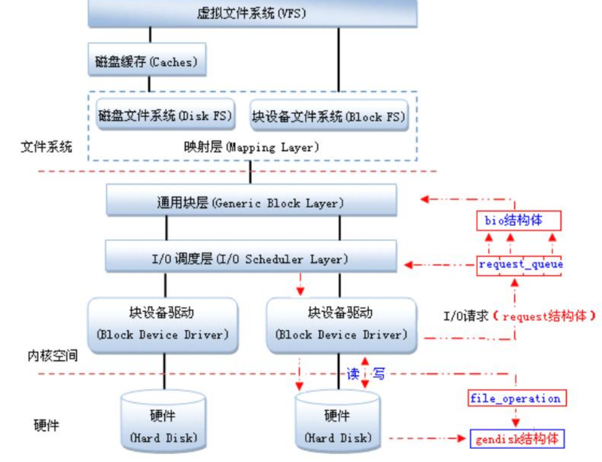

Linux使用虚拟文件系统屏蔽不同I/O设备的差别，Linux内核通过映射层、通用块层、I/O调度层屏蔽不同块设备的差别

**块设备（blockdevice）**

是一种具有一定结构的**随机存取**设备，对这种设备的读写是按**块**进行的，他使用**缓冲**区来存放暂时的数据，待条件成熟后，从缓存一次性写入设备或者从设备一次性读到缓冲区。

**字符设备（Character device）**

是一个**顺序的数据流**设备，对这种设备的读写是按**字符**进行的，而且这些字符是连续地形成一个数据流。他不具备缓冲区，所以对这种设备的读写**是实时的**。

**扇区**（来源于硬盘），**硬件上I/O操作的最小单位，通常是512字节**。可以通过fdisk -l命令查看每个磁盘sector的大小

**块**，是L**inux虚拟文件系统I/O操作的最小单位** ，通常为扇区的2的幂次方倍。通过tune2fs -l /dev/vdb1|grep Block查看块大小

**段**，Linux内存页或页的一部分，是块的整数倍

**页**，Linux内存页，一般是4096字节，用作磁盘缓存。通过getconf PAGE_SIZE查看。

**request结构体**

在Linux中，驱动对块设备的输入或输出(I/O)操作，都会向块设备发出一个请求，在驱动中用**request结构体**描述。但对于一些磁盘设备而言请求的速度很慢，这时候内核就提供一种队列的机制把这些**I/O请求**添加到队列中（即：请求队列），在驱动中用**request_queue结构体**描述。在向块设备提交这些请求前内核会先执行请求的合并和排序预操作，以提高访问的效率，然后再由内核中的**I/O调度程序子系统**来负责提交 I/O 请求， 调度程序将磁盘资源分配给系统中所有挂起的块 I/O 请求，其工作是管理块设备的请求队列，**决定队列中的请求的排列顺序以及什么时候派发请求到设备**。

当多个请求提交给块设备时，执行效率依赖于请求的顺序。如果所有的请求是同一个方向（如：写数据），执行效率是最大的。内核在调用块设备驱动程序例程处理请求之前，先收集I/O请求并将请求排序，然后，**将连续扇区操作的多个请求进行合并以提高执行效率（内核算法会自己做，不用你管）**，对I/O请求排序的算法称为**电梯算法**（elevator algorithm）。电梯算法在I/O调度层完成。内核提供了不同类型的电梯算法，电梯算法有

1 noop（实现简单的FIFO，基本的直接合并与排序）,
2 anticipatory（延迟I/O请求，进行临界区的优化排序），
3 Deadline（针对anticipatory缺点进行改善，降低延迟时间）,
4 Cfq（均匀分配I/O带宽，公平机制）

PS：其实IO调度层（包括请求合并排序算法）是不需要用户管的，内核已经做好

**bio结构**

由通用块层(Generic Block Layer)负责维持一个I/O请求在上层文件系统与底层物理磁盘之间的关系。在通用块层中，**通常用一个bio结构体来对应一个I/O请求**。

**gendisk数据结构体**

Linux提供了一个**gendisk数据结构体**，用来表示一个独立的磁盘设备或分区，用于对底层物理磁盘进行访问。在gendisk中有一个类似字符设备中file_operations的硬件操作结构指针，是**block_device_operations结构体**。

***\*相关数据结构\****

block_device:   描述一个分区或整个磁盘对内核的一个块设备实例 
gendisk:        描述一个通用硬盘（generic hard disk）对象。
hd_struct:       描述分区应有的分区信息 
bio:            描述块数据传送时怎样完成填充或读取块给driver
request:        描述向内核请求一个列表准备做队列处理。 
request_queue: 描述内核申请request资源建立请求链表并填写BIO形成队列。

### Bio结构

**通常1个bio对应1个I/O请求**，IO调度算法可将连续的bio合并成1个请求。所以，1个请求可以包含多个bio。

内核中块I/O操作的基本容器由bio结构体表示，定义 在<linux/bio.h>中，该结构体代表了正在现场的（活动的）以片段（segment）链表形式组织的块I/O操作。一个片段是一小 块连续的内存缓冲区。这样的好处就是不需要保证单个缓冲区一定要连续。所以通过片段来描述缓冲区，即使一个缓冲区分散在内存的多个位置上，bio结构体也 能对内核保证I/O操作的执行，这样的就叫做聚散I/O.
***\*bio为通用层的主要数据结构，既描述了磁盘的位置，又描述了内存的位置，是上层内核vfs与下层驱动的连接纽带\****

  结构bio_vec代表了内存中的一个数据段，数据段用页、偏移和长度描
述。I/O需要执行的内存位置用段表示，结构bio指向了一个段的数组。
结构bio_vec列出如下（在include/linux/bio.h中）：
struct bio_vec {
    struct page   *bv_page;  /*数据段所在的页*/
    unsigned short bv_len;   /*数据段的长度*/
    unsigned short bv_offset; /*数据段页内偏移*/
};

## Linux块I/O原理

## iostat命令——查看I/O统计情况

- 查看tps和读写吞吐量

## fio命令——I/O性能测试利器

一般用于线上业务的服务器，都需要在使用前测试磁盘的性能。推荐fio进行性能测试，fio命令参数说明如下（详细方法请看参考文献2）

## blktrace——深入分析I/O性能

如果需要深入分析I/O性能，推荐使用blktrace命令。该命令可以将I/O请求到达块设备处理层后的所有步骤进行统计分析。