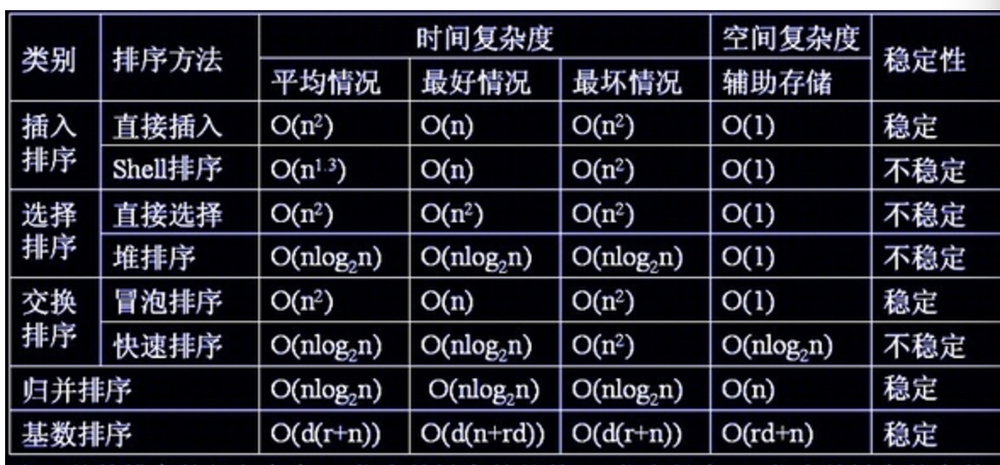

<center><font size="45px">排序</font></center>

## 算法复杂度




##  排序分类

1. **稳定排序**

   待排序的记录序列中可能存在两个或两个以上关键字相等的记录。排序前的序列中Ri领先于Rj（即i<j）.若在排序后的序列中Ri仍然领先于Rj，则称所用的方法是稳定的。

   **分为**：插入排序，基数排序，归并排序，冒泡排序，计数排序

2. **不稳定排序**

   待排序的记录序列中可能存在两个或两个以上关键字相等的记录。排序前的序列中Ri领先于Rj（即i<j）.若在排序后的序列中Ri不在领先于Rj，则称所用的方法是不稳定的。

   **分为**：快速排序，希尔排序，选择排序，堆排序。 

   

## 冒泡排序

##### 步骤

1. 比较相邻的元素。如果第一个比第二个大，就交换他们两个。
2. 对每一对相邻元素作同样的工作，从开始第一对到结尾的最后一对。这步做完后，最后的元素会是最大的数。
3. 针对所有的元素重复以上的步骤，除了最后一个。
4. 持续每次对越来越少的元素重复上面的步骤，直到没有任何一对数字需要比较。

##### 动画演示


##### 代码

```c++

```

## 选择排序

##### 步骤


##### 动画演示


##### 代码

```c++

```

## 

## 插入排序

##### 步骤

1. 将第一待排序序列第一个元素看做一个有序序列，把第二个元素到最后一个元素当成是未排序序列。
2. 从头到尾依次扫描未排序序列，将扫描到的每个元素插入有序序列的适当位置。（如果待插入的元素与有序序列中的某个元素相等，则将待插入元素插入到相等元素的后面。）

##### 动画演示


##### 代码

```c++

```

## 希尔排序

##### 步骤

1.  选择一个增量序列 t1，t2，……，tk，其中 ti > tj, tk = 1；
2.  按增量序列个数 k，对序列进行 k 趟排序；
3.  每趟排序，根据对应的增量 ti，将待排序列分割成若干长度为 m 的子序列，分别对各子表进行直接插入排序。仅增量因子为 1 时，整个序列作为一个表来处理，表长度即为整个序列的长度。

##### 动画演示


##### 代码

```c++

```

## 快速排序

##### 步骤


##### 动画演示


##### 代码

```c++

```

## 归并排序

##### 步骤

1. 申请空间，使其大小为两个已经排序序列之和，该空间用来存放合并后的序列；
2. 设定两个指针，最初位置分别为两个已经排序序列的起始位置；
3. 比较两个指针所指向的元素，选择相对小的元素放入到合并空间，并移动指针到下一位置；
4. 重复步骤 3 直到某一指针达到序列尾；
5. 将另一序列剩下的所有元素直接复制到合并序列尾。

##### 动画演示


##### 代码

```c++

```

## 堆排序

##### 步骤


##### 动画演示


##### 代码

```c++

```

##### 步骤


##### 动画演示


##### 代码

```c++

```

## 计数排序

##### 步骤


##### 动画演示


##### 代码

```c++

```

## 桶排序

##### 步骤


##### 动画演示


##### 代码

```c++

```

## 基数排序

##### 步骤


##### 动画演示


##### 代码

```c++

```

## 其它非常规排序

睡眠排序、猴子排序、面条排序、珠排序